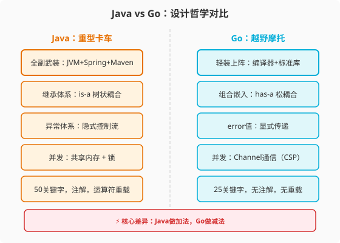
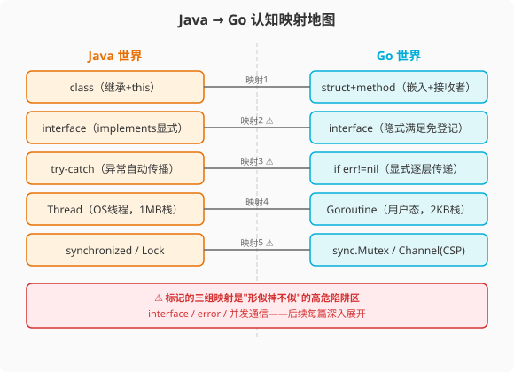

### 第1章 为什么是Go：一场"减法"革命的开始

> 📖 本章你将学会：
> - 说清Go语言的设计哲学三原则及其与Java的本质差异
> - 用一张认知地图将Java核心概念映射到Go对应概念
> - 搭建Go开发环境并运行第一个程序
> - 识别Java程序员学Go的三大思维陷阱

---

#### 1.1 Go的诞生与设计哲学

##### 1.1.1 开篇：一辆越野摩托的邀请

如果你在Java的世界里待了足够久，你一定经历过这样的场景：

为了启动一个简单的Web服务，你需要：创建Maven工程 → 配置`pom.xml`
（50行起步）→ 引入Spring Boot Starter → 写`@SpringBootApplication`
→ 等待JVM启动（30秒过去了）→ 终于看到"Started Application in 28.5 seconds"。

整个过程中，你写的业务代码可能只有10行，但围绕这10行代码的"脚手架"
却有上百行。这不是Java的错——Java的哲学是"提供一切可能需要的东西"，
就像一辆重型卡车，备胎、工具箱、千斤顶一应俱全，开起来稳当。

但有时候，你只是想去街角买杯咖啡。

Go就是那辆越野摩托。它没有Spring的依赖注入，没有Hibernate的对象映射，
没有JVM的运行时优化。但它的`net/http`标准库直接就能起一个HTTP服务，
从写代码到服务启动，不到1秒。它的设计哲学是：**只提供最本质的东西，
把复杂度留给组合，而不是用框架去堆叠。**

这是一场"减法"革命。而在我们深入Go的语法和并发模型之前，先来理解
这场革命的源头——Go为什么会被创造出来，它要解决什么问题。

---

#### 1.2 Go的诞生背景：C的速度 + Python的简洁 + Java的工程化

故事要从Google的一间办公室说起。

2007年，Google的三位工程师——**Rob Pike**（Unix老将）、**Ken Thompson**
（C语言和Unix的联合发明人）、**Robert Griesemer**——在等待C++编译时
闲聊。他们当时在做一个庞大的C++项目，编译一次要花45分钟。

45分钟。

这个数字成了最后一根稻草。三位已经在系统编程领域耕耘数十年的老兵，
决定设计一门新语言，解决他们在Google内部遇到的核心痛点：

##### 1.2.1 痛点一：C++太复杂，Java太重。

C++的模板元编程和多重继承让代码维护变成噩梦。Java虽然简化了语法，
但JVM的启动开销、GC的STW停顿、以及日益庞大的框架生态（Spring全家桶）
让"写一个简单的服务"变成了一项工程。在Google的规模下，数以万计的
服务需要快速编译、快速部署、高效运行——C++和Java都不够理想。

##### 1.2.2 痛点二：并发太难写。

2007年正是多核CPU普及的拐点。Java的线程模型是1:1（一个Java线程对应
一个OS线程），创建一个线程要分配1MB栈空间。在高并发场景下，线程数
受限于内存，线程切换的开销开始显著。开发者需要一种更轻量的并发模型，
但C++的线程库和Java的`java.util.concurrent`都太"重"了。

##### 1.2.3 痛点三：依赖管理太混乱。

C++的`#include`是文本包含，Java的`import`只是命名空间引用——
两者都没有解决版本依赖问题。Google内部为此自建了Build系统，
但语言层面的缺失让依赖管理始终是个痛点。

> 💡 提示：这些问题直到今天依然存在——只是被各种工具和框架
> "包装"得没那么痛了。Go选择从语言层面解决它们，而不是用框架补丁。

三位工程师给这门新语言定了三个设计目标，可以用一个公式概括：

```
Go = C的速度 + Python的简洁 + Java的工程化
```

但这个公式不是简单的"取各家之长"。Go的设计哲学更像是**有选择的减法**——
从C那里保留了对系统资源的直接控制（指针、内存布局），从Python那里
取了语法的简洁（没有分号、类型推断、少量关键字），从Java那里学了
工程化的纪律（包管理、接口契约、垃圾回收）——然后**把其他所有东西都删掉了**。

删除了什么？

| Java有的，Go删掉了 | 为什么删 |
|------|------|
| 类继承（`extends`） | 继承导致强耦合，组合更灵活 |
| 异常体系（`try-catch`） | 异常是隐式控制流，难以追踪 |
| 构造函数 | 用工厂函数或零值初始化更简单 |
| 泛型（直到1.18才加回） | 先用接口解决，避免过早复杂化 |
| 注解（Annotation） | 注解是隐式魔法，Go偏好显式 |
| 运算符重载 | 重载让代码含义不透明 |
| 隐式类型转换 | 显式转换避免bug |
| `while` / `do-while` | 一个`for`就够了 |

这张表看起来像Go在"自断手臂"。但对于写过十年Java的人来说，
你仔细想想：你最后一次用`protected`是什么时候？你真的需要多重继承吗？
你的`try-catch`里有多少是`catch (Exception e) { log.error(e); }`
这种"吞异常"的代码？

Go的减法不是偷懒，而是**经过深思熟虑的克制**。每删掉一个特性，
都对应着一个设计决策——用更简单的方式解决同一个问题。这些决策
构成了Go的设计哲学三原则。

##### 1.2.4 原则一：简单（Simplicity）

Go只有25个关键字（Java有50个）。没有继承，没有异常，没有注解，
没有运算符重载。语法规则少到可以打印在一张A4纸上。

这不是为了简单而简单。Edsger W. Dijkstra 有一句名言：

> "简单是可靠的先决条件。"（Simplicity is the prerequisite for reliability.）
> —— Edsger W. Dijkstra, "How do we tell truths that might hurt?" (EWD498, 1975)[^dijkstra]

在Google的规模下，代码的读者比作者多得多。一段代码会被数十个工程师
审查、修改、维护。语法越复杂，理解成本越高，bug越多。Go选择把复杂度
从语法层面转移到组合层面——用少量、正交的语法元素，组合出丰富的行为。

##### 1.2.5 原则二：组合（Composition）

Java的面向对象是"继承驱动"的：`Dog extends Animal`，`Animal extends
Creature`，层层继承形成树状结构。改动一个父类，所有子类都受影响。

Go没有继承，只有**嵌入（Embedding）**。你把一个结构体"嵌入"另一个结构体，
就获得了它的字段和方法，但两者之间没有父子关系，没有虚函数表，
没有`super()`调用。想换掉某个行为？直接替换嵌入的类型就行。

```
Java：Dog IS-A Animal（狗是一种动物） → 继承关系，强耦合
Go： Dog HAS-A Animal（狗有一个动物的组件） → 组合关系，松耦合
```

##### 1.2.6 原则三：并发（Concurrency）

Go是第一门把并发作为"一等公民"内建到语法中的主流语言。`go`关键字
启动一个Goroutine，`chan`类型创建一个Channel。不需要`import`
并发库，不需要`extends Thread`或`implements Runnable`。

更关键的是，Go的并发模型基于**CSP（Communicating Sequential Processes）**——
"不要通过共享内存来通信，而要通过通信来共享内存"[^go-proverbs]。这句话听起来绕，
但它和Java的并发思维完全不同：

```
Java并发思维：多个线程共享一个变量 → 用锁保护它 → 小心死锁
Go并发思维：  多个Goroutine各自持有数据 → 通过Channel传递 → 不需要锁
```

> 💡 提示：CSP不是说"永远不用锁"——Go也有`sync.Mutex`。它的意思是：
> **默认优先用Channel通信，只有当共享内存确实更简单时才用锁。**
> 这个优先级的反转，是Java程序员学Go最大的思维转变。

这三个原则——简单、组合、并发——不是孤立的，而是相互支撑的：
简单使得组合可行（少量元素才能自由拼装），组合使得并发安全
（松耦合的组件通过Channel通信比共享变量加锁更不容易出错）。

理解了这三原则，你就理解了Go所有"奇怪"设计的来由——
没有继承是因为组合优先，没有异常是因为简单优先，
没有`while`是因为一个`for`的多种形态就够了。

##### 1.2.7 Go vs Java 设计哲学全景对比

| 维度 | Java哲学 | Go哲学 | 本质差异 |
|------|----------|--------|----------|
| 核心隐喻 | 重型卡车（全副武装） | 越野摩托（轻装上阵） | 提供一切 vs 只留本质 |
| 复杂度策略 | 加法（框架解决问题） | 减法（删掉问题源头） | 框架堆叠 vs 语言内建 |
| 面向对象 | 继承驱动（is-a） | 组合驱动（has-a） | 强耦合树 vs 松耦合积木 |
| 并发模型 | 共享内存+锁 | 通信优先（CSP） | 抢会议室 vs 用对讲机 |
| 错误处理 | 异常（隐式控制流） | error值（显式传递） | 消防喷淋 vs 快递签收 |
| 设计信条 | "提供选择" | "做减法" | 50个关键字 vs 25个关键字 |



这场"减法"革命的结果，是一门在多个维度上与Java截然不同的语言。
Go于2009年11月10日正式对外发布[^go-opensource]。此后十余年间，它成为了云原生时代的
基础设施语言——Docker、Kubernetes、etcd、Prometheus、TiDB、CockroachDB
——这些定义了现代基础设施的项目，无一例外选择了Go。

选择Go的不是语言发烧友，而是真正面临规模挑战的工程团队。他们选择Go
的原因，和Go创造者们十余年前的初衷一样：**简单、组合、并发。**

---

#### 1.3 Java vs Go：语言特性全景对照

在上一节，我们理解了Go"减法革命"的设计哲学。现在，让我们把镜头拉远，
俯瞰这两门语言的全景特征。这一节的目的是帮你建立**第一张认知映射地图**——
看清楚Java世界里的每个概念，在Go世界里对应什么，以及哪些对应关系是
"形似神不似"的陷阱。

##### 1.3.1 语言特性全景对比表

先上一张大表。这张表覆盖了从类型系统到工程实践的15个核心维度，
是你学Go全程的导航图。建议 bookmark 这一页。

| 维度 | Java | Go | 差异本质 |
|------|------|----|----------|
| 运行方式 | JVM解释+JIT混合 | 静态编译为原生二进制 | 运行时依赖 vs 自包含 |
| 启动速度 | 1-30秒（JVM预热） | <100毫秒 | JIT预热 vs 零预热 |
| 类型系统 | 名义类型+继承 | 结构类型+组合 | is-a vs has-a |
| 接口实现 | 显式（`implements`） | 隐式（鸭子类型） | 契约驱动 vs 能力驱动 |
| 泛型 | 类型擦除（1.5+） | 单态化（1.18+） | 运行时无类型 vs 编译期特化 |
| 错误处理 | 异常（`try-catch`） | `error`值（`if err != nil`） | 隐式控制流 vs 显式传递 |
| 空值安全 | `Optional<T>`（手动） | 指针`*T` + `nil`检查 | 包装类 vs 零值+指针 |
| 并发单元 | `Thread`（OS线程1:1） | `Goroutine`（用户态M:N） | 1MB栈 vs 2KB栈 |
| 同步方式 | `synchronized`+`Lock` | `sync.Mutex`+`Channel` | 内建关键字 vs 库函数+CSP |
| 继承 | `extends`单继承 | 无，只有嵌入（Embedding） | 父子耦合 vs 积木组合 |
| 构造/初始化 | 构造函数+`new` | 零值+工厂函数 | 特殊方法 vs 普通函数 |
| 方法接收者 | `this`隐式 | 显式接收者`(r Receiver)` | 隐式绑定 vs 显式绑定 |
| 包管理 | Maven/Gradle | Go Modules（内建） | 中心仓库 vs 去中心化 |
| 代码组织 | `package`+`import` | `package`+`import` | 形似但可见性规则不同 |
| 可见性 | `public/private/protected` | 首字母大小写 | 四级修饰符 vs 二级约定 |

这张表的信息量很大，不要试图一次记住。它更像一张地图——后面每章都会
深入其中几个维度，逐步把"形似神不似"的陷阱讲透。

现在，让我们聚焦其中**最关键的5个映射关系**——它们是Java程序员学Go时
"最容易自信犯错"的地方。

##### 1.3.2 五大核心认知映射（含陷阱标注）

**映射一：`class` → `struct` + `method`**

Java程序员看到Go的`struct`，第一反应是"这不就是没有方法的POJO吗"。
表面确实像——都是字段容器。但Go的`struct`和Java的`class`有三个本质差异：

- Go的`struct`没有继承，只有**嵌入**。你把一个struct塞进另一个struct，
  就能"复用"它的字段和方法，但这不是is-a关系，没有多态分派。
- Go的**方法**是独立定义在struct外面的——`func (r Receiver) Method()`，
  接收者显式写明，而不是Java的`this`隐式绑定。
- Go的struct有**零值（Zero Value）**概念：`var u User`直接可用，
  字符串字段是`""`，数字字段是`0`，不需要构造函数。

> ⚠️ 陷阱：如果你用Java的习惯给每个struct写构造函数，你会发现Go社区
> 看你像看外星人。Go的惯用法是：能零值初始化的就零值，需要复杂初始化
> 的用工厂函数`NewUser()`。

**映射二：`interface`（显式） → `interface`（隐式）**

这是Go和Java差异最大的概念之一，也是第二篇会重点展开的主题。先建立直觉：

```
Java：Dog implements Animal  ← 必须声明，编译器检查
Go：  只要Dog有Animal接口要求的方法，自动满足  ← 不需要声明
```

Java的接口是"入职合同"——你在简历上写了`implements`，HR才认你是员工。
Go的接口是"免试上岗"——只要你的技能匹配岗位要求，系统自动录用你，
你甚至不需要知道这个岗位（接口）的存在。

这个差异的深远影响：Go的接口通常定义在**使用方**而不是**实现方**。
你写一个函数接收`io.Reader`，任何实现了`Read()`方法的类型都能传进来——
包括那些在你写函数时还不存在的类型。

> ⚠️ 陷阱：Java程序员习惯在实现类上写`implements Comparable`，
> 在Go里这样做毫无意义——Go的接口不需要声明实现关系。正确做法是：
> 定义接口的人写接口，实现接口的人写方法，两者不需要见面。

**映射三：`try-catch` → `if err != nil`**

错误处理是Java→Go最痛苦的风格转变。不是难，而是"反直觉"。

Java的异常像消防喷淋系统——一旦触发，水淹全场（栈展开），你可以在
调用链任意一层`catch`。Go的`error`像快递签收——每一站都要当面拆开检查，
不检查就丢掉了，没有自动传播。

```java
// Java：异常自动向上传播
public User findUser(String id) throws UserNotFoundException {
    return repository.findById(id); // 异常自动抛给调用者
}
```

```go
// Go：error必须显式传递
func FindUser(id string) (*User, error) {
    user, err := repository.FindByID(id) // 必须当场检查
    if err != nil {
        return nil, err // 必须手动返回
    }
    return user, nil
}
```

> ⚠️ 陷阱：Java程序员最容易犯的错误是"吞错误"——`err`拿到了但忘记
> 返回，导致调用者以为成功了。Go的`errcheck`和`golangci-lint`就是
> 用来抓这类问题的。养成肌肉记忆：**看到`err`就`if err != nil`**。

**映射四：`Thread` → `Goroutine`**

Java线程和Goroutine都是"并发执行单元"，但底层模型完全不同：

| 维度 | Java Thread | Go Goroutine |
|------|-------------|--------------|
| 模型 | 1:1（一个Java线程=一个OS线程） | M:N（M个Goroutine映射到N个OS线程） |
| 初始栈 | ~1MB | ~2KB（可动态增长） |
| 创建成本 | ~1ms（系统调用） | ~1μs（用户态分配） |
| 调度 | OS抢占式 | Go runtime协作式+信号抢占(1.14+) |
| 通信 | 共享内存+锁 | Channel（CSP模型） |

Java线程像出租车——贵但靠谱，有司机帮你处理路线。Goroutine像共享单车——
便宜到随手用，但你得自己管理停在哪（生命周期）。

> ⚠️ 陷阱：Goroutine太轻量，容易"随手创建忘记回收"，导致**Goroutine泄漏**。
> 第三篇会专门讲如何用`context.Context`和Channel来管理Goroutine的生命周期。

**映射五：`synchronized`/`Lock` → `sync.Mutex` / `Channel`**

Java的并发安全主要靠锁：`synchronized`关键字内建于语言，`ReentrantLock`
在`java.util.concurrent`里。Go的思路是双轨制：

- 需要保护共享状态时，用`sync.Mutex`（和Java的Lock用法接近）
- 需要在Goroutine间传递数据时，用Channel（Java没有直接等价物）

Go的格言是：**"不要通过共享内存来通信，而要通过通信来共享内存。"**
这不是禁止用锁，而是建议**优先考虑Channel**——当你的第一反应是"加个锁"
时，先问自己：能不能用一个Channel来传递所有权？

> ⚠️ 陷阱：Java程序员看到`sync.Mutex`会觉得亲切，但Go社区更推崇Channel。
> 如果你写的Go代码里到处是`Mutex`而没有一个Channel，大概率是在用
> "Java思维写Go"——代码能跑，但不符合Go的惯用法。

##### 1.3.3 认知映射地图（SVG）

把五大映射关系画成一张图，帮你建立全景直觉：



看这张图时，记住一个原则：**标了⚠️的映射是"形似神不似"的陷阱区。**
它们看起来和Java很像，但底层语义完全不同。这三组映射——interface、
error、并发通信——正是这本书后续每篇都会反复回到的主题。

---

#### 1.4 环境搭建：从JDK到Go工具链

认知地图建好了，现在让我们动手搭环境。对于Java老兵来说，这一节会很轻松——
Go的工具链比Java简单一个量级。

##### 1.4.1 安装Go

**macOS**：
```bash
brew install go
```

**Linux**：
```bash
# 下载（以 Go 1.22 为例）
wget https://go.dev/dl/go1.22.0.linux-amd64.tar.gz
sudo tar -C /usr/local -xzf go1.22.0.linux-amd64.tar.gz
export PATH=$PATH:/usr/local/go/bin
```

**Windows**：从 [go.dev/dl](https://go.dev/dl) 下载 MSI 安装包，一键安装。

安装完成后验证：

```bash
go version
# 输出: go version go1.22.0 darwin/amd64
```

对比一下Java的安装流程：下载JDK → 配置`JAVA_HOME` → 配置`PATH` →
配置`CLASSPATH` → 验证`java -version` → 下载Maven → 配置`MAVEN_HOME` →
配置`settings.xml`。Go把编译器、包管理、测试工具、代码格式化工具
全部打包成一个命令行工具——`go`。没有`JAVA_HOME`，没有`pom.xml`，
没有`settings.xml`。

##### 1.4.2 Go vs Java 工具链对比

| 功能 | Java | Go | Go的优势 |
|------|------|----|----------|
| 编译 | `javac` / Maven | `go build` | 内建，无需配置文件 |
| 运行 | `java -jar` | `./二进制文件` | 直接运行，无JVM |
| 包管理 | Maven/Gradle | `go mod` | 内建于工具链 |
| 测试 | JUnit + Maven Surefire | `go test` | 内建测试框架 |
| 格式化 | 需IDE插件 | `go fmt` | 内建，全社区统一风格 |
| 静态检查 | SpotBugs/FindSecBugs | `go vet` | 内建基础检查 |
| 性能分析 | JProfiler(收费) | `go tool pprof` | 内建，免费 |
| 文档生成 | Javadoc | `go doc` | 内建 |
| 交叉编译 | 复杂（需交叉工具链） | `GOOS=linux go build` | 一条命令 |

注意最后一行——**交叉编译**。这是Go对Java的"降维打击"之一。
在Java里，交叉编译（比如在Mac上编译出Linux可运行二进制）需要复杂的
配置。在Go里，设两个环境变量就行：

```bash
# 在 macOS 上编译出 Linux 可运行的二进制
GOOS=linux GOARCH=amd64 go build -o myapp
```

这个能力在云原生时代至关重要——你的开发机是Mac，服务器是Linux，
用Go你不需要在服务器上装编译器，本地编译完直接扔上去就行。

##### 1.4.3 第一个程序：Hello World 对比

说了这么多，不如写代码来得直接。同一个"Hello World"，Java和Go分别怎么写。

**Java版**：

```java
public class HelloWorld {
    public static void main(String[] args) {
        System.out.println("Hello, Go!");
    }
}
```

```bash
# 编译+运行
javac HelloWorld.java
java HelloWorld
```

**Go版**：

```go
package main

import "fmt"

func main() {
    fmt.Println("Hello, Go!")
}
```

```bash
# 直接运行（编译+执行一步完成）
go run hello.go

# 或编译后运行
go build -o hello hello.go
./hello
```

对比感受：

| 步骤 | Java | Go |
|------|------|----|
| 文件名约束 | 必须与`public class`同名 | 无约束（但`package main`必须有`func main`） |
| 类声明 | 必须`public class` | 不需要类，直接`func main` |
| 入口 | `public static void main(String[] args)` | `func main()` |
| 输出 | `System.out.println` | `fmt.Println` |
| 编译运行 | `javac` + `java` 两步 | `go run` 一步 |
| 产物 | `.class`文件（需JVM运行） | 独立二进制（直接运行） |

Go版的Hello World只有7行，没有`public class`，没有`static`，没有`String[] args`。
这是Go"减法哲学"的第一个具象体现——**入口点就是入口点，不需要仪式感。**

##### 1.4.4 创建第一个Go项目

用Go Modules创建一个真实项目：

```bash
# 初始化模块
mkdir hello-go && cd hello-go
go mod init github.com/yourname/hello-go

# 查看生成的 go.mod
cat go.mod
```

`go.mod`文件内容：

```
module github.com/yourname/hello-go

go 1.22
```

对比Java的`pom.xml`动辄50-100行，Go的`go.mod`只有3行。模块名就是
你的仓库地址，Go版本声明在第二行。就这么简单。

创建`main.go`：

```go
package main

import "fmt"

func main() {
    fmt.Println("Hello, Go!")
}
```

运行：

```bash
go run main.go
# 输出: Hello, Go!
```

恭喜，你已经写出了第一个Go程序。感觉是不是比配Spring Boot项目轻多了？

> 💡 提示：`go mod init` 生成的 `go.mod` 类似于 `pom.xml` 的 `<groupId>`
> 声明，但无需声明依赖（等你 `go get` 引入第三方包时会自动追加）。
> Go的依赖管理是**增量自动**的——你写代码`import`了什么，`go mod tidy`
> 就自动帮你管理，不需要手写依赖清单。

---

#### 1.5 Java程序员的三大思维陷阱

在结束这一章之前，我想给你打三针"预防针"。这三个陷阱不是语法错误，
而是**思维错误**——你的Java肌肉记忆会让你不自觉地掉进去。

##### 1.5.1 陷阱一：用Go写Java代码（"语法翻译"陷阱）

最常见的错误。你打开Go，看到`struct`想成`class`，看到`interface`
想成`interface`，看到`error`想成`Exception`，然后逐行把Java代码
"翻译"成Go。结果：代码能跑，但充满了"反Go惯用法"——到处是不必要的
抽象层、不必要的getter/setter、不必要的继承模拟。

**症状清单**：

- 给每个struct写getter/setter（Go惯例：字段公开就直接访问）
- 用嵌套struct模拟继承链（Go惯例：用组合，不要模拟继承）
- 用`panic`/`recover`模拟`try-catch`（Go惯例：error值，不要用panic做流程控制）
- 每个函数都定义interface（Go惯例：接口定义在使用方，且越小越好）
- 写大型单体`main`包（Go惯例：按职责拆分package）

**治疗方案**：学Go的前三个月，每写完一段代码，问自己三个问题——
"这符合Go社区惯例吗？"、"有没有更Go的方式来表达？"
"Rob Pike会这样写吗？"推荐阅读Go官方的[Effective Go](https://go.dev/doc/effective_go)
和[Code Review Comments](https://github.com/golang/go/wiki/CodeReviewComments)。

##### 1.5.2 陷阱二：忽视Channel，过度依赖Mutex（"锁思维"陷阱）

Java程序员的并发直觉是"共享变量+锁"。到了Go，看到`sync.Mutex`觉得亲切，
于是所有并发问题都用Mutex解决。代码能跑，但你会错过Go并发模型的核心价值。

**症状**：Go代码里出现`Mutex`和`WaitGroup`却没有一个Channel；
用共享变量+锁在Goroutine间传递数据，而不是用Channel。

**治疗方案**：第三篇会深入讲解CSP模型。现在先记住一个原则——
**当你想用Mutex时，先问自己：能不能用Channel替代？** 只有在Channel
确实让代码更复杂时，才退回Mutex。这和Java完全相反——Java是"默认用锁，
Channel（BlockingQueue）是备选"。

##### 1.5.3 陷阱三：忽视Goroutine生命周期管理（"随手go"陷阱）

Goroutine太轻量了——2KB初始栈，微秒级创建——以至于你会不自觉地
"随手`go func()`"。但轻量不等于免费。如果你启动了Goroutine却没有
提供退出机制，它就会一直运行，占用内存，最终导致**Goroutine泄漏**。

**症状**：代码里到处是`go func() { ... }()`但没有`context.Context`
传递；HTTP handler里`go processRequest(r)`但请求结束后Goroutine还在跑。

**治疗方案**：每个Goroutine都应该有明确的**退出条件**。最常用的模式是
配合`context.Context`：

```go
func worker(ctx context.Context) {
    for {
        select {
        case <-ctx.Done():
            return // 收到取消信号，优雅退出
        case data := <-inputChan:
            process(data)
        }
    }
}

func main() {
    ctx, cancel := context.WithCancel(context.Background())
    defer cancel()
    go worker(ctx)
    // ... 工作完成后
    cancel() // 通知 worker 退出
}
```

> ⚠️ 注意：`context.Context`是Go并发编程的"生命线"——它贯穿整个
> Goroutine调用链，负责传递取消信号、超时和值。Java没有直接等价物
> （`Thread.interrupt()`勉强算半个，但语义和用法完全不同）。第三篇
> 会用一整章讲Context。

---

#### ⚡ 1.6 性能贴士

第一章的性能对比，我们从最直观的"冷启动"和"内存占用"开始。
这两个指标是微服务架构下最敏感的——它们直接影响扩容速度和资源成本。

##### 1.6.1 性能对比

| 指标 | Java (Spring Boot) | Go (net/http) | 倍数 |
|------|---------------------|----------------|------|
| 冷启动时间 | 3-15秒 | 5-50毫秒 | **100-300x** |
| 空载内存 | 150-400MB | 10-30MB | **5-15x** |
| 二进制大小 | 30-80MB (fat JAR) | 5-15MB | **3-5x** |
| 编译速度 | 10-60秒（Maven全量） | 0.5-3秒 | **10-20x** |

> 测试环境：MacBook Pro M2 / 16GB / macOS 14 / OpenJDK 21 / Go 1.22
> 基准方法：Spring Boot 3.2 空项目 vs Go 1.22 `net/http` 空服务，
> 各运行10次取中位数

**为什么差距这么大？**

- **冷启动**：Java需要JVM初始化 → 类加载 → 字节码验证 → JIT预热，
  Spring还要扫描Bean定义、依赖注入。Go编译为原生二进制，操作系统直接
  执行，没有"启动仪式"。
- **内存占用**：JVM自身运行时（GC线程、JIT编译器、类元数据）就要吃掉
  100MB+。Go的运行时只有GC和调度器，且按需分配，空载时10MB以内。
- **编译速度**：Java需要类型擦除+字节码生成+JAR打包。Go直接编译为
  机器码，且增量编译只重编译变更的包。
- **二进制大小**：Java的fat JAR要打包依赖库。Go默认静态链接，但
  标准库精简，且`-ldflags "-s -w"`可去掉调试信息进一步瘦身。

##### 1.6.2 优化建议

1. **Go二进制瘦身**：`go build -ldflags "-s -w"` 可减小 ~30% 体积
2. **交叉编译**：开发机编译，服务器直接运行，无需在服务器装Go
3. **利用启动快**：K8s滚动更新时，Go服务几乎零感知重启
4. **利用内存省**：同样规格的Node可以跑更多Go Pod实例

> 💡 性能口诀：**Java靠JIT跑得快，Go靠编译跑得稳；Java启动慢如牛，
> Go启动快如闪；微服务时代比启动，Go的冷启动赢一半。**

---

#### 本章小结

这一章我们从"宏观"视角建立了Java→Go的认知框架。记住这几个记忆点：

1. **Go是一场"减法"革命** —— 从C取速度，从Python取简洁，从Java取工程化，
   然后把继承、异常、注解等复杂特性全部删掉。Java是全副武装的重型卡车，
   Go是轻装上阵的越野摩托。

2. **三大设计原则贯穿全书** —— 简单（25个关键字）、组合（嵌入替代继承）、
   并发（CSP通信模型）。后续每章的"为什么Go这样设计"，都能追溯到这三条。

3. **五大认知映射是你的导航图** —— class→struct、interface→interface（隐式）、
   try-catch→if err != nil、Thread→Goroutine、synchronized→Mutex/Channel。
   标⚠️的三组是"形似神不似"的高危区。

4. **三大思维陷阱要提前预防** —— "语法翻译"（用Go写Java）、"锁思维"
   （忽视Channel）、"随手go"（Goroutine泄漏）。前三个月每周自检一次。

> 🤔 思考题：Go删掉了继承和异常，这两个你在Java里几乎每天都会用的特性。
> 你觉得Go用什么来替代它们？替代方案真的更好吗？
> 带着这个问题，我们进入第2章——深入Go的设计原则和思维密码。

---

[^go-opensource]: Go 于 2009 年 11 月 10 日作为开源项目发布。参见 Go 官方博客：[https://go.dev/blog/open-source](https://go.dev/blog/open-source)

[^dijkstra]: Dijkstra, E.W. "How do we tell truths that might hurt?" EWD498, 1975. 该文是 Dijkstra 著名的手稿系列（EWD）之一，原句为 "Simplicity is the prerequisite for reliability."

[^go-proverbs]: Rob Pike, "Go Proverbs", Gopherfest SV 2015（2015年11月18日）。完整格言列表见 [https://go-proverbs.github.io/](https://go-proverbs.github.io/)
