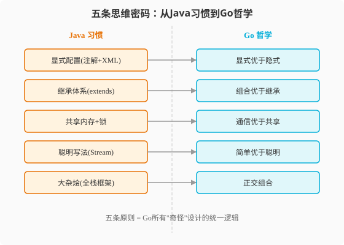

### 第2章 Go的思维密码：五条原则重塑你的编程大脑

> 📖 本章你将学会：
> - 用五条核心原则理解Go所有"奇怪"设计背后的统一逻辑
> - 对照Java思维习惯，列出必须扔掉的10个旧习惯
> - 用一张认知映射表把Java概念翻译成Go概念
> - 判断"这段Go代码是惯用法还是Java翻译体"

---

#### 2.1 五条原则重塑你的编程大脑

##### 2.1.1 开篇：换大脑比换语言难

你有没有过这样的经历——去国外旅行，明明学了点当地语言，
但点餐时脱口而出的还是英语？

学Go也一样。语法一周就能学会，但**思维方式**的转变需要几个月。
原因很简单：你的Java大脑里刻着十几年的肌肉记忆——看到问题先想类图、
看到并发先想锁、看到错误先想try-catch。这些反应快到你自己都意识不到。

Rob Pike 曾多次强调：语言不仅决定你写代码的方式，也塑造你看待问题的思维方式[^pike-language-thought]。

> 编程语言影响编程思维——你习惯的语法会悄悄限定你能想象出的解决方案。
> （此为 Rob Pike 系列演讲与访谈中反复表达的观点，非精确原话）

Go的思维密码不是25个关键字，而是**五条设计原则**。它们像五根柱子，
撑起了Go语言的整座建筑。理解了这五根柱子，你就能预测Go在任何场景下
的"正确写法"——因为你理解了它为什么这样设计。



---

#### 2.2 原则一：显式优于隐式（Explicit > Implicit）

Java世界里充满了"魔法"：Spring的`@Autowired`偷偷帮你注入依赖，
Lombok的`@Data`偷偷生成getter/setter，Hibernate的`@Entity`偷偷
管理对象生命周期。这些魔法提高了开发效率，但也制造了大量"看不见的行为"——
你读代码时看到的是一个注解，但背后发生了一连串隐式操作。

Go的选择截然不同：**把一切摆在台面上。**

| Java的隐式魔法 | Go的显式替代 | 差异 |
|------|------|------|
| `@Autowired` 依赖注入 | 手写初始化函数 | 看得见依赖链 |
| `@Override` 方法重写 | 无（没有继承就没有重写） | 不需要标记 |
| Lombok `@Data` | 手写或直接暴露字段 | 字段访问一目了然 |
| Hibernate 懒加载 | 显式查询 | 没有"代理对象"陷阱 |
| 异常自动传播 | `if err != nil` 手动传递 | 每一步都看得见错误 |
| `Thread.interrupt()` | `context.Cancel()` 显式取消 | 取消信号可见 |

> 💡 提示：Java的"魔法"不是坏事——在大型团队中，约定优于配置能减少
> 重复劳动。但Go的受众是基础设施开发者，他们需要**完全掌控代码行为**。
> 显式意味着可预测，可预测意味着可靠。

**代码对比：依赖注入**

```java
// Java: Spring 隐式注入
@Service
public class OrderService {
    @Autowired
    private PaymentGateway gateway; // 谁注入的？怎么注入的？看不出来

    public Order create(OrderRequest req) {
        gateway.charge(req.getAmount()); // gateway从哪来？编译期不知道
        return new Order(req);
    }
}
```

```go
// Go: 显式构造
type OrderService struct {
    gateway PaymentGateway // 依赖明确写在struct里
}

// 显式工厂函数，依赖关系一目了然
func NewOrderService(gateway PaymentGateway) *OrderService {
    return &OrderService{gateway: gateway}
}

func (s *OrderService) Create(req OrderRequest) (*Order, error) {
    if err := s.gateway.Charge(req.Amount); err != nil {
        return nil, err // 错误显式处理
    }
    return &Order{Request: req}, nil
}
```

Go版本多了几行"脚手架"代码，但任何人读`NewOrderService`就知道
这个服务依赖什么、怎么构造。没有XML配置，没有注解扫描，没有运行时
反射。**代码即文档。**

---

#### 2.3 原则二：组合优于继承（Composition > Inheritance）

在Java的世界里，"复用代码"的默认答案是继承。你写一个`BaseController`，
然后`UserController extends BaseController`，`OrderController extends
BaseController`。看起来优雅——但三个月后你想改`BaseController`的一个
方法签名，二十个子类全炸了。

Go没有继承。连`extends`关键字都不存在。复用代码的方式是**嵌入（Embedding）**：

```go
// Go: 嵌入复用
type BaseController struct {
    logger *log.Logger
}

func (c *BaseController) Log(msg string) {
    c.logger.Println(msg)
}

// UserController "嵌入" BaseController，获得其字段和方法
type UserController struct {
    BaseController // 嵌入——不是继承！
    repo UserRepository
}

func (c *UserController) GetUser(id string) (*User, error) {
    c.Log("getting user: " + id) // 直接调用，像继承一样方便
    return c.repo.Find(id)
}
```

看起来像继承？但本质完全不同：

| 维度 | Java继承 | Go嵌入 | 差异 |
|------|----------|--------|------|
| 关系 | is-a（是一种） | has-a（有一个） | 父子 vs 组件 |
| 耦合 | 强（改父类影响所有子类） | 弱（可随时替换组件） | 树形依赖 vs 独立拼装 |
| 多态 | 虚方法分派 | 接口（独立机制） | 继承链内 vs 接口跨链 |
| `super` | 有（可调父类方法） | 无（但可直接用嵌入类型名调用） | 有限 |
| 层级 | 可多层继承 | 可多层嵌入，但无"层级"概念 | 树 vs 积木 |

> 💡 比喻：Java继承像家族企业——子承父业，改一代影响三代。
> Go嵌入像乐高积木——每块独立，想拼就拼，想拆就拆。

---

#### 2.4 原则三：通信优于共享（Communication > Sharing）

这条原则是Go并发的灵魂，也是Java程序员最大的思维转弯。

Java并发模型的核心是**共享内存+锁**：多个线程访问同一个变量，
用`synchronized`或`ReentrantLock`保护，小心翼翼地避免死锁。

Go并发模型的核心是**CSP（Communicating Sequential Processes）**：
多个Goroutine各自持有自己的数据，通过Channel传递消息，默认不共享。

```
Java思维：                         Go思维：
  线程A ──┐                        Goroutine A ──→ [Channel] ──→ Goroutine B
          ├── 共享变量 + Lock          （各自持有数据，通过管道传递）
  线程B ──┘
```

这不是说Go不能用锁——`sync.Mutex`存在且常用。但Go的**默认优先级**
和Java相反：

| 场景 | Java第一反应 | Go第一反应 |
|------|-------------|------------|
| Goroutine间传数据 | 共享变量+锁 | Channel |
| 保护共享状态 | synchronized | sync.Mutex（合理使用） |
| 等待一组任务完成 | CountDownLatch | sync.WaitGroup |
| 定时/超时控制 | ScheduledExecutor | context.WithTimeout / time.After |
| 扇出扇入模式 | 线程池+Future | 多Goroutine + Channel合并 |

> 💡 比喻：Java并发像一群人抢一个白板——得轮流写（锁），抢不到就排队。
> Go并发像一群人用对讲机——各自有自己的白板，需要分享时通过对讲机
> （Channel）发消息，不抢不挤。

---

#### 2.5 原则四：简单优于聪明（Simple > Clever）

Java文化鼓励"聪明"的代码——设计模式、抽象层、泛型约束、Lambda组合、
Stream链式调用。一段代码如果能用三行写出别人十行才能实现的功能，
Java程序员会觉得"优雅"。

Go文化恰恰相反。Rob Pike 在 Go Proverbs 演讲中有一句名言：

> "清晰优于聪明。"（Clear is better than clever.）
> —— Rob Pike, Go Proverbs, Gopherfest SV 2015[^go-proverbs]

Go社区的审美是：**代码应该无聊到任何人都能一眼看懂。**

| Java的"聪明" | Go的"无聊" | 差异 |
|------|------|------|
| Stream.map().filter().collect() | for循环 | 直白可读 |
| 抽象工厂+策略模式+依赖注入 | switch + 函数变量 | 少一层间接 |
| 泛型通配符 `<? extends T>` | `T`约束（1.18+） | 更简单 |
| 反射动态调用 | 接口+类型断言 | 编译期可检查 |
| 动态代理AOP | 中间件函数 | 显式可见 |

```java
// Java: "聪明"的Stream写法
List<String> names = users.stream()
    .filter(u -> u.getAge() > 18)
    .map(User::getName)
    .sorted()
    .collect(Collectors.toList());
```

```go
// Go: "无聊"的for循环写法
var names []string
for _, u := range users {
    if u.Age > 18 {
        names = append(names, u.Name)
    }
}
sort.Strings(names)
```

Go版本更长？是的。但任何会编程的人都能秒读Go版本，而Stream版本
需要你熟悉`Collectors`、方法引用和函数式接口。在代码审查和紧急排障时，
"无聊"的代码胜过"聪明"的代码。

> ⚠️ 注意：这不是说Go不支持函数式风格——Go 1.18+的泛型和1.21+的
> `slices`/`maps`标准库包提供了类似Stream的能力。但Go社区的**默认审美**
> 仍然是简单循环。只有在循环确实冗长时才考虑用`maps.Filter`等工具。

---

#### 2.6 原则五：正交组合（Orthogonal Composition）

Go的25个关键字不是随意选择的——它们被设计成**正交**的：每个关键字
解决一个独立的问题，关键字之间不重叠。

对比Java的50个关键字，很多功能重叠：`for`和`while`都是循环，
`final`和`private`都是限制，`abstract`和`interface`都是抽象。
Java程序员需要在多个等价选项中做选择，增加了认知负担。

Go的设计是：**每个概念只有一个表达方式。**

| 概念 | Java的选择 | Go的选择 | Go的简化 |
|------|----------|----------|----------|
| 循环 | `for` / `while` / `do-while` | `for`（三合一） | 一个关键字搞定三种循环 |
| 可见性 | `public` / `private` / `protected` / 包级 | 首字母大小写 | 二级约定，零关键字 |
| 抽象 | `abstract class` / `interface` | `interface`（唯一抽象机制） | 只有一种抽象 |
| 初始化 | 构造函数 / `static {}` 初始化块 | 零值 + `init()` 函数 | 统一机制 |
| 类型声明 | `class` / `interface` / `enum` / `record` | `type`（统一关键字） | 一个关键字声明一切 |

```go
// Go的type关键字：声明结构体、接口、类型别名、函数类型——全靠它
type User struct { Name string }           // 结构体
type Reader interface { Read() ([]byte, error) } // 接口
type UserID int                              // 类型别名
type HandlerFunc func(w http.ResponseWriter, r *http.Request) // 函数类型
```

正交性带来的好处：**学完25个关键字，你就学完了Go的全部语法。**
没有隐藏规则，没有特例，没有"这个关键字在这个上下文中意思不同"。

---

#### 2.7 旧习惯清盘与认知映射

理解了五条原则，现在让我们做一次"旧习惯清盘"。以下10个Java习惯
在Go里要么没用，要么有害。每一条都标注了对应的Go替代方案。

| # | 必须扔掉的Java习惯 | Go替代方案 | 原则 |
|---|------|------|------|
| 1 | 给每个字段写getter/setter | 公开字段直接访问，需要验证时才封装 | 显式优于隐式 |
| 2 | 用继承复用代码 | 用嵌入（Embedding）组合 | 组合优于继承 |
| 3 | 用try-catch处理错误 | `if err != nil` 逐层传递 | 显式优于隐式 |
| 4 | 用异常做流程控制 | error值 + 正常控制流 | 简单优于聪明 |
| 5 | 共享变量+锁做并发通信 | 优先用Channel传递数据 | 通信优于共享 |
| 6 | 设计大型继承体系 | 定义小接口+组合 | 组合优于继承 |
| 7 | 过度抽象（工厂的工厂） | 写具体代码，需要时再抽象 | 简单优于聪明 |
| 8 | 用注解配置行为 | 写显式代码 | 显式优于隐式 |
| 9 | 一个文件放多个public类 | 一个package按职责组织，文件名自由 | 正交组合 |
| 10 | 用`instanceof`做类型判断 | 接口+类型断言（type switch） | 正交组合 |

> ⚠️ 陷阱：第1条和第5条是Java程序员最难改的。getter/setter在Java里
> 是"好习惯"（封装），在Go里是"反模式"（冗余）。锁在Java里是默认选择，
> 在Go里是Channel的备选。这两个习惯的"反转"需要刻意练习。

---

#### 2.8 Java → Go 认知映射表

这张表是后续所有章节的导航图。把它拍照存手机，随时查阅。

| Java概念 | Go对应 | 形似度 | 陷阱说明 |
|------|------|------|------|
| `class` | `struct` + `method` | ⭐⭐⭐ | 无继承，方法是独立函数 |
| `interface`（显式实现） | `interface`（隐式实现） | ⭐⭐ | 不需声明implements |
| `extends` | 嵌入（Embedding） | ⭐⭐ | 不是继承，是组合 |
| `abstract class` | `interface` | ⭐ | 只有接口一种抽象 |
| `try-catch-finally` | `if err != nil` + `defer` | ⭐⭐ | error是值不是控制流 |
| `throw new Exception` | `return err` | ⭐⭐ | 不能跨层自动传播 |
| `Thread` | `Goroutine` | ⭐⭐⭐ | 轻量1000倍，模型不同 |
| `synchronized` | `sync.Mutex` | ⭐⭐⭐ | 用法类似，但Channel优先 |
| `BlockingQueue` | `chan` | ⭐⭐⭐ | 语义接近但更原生 |
| `volatile` | 无直接对应 | ⭐ | 用atomic或Channel替代 |
| `CompletableFuture` | Goroutine + Channel | ⭐ | 完全不同的异步模型 |
| `Optional<T>` | `*T`（指针）+ nil检查 | ⭐⭐ | 指针就是"可能为空" |
| `enum` | `const` + `iota` | ⭐⭐ | 没有类型安全的枚举 |
| `annotation` | 无（用代码生成替代） | ⭐ | Go没有注解 |
| `record`（Java 14+） | `struct` | ⭐⭐⭐ | struct天然就是数据载体 |
| `var`（Java 10+） | `:=`（短变量声明） | ⭐⭐⭐ | 只能局部变量 |
| `static`方法 | 包级函数 | ⭐⭐ | 不需要挂在struct上 |
| `final`变量 | `const`（编译期）/ 变量不可变靠约定 | ⭐ | Go没有const变量 |
| `package private` | 小写首字母 | ⭐⭐ | 约定而非关键字 |
| `import` | `import` | ⭐⭐⭐ | 路径就是仓库地址 |

标⭐⭐⭐的映射"形似神也似"，可以放心迁移。标标⭐⭐的"形似神不似"，
需要理解差异。标⭐的"形不似神也不似"，需要重新学习。

---

#### ⚡ 2.9 性能贴士

思维习惯不仅影响代码风格，还直接影响性能。以下是Java思维写Go
时的常见性能问题：

| Java思维 | 性能问题 | Go正确做法 | 性能提升 |
|------|------|------|------|
| 每个对象都new | GC压力增大 | 用零值初始化 + sync.Pool复用 | 减少50%+ GC |
| 到处加锁 | 锁竞争成为瓶颈 | 用Channel避免共享 | 吞吐量提升数倍 |
| 过度封装（多层wrapper） | 额外内存分配+间接调用 | 扁平化结构体 | 减少逃逸 |
| 异常处理做流程 | 栈展开开销 | error值传递 | 零开销 |
| 大对象深层拷贝 | 内存拷贝开销 | 用指针传递大结构 | 避免拷贝 |

> 💡 性能口诀：**Java思维写Go，性能减半跑不快；显式组合通信好，
> 减法减出高性能。**

---

#### 本章小结

1. **五条原则是Go的思维DNA** —— 显式优于隐式、组合优于继承、通信优于
   共享、简单优于聪明、正交组合。每条都和Java的"默认值"相反。

2. **显式是Go的第一审美** —— 没有注解魔法，没有隐式控制流，没有运行时
   反射注入。代码即文档，看得见的才可靠。

3. **组合不是继承的退化版** —— 它是更好的复用方式。乐高积木比家族企业
   灵活一百倍，且不会"牵一发而动全身"。

4. **通信优于共享是并发分水岭** —— Java默认共享+锁，Go默认Channel+各自
   持有。这个优先级反转是Java→Go最大的思维转弯。

5. **10个旧习惯必须清盘** —— getter/setter、继承、try-catch、注解配置、
   过度抽象……这些Java"好习惯"在Go里是"反模式"。

> 🤔 思考题：本章说Go"只有25个关键字"，Java有50个。你觉得关键字少
> 是优势还是限制？什么样的场景下，"少"反而比"多"更强大？
> 带着这个问题，我们进入第3章——搭建Go的开发环境。

---

[^pike-language-thought]: Rob Pike 在多次演讲中表达过"编程语言影响思维方式"的观点，最著名的体现是 Go Proverbs 演讲（Gopherfest SV 2015）。此处为观点转述，非逐字引用。

[^go-proverbs]: Rob Pike, "Go Proverbs", Gopherfest SV 2015（2015年11月18日）。完整格言列表见 [https://go-proverbs.github.io/](https://go-proverbs.github.io/)
