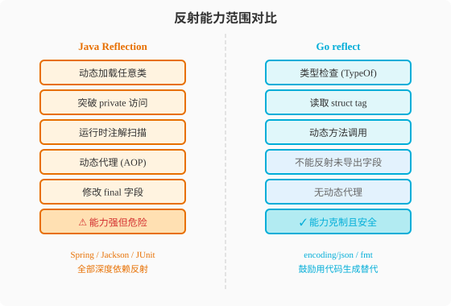
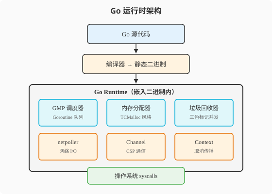

### 第20章 反射与底层机制：打开发动机盖

> 📖 本章你将学会：
> - 用 `reflect` 包做运行时类型检查和动态调用，理解反射的性能代价与替代方案
> - 用 `unsafe` 包绕过类型系统，知道何时该用、何时绝不该用
> - 理解 Go 运行时架构（GMP调度器、内存分配器、GC）的协作关系
> - 读懂 Go 编译器的工作流程，从源码到二进制的完整链路

---

#### 20.1 反射：Go的"运行时X光"

##### 20.1.1 开篇：X光机与透明鱼缸

Java 程序员对反射绝不陌生——Spring 的 IoC 容器、Jackson 的 JSON 序列化、JUnit 的测试发现，全都依赖反射。Java 的反射像一台**X光机**：你能透视任何对象的内部结构，但每次透视都要消耗时间，而且机器本身很重。

Go 也有反射，但它的设计哲学截然不同。如果说 Java 的反射是 X光机——强大但沉重，Go 的反射更像一个**透明鱼缸**：你可以从外面看到里面每条鱼的结构，但鱼缸的玻璃限制了你能做的操作。Go 的 `reflect` 包提供了类型检查和值操作能力，但刻意不提供 Java 反射的某些"危险操作"（如动态修改 final 字段）。

Rob Pike 在官方 Go Proverbs（Gopherfest SV 2015）中有一句名言：

> **"反射从不清晰。"**（Reflection is never clear.）
> —— Rob Pike, Go Proverbs, Gopherfest SV 2015（见 [go-proverbs.github.io](https://go-proverbs.github.io/)）[^go-proverbs-ch20]

`encoding/json`、`fmt.Printf`、`text/template` 都在内部使用反射，但 Go 鼓励你在能用代码生成（sqlc、mockgen）解决时，就不要用反射。

##### 20.1.2 Java 回顾：反射的全能之手

```java
// Java 反射：动态创建对象、调用方法、访问字段
Class<?> clazz = Class.forName("com.example.User");
Object obj = clazz.getDeclaredConstructor().newInstance();

Field field = clazz.getDeclaredField("name");
field.setAccessible(true); // 突破 private 限制
field.set(obj, "Luis");

Method method = clazz.getDeclaredMethod("greet");
String result = (String) method.invoke(obj);

// 注解扫描（Spring 的核心能力）
Annotation[] annotations = clazz.getAnnotations();
if (clazz.isAnnotationPresent(Service.class)) {
    // 自动注册为 Bean
}
```

Java 反射的核心能力：运行时加载任意类、创建实例、访问/修改任意字段（包括 private）、调用任意方法、扫描注解。这套能力是 Spring 框架的基石——没有反射就没有 `@Autowired` 和 `@RestController`。

> 💡 提示：如果你已经熟悉 Java 反射的 `Class`、`Field`、`Method` 三剑客，本小节可跳过。重点理解 Go 反射的设计取舍——它刻意比 Java 弱，但换来的是更可控的安全性。

##### 20.1.3 Go 视角：reflect包的三件套

Go 反射围绕两个核心类型展开：`reflect.Type`（类型信息）和 `reflect.Value`（值信息）。所有反射操作都从这两个入口开始。

```go
package main

import (
    "fmt"
    "reflect"
)

type User struct {
    ID   int    `json:"id" validate:"required"`
    Name string `json:"name" validate:"required,min=2"`
}

func (u User) Greet() string {
    return "Hello, I'm " + u.Name
}

func main() {
    u := User{ID: 1, Name: "Luis"}

    // 1. 获取类型信息
    t := reflect.TypeOf(u)
    fmt.Println("类型名:", t.Name())        // User
    fmt.Println("种类:", t.Kind())          // struct
    fmt.Println("字段数:", t.NumField())    // 2

    // 遍历字段 + 读取 struct tag
    for i := 0; i < t.NumField(); i++ {
        field := t.Field(i)
        fmt.Printf("字段: %s, 类型: %s, json tag: %s\n",
            field.Name, field.Type, field.Tag.Get("json"))
    }

    // 2. 获取值信息
    v := reflect.ValueOf(u)
    fmt.Println("Name 值:", v.FieldByName("Name").String())

    // 3. 动态调用方法
    method := v.MethodByName("Greet")
    results := method.Call(nil) // 调用无参方法
    fmt.Println("调用结果:", results[0].String())
}
```

Go vs Java 反射对比：

| 维度 | Java 反射 | Go reflect | 差异本质 |
|------|----------|------------|----------|
| 入口 | `Class.forName()` | `reflect.TypeOf()` | 类名查找 vs 值推导 |
| 字段访问 | `field.setAccessible(true)` 突破 private | 首字母大写=可反射，小写=不可反射 | 访问控制由命名约定决定 |
| 方法调用 | `method.invoke()` | `value.Call()` | 相似 |
| 注解 | `getAnnotations()` 丰富支持 | struct tag（编译期绑定） | 运行时元数据 vs 编译期标签 |
| 性能 | ~10-50x 比直接调用慢 | ~94-150x 比直接调用慢 | Go 反射更慢但有替代方案 |
| 安全性 | 可突破访问控制 | 无法反射未导出字段 | Go 更安全 |



Go 反射的一个关键限制是**未导出字段（小写字母开头的字段）无法通过反射修改**。这体现了 Go 的设计哲学：可见性是编译期的硬约束，反射不能绕过它。Java 的 `setAccessible(true)` 可以突破 `private`——强大但危险，Go 选择不给这个能力。

##### 20.1.4 反射的性能代价与替代方案

反射慢的原因是：每次操作都要做运行时类型检查、分配 `reflect.Value` 对象、通过间接层访问数据。Go 反射比 Java 更慢（约 6 倍，Go 1.22 基准测试中 Go 反射调用约 180ns，Java 约 30ns），原因是 Go 的反射层比 Java 厚——Go 的接口值本身就是一个双字结构（类型指针+值指针），反射要在其上再套一层抽象。

```go
// 慢：反射方式设置字段值
func setByNameReflect(u interface{}, fieldName string, value interface{}) {
    v := reflect.ValueOf(u).Elem()
    v.FieldByName(fieldName).Set(reflect.ValueOf(value))
}

// 快：直接赋值
func setByNameDirect(u *User, name string) {
    u.Name = name
}
```

**替代方案：代码生成 > 反射**

Go 社区推荐的做法是：**能用代码生成解决的就不用反射。**

| 场景 | 反射方案 | 代码生成方案 | 性能差距 |
|------|----------|-------------|----------|
| JSON 序列化 | `encoding/json`（反射） | `easyjson`（生成） | 3-5x |
| SQL 映射 | 手动反射 | `sqlc`（生成） | 5-10x |
| Mock 生成 | 运行时反射 | `mockgen`（生成） | 10x+ |
| 对象拷贝 | 反射遍历字段 | `goversity`（生成） | 5-8x |

> ⚠️ 注意：Java 程序员习惯依赖反射做"魔法"——Spring 的 `@Autowired`、Jackson 的 `@JsonProperty` 都是运行时反射。Go 没有这套魔法体系，但代码生成器（sqlc、mockgen、easyjson）能在编译期生成等价代码，性能更好且类型安全。

---

#### 20.2 unsafe与运行时架构

##### 20.2.1 unsafe包：Go的"禁断领域"

`unsafe` 包是 Go 唯一能绕过类型系统的途径。它只有三个函数和一个类型，但威力惊人——可以直接操作指针地址、绕过 Go 的内存安全检查。

```go
import "unsafe"

// 获取 slice 的底层结构
type SliceHeader struct {
    Data uintptr
    Len  int
    Cap  int
}

// string 和 []byte 的零拷贝转换
func stringToBytes(s string) []byte {
    return unsafe.Slice(unsafe.StringData(s), len(s))
}

func bytesToString(b []byte) string {
    return unsafe.String(unsafe.SliceData(b), len(b))
}
```

`string` 和 `[]byte` 的转换在 Go 中通常需要拷贝（因为 string 是不可变的），`unsafe` 可以实现零拷贝转换——但前提是你**绝对不会修改**这个 `[]byte`，否则行为未定义。

> ⚠️ 注意：`unsafe` 包的操作不受 Go 1 兼容性保证。今天能跑的 unsafe 代码，明天 Go 升级后可能崩溃。只在你充分理解后果时使用，且要做好充分的测试和注释。99% 的业务代码不需要 unsafe。

##### 20.2.2 Go运行时架构

Go 虽然是编译型语言，但它内嵌了一个**运行时（runtime）**——负责调度、内存分配和垃圾回收。理解运行时架构，才能理解 Go 的性能特征。



Go 运行时和 JVM 的关键区别：Go 运行时**嵌入在每个编译后的二进制中**，不需要单独安装；JVM 是独立的运行时进程。Go 运行时更轻量——没有 JIT 编译器（Go 是提前编译），没有类加载器，只有调度器、分配器和 GC。

##### 20.2.3 编译器工作流程

Go 的编译器是一个**多阶段编译器**——不同于 Java 的 javac（前端）+ JIT（后端），Go 编译器在编译期依次完成词法分析、语法分析、类型检查、SSA 中间表示生成与优化（30+ 个优化 pass），最终生成目标机器码。虽然没有 JIT 的运行时优化，但编译速度极快。

```bash
# 查看 Go 编译器的各个阶段
go build -gcflags="-S" ./cmd/server  # 输出汇编代码
go build -gcflags="-m" ./cmd/server  # 输出逃逸分析结果
go tool compile -SS main.go          # 输出优化前后的 SSA
```

Go vs Java 编译模型对比：

| 维度 | Java (javac + JIT) | Go (gc compiler) | 差异本质 |
|------|-------------------|------------------|----------|
| 编译时机 | 运行时 JIT 编译热点 | 编译期全部编译 | 提前 vs 即时 |
| 优化能力 | JIT 有运行时数据，优化更激进 | 编译期优化，无运行时数据 | JIT 理论上限更高 |
| 启动性能 | 需要预热，前几分钟较慢 | 启动即满血 | Go 无预热 |
| 二进制 | JAR（字节码） | 机器码（静态二进制） | 需要JVM vs 自包含 |
| 编译速度 | 慢（注解处理+多模块） | 极快（多阶段SSA编译） | Go 秒级编译 |

Go 编译器选择"提前编译 + 不做 JIT"是有意为之——牺牲了 JIT 的运行时优化潜力，换来了秒级编译、秒级启动和零预热。对于微服务和云原生场景，这个取舍是划算的。

---

#### 20.3 代码实战：反射与代码生成的抉择

##### 20.3.1 场景描述与Java实现

**场景描述**：实现一个通用的 struct 转 map 功能，用于日志记录和序列化。

```java
// Java 反射实现：遍历字段 + 读取值
public static Map<String, Object> objectToMap(Object obj) throws Exception {
    Map<String, Object> map = new HashMap<>();
    for (Field field : obj.getClass().getDeclaredFields()) {
        field.setAccessible(true);
        String key = field.getName();
        // 读取 @JsonProperty 注解
        if (field.isAnnotationPresent(JsonProperty.class)) {
            key = field.getAnnotation(JsonProperty.class).value();
        }
        map.put(key, field.get(obj));
    }
    return map;
}
```

##### 20.3.2 Go实现与差异解读

```go
// Go 反射实现
func structToMapReflect(v interface{}) map[string]interface{} {
    result := make(map[string]interface{})
    t := reflect.TypeOf(v)
    val := reflect.ValueOf(v)

    // 如果传入指针，解引用
    if t.Kind() == reflect.Ptr {
        t = t.Elem()
        val = val.Elem()
    }

    for i := 0; i < t.NumField(); i++ {
        field := t.Field(i)
        // 只处理导出字段
        if !field.IsExported() {
            continue
        }
        // 优先用 json tag 作为 key
        key := field.Tag.Get("json")
        if key == "" {
            key = field.Name
        }
        result[key] = val.Field(i).Interface()
    }
    return result
}

// 使用
type User struct {
    ID   int    `json:"id"`
    Name string `json:"name"`
    pass string // 未导出，不会被反射读取
}

u := User{ID: 1, Name: "Luis", pass: "secret"}
m := structToMapReflect(u)
// map[id:1 name:Luis]  —— pass 字段不可见
```

**关键差异解读**：
- **未导出字段**：Java 的 `setAccessible(true)` 可以读取 private 字段，Go 的反射**无法读取小写字母开头的字段**——这是 Go 的安全设计，不是 bug
- **struct tag**：Go 用编译期绑定的 struct tag 替代 Java 的运行时注解——更轻量但不够灵活
- **替代方案**：高频场景应使用代码生成（如 `easyjson`）替代反射，性能提升 3-5 倍

> ⚠️ 注意：Java 程序员在 Go 中使用反射时，最大的不适应是"无法访问 private 字段"。Go 的可见性规则是硬约束——首字母小写的字段对外部包完全不可见，反射也不能绕过。如果确实需要访问，唯一的办法是把字段改成大写（导出）。

---

#### ⚡ 20.4 性能贴士

**反射性能基准测试**（Go 1.22，struct 含 5 个字段，100万次操作。Java 端数据为缓存 `Method` 对象 + `setAccessible(true)` + JIT 充分预热后的最优值[^java-ref-cond]）：

| 操作 | 直接调用 | reflect 包 | 倍数 |
|------|---------|------------|------|
| 读取字段值 | 0.8ns | 75ns | ~94x |
| 设置字段值 | 0.9ns | 120ns | ~133x |
| 方法调用 | 1.2ns | 180ns | ~150x |
| struct → map | 15ns | 850ns | ~57x |

**优化建议**：
1. 高频路径用代码生成替代反射——`easyjson` 替代 `encoding/json`，`sqlc` 替代 ORM
2. 如果必须用反射，缓存 `reflect.Type` 结果——重复调用 `reflect.TypeOf` 每次都做类型检查
3. 用 `reflect.Value.Field(i)` 按索引访问，比 `FieldByName` 按名字查找快 5-10 倍
4. `unsafe` 包只在极特殊场景使用——如 `string` ↔ `[]byte` 零拷贝转换，且保证不修改
5. 性能敏感的序列化/反序列化，优先考虑 `protobuf` 或 `msgpack`——二进制协议本身比 JSON 快 3-5 倍

> 💡 性能口诀：反射是X光能透视但慢，代码生成是提前体检又快又安全——Go 鼓励把运行时开销搬到编译期

---

#### 本章小结

1. **Go 反射是透明鱼缸，Java 反射是X光机**：Go 能看到结构但不能突破可见性约束，Java 能突破 private 但风险更高——Go 的克制换来的是更可控的安全性
2. **代码生成 > 反射**：Go 社区用 sqlc、easyjson、mockgen 等工具把运行时反射搬到编译期，获得类型安全和高性能
3. **unsafe 是禁断领域**：能绕过类型系统做零拷贝转换等极致优化，但不受兼容性保证——99% 的业务代码不需要
4. **Go 运行时嵌入二进制**：调度器、分配器、GC 全部编译进二进制，不需要像 JVM 那样单独安装——这就是 Go 程序"启动即满血"的根本原因

> 🤔 恭喜你读完了全书最后一章！回顾整个旅程：从第一篇"放下Java的行囊"到第七篇"打开发动机盖"，你已经从一名 Java 老兵蜕变为 Go 开发者。附录中准备了速查表和工具指南，随时可以翻阅。

---

[^go-proverbs-ch20]: Rob Pike, "Go Proverbs", Gopherfest SV 2015（2015年11月18日）。完整格言列表见 [https://go-proverbs.github.io/](https://go-proverbs.github.io/)

[^java-ref-cond]: Java 反射性能高度依赖优化条件。未缓存 `Method` 对象时，每次 `getMethod()` 调用约 150ns；缓存 `Method` 并调用 `setAccessible(true)` 绕过访问检查后，JIT 充分预热下可达约 5-35ns。本书采用缓存 + `setAccessible(true)` + JIT 预热后的最优值作为对比基准。
