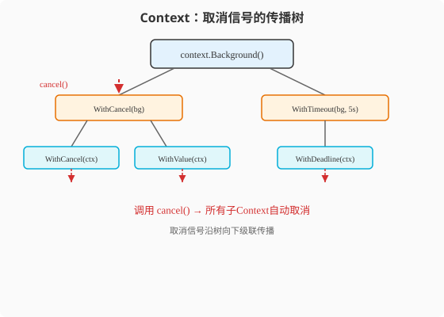

### 第10章 Context：Go并发取消的终极武器

> 📖 本章你将学会：
> - 理解Context解决了Java`Thread.interrupt()`无法解决的问题
> - 用`context.WithCancel`/`WithTimeout`/`WithValue`管理Goroutine生命周期
> - 在HTTP服务中正确传递Context实现请求级取消
> - 识别Context使用的六大反模式

---

#### 10.1 Context是什么

##### 10.1.1 开篇：Java中断的"假取消"问题

Java的`Thread.interrupt()`是一个**礼貌的请求**——它设置一个中断标志，
但如果线程在`sleep`/`wait`/`IO`阻塞中，会抛`InterruptedException`；
如果在正常运行，线程需要**自己检查**`Thread.interrupted()`并决定退出。

```java
// Java: 中断是"礼貌请求"，线程可以忽略
Thread t = new Thread(() -> {
    while (!Thread.interrupted()) { // 必须主动检查
        doWork(); // 如果这里不检查中断，线程永远不退出
    }
});
t.start();
t.interrupt(); // 只是"请"它退出，它可以拒绝
```

问题：如果线程在`CPU密集计算`中（不涉及阻塞IO），`interrupt()`无法
中断它——只能靠线程自己周期性检查。很多Java并发bug的根源就在于此。

Go的`context.Context`解决了这个问题——它是一套**显式的、可传递的、
不可违背的取消机制**。

> 💡 比喻：Java的interrupt像打电话说"你回来吧"——对方可以不接。
> Go的Context像消防警报——一旦响起，所有楼层的人必须撤离，
> 而且警报会层层传递到每个房间。

---

#### 10.2 Context的接口定义：四个方法

`context.Context`是一个接口，定义了四个方法：

```go
type Context interface {
    Deadline() (deadline time.Time, ok bool) // 截止时间
    Done() <-chan struct{}                   // 取消信号Channel
    Err() error                              // 取消原因
    Value(key any) any                       // 请求级值传递
}
```

核心是`Done()`——返回一个Channel，当Context被取消或超时时，
这个Channel会被关闭。Goroutine用`select`监听这个Channel就能
收到取消信号。

```go
func worker(ctx context.Context) {
    for {
        select {
        case <-ctx.Done(): // 收到取消信号
            fmt.Println("收到取消，退出:", ctx.Err())
            return
        default:
            doWork() // 正常工作
        }
    }
}
```

---

#### 10.3 三种Context创建方式

##### 10.3.1 WithCancel：手动取消

```go
ctx, cancel := context.WithCancel(context.Background())

go worker(ctx)

time.Sleep(2 * time.Second)
cancel() // 取消所有使用ctx的Goroutine
```

##### 10.3.2 WithTimeout：超时自动取消

```go
// 3秒后自动取消
ctx, cancel := context.WithTimeout(context.Background(), 3*time.Second)
defer cancel() // 即使提前完成也要cancel，释放资源

go worker(ctx)

// 等待结果或超时
select {
case result := <-resultCh:
    fmt.Println("完成:", result)
case <-ctx.Done():
    fmt.Println("超时:", ctx.Err()) // context deadline exceeded
}
```

##### 10.3.3 WithDeadline：到指定时间取消

```go
deadline := time.Date(2026, 1, 1, 0, 0, 0, 0, time.UTC)
ctx, cancel := context.WithDeadline(context.Background(), deadline)
defer cancel()
```

##### 10.3.4 WithValue：传递请求级值

```go
type key int
const userIDKey key = 0

ctx := context.WithValue(context.Background(), userIDKey, "user-123")

// 在任何深度取出
func handleRequest(ctx context.Context) {
    userID := ctx.Value(userIDKey).(string)
    fmt.Println("User:", userID)
}
```

> ⚠️ 注意：`WithValue`不是用来传业务参数的！它只适合传**请求级元数据**
> （trace ID、用户认证信息）。业务参数应该用函数参数显式传递。

---

#### 10.4 Context的传递链

Context的核心价值是**传递**——父Context取消，所有子Context自动取消。



```go
func main() {
    // 根Context
    rootCtx, cancel := context.WithCancel(context.Background())
    defer cancel()

    // 子Context（继承rootCtx的取消）
    childCtx, childCancel := context.WithTimeout(rootCtx, 5*time.Second)
    defer childCancel()

    // 孙Context
    grandCtx, grandCancel := context.WithCancel(childCtx)
    defer grandCancel()

    // 三个Goroutine用不同层级的Context
    go worker("root", rootCtx)
    go worker("child", childCtx)
    go worker("grand", grandCtx)

    time.Sleep(2 * time.Second)
    cancel() // 取消root → child → grand全部取消
    time.Sleep(time.Second)
}

func worker(name string, ctx context.Context) {
    <-ctx.Done()
    fmt.Printf("%s 被取消: %v\n", name, ctx.Err())
}
// 输出:
// root 被取消: context canceled
// child 被取消: context canceled
// grand 被取消: context canceled
```

```
rootCtx (cancel)
  └─ childCtx (5s timeout)
       └─ grandCtx (cancel)

cancel(rootCtx) → childCtx取消 → grandCtx取消（级联传播）
```

---

#### 10.5 HTTP服务中的Context

Go 1.7+的`net/http`自动为每个请求创建Context，绑定到`r.Context()`：

```go
func handler(w http.ResponseWriter, r *http.Request) {
    ctx := r.Context() // 请求级Context

    // 客户端断开连接或请求超时时，ctx自动取消

    select {
    case result := <-slowDBQuery(ctx):
        json.NewEncoder(w).Encode(result)
    case <-ctx.Done():
        log.Println("请求取消:", ctx.Err())
        return
    }
}

// 数据库查询支持Context
func slowDBQuery(ctx context.Context) <-chan Result {
    out := make(chan Result, 1)
    go func() {
        defer close(out)
        // 模拟慢查询
        select {
        case <-time.After(5 * time.Second):
            out <- Result{Data: "done"}
        case <-ctx.Done():
            return // 请求取消，停止查询
        }
    }()
    return out
}
```

对比Java Servlet——`HttpServletRequest`没有内置取消机制。Spring的
`AsyncContext`有超时但不支持级联传递。Go的Context是**全栈贯穿**的——
从HTTP handler到数据库查询到下游RPC调用，一条Context链传递取消信号。

---

#### 10.6 Context六大反模式

##### 10.6.1 反模式一：忘记调用cancel

```go
// ❌ 泄漏: WithTimeout的timer不被释放
func bad() {
    ctx, _ := context.WithTimeout(context.Background(), 5*time.Second)
    // cancel没调用！timer会一直运行直到超时
    go worker(ctx)
}

// ✅ 正确: defer cancel
func good() {
    ctx, cancel := context.WithTimeout(context.Background(), 5*time.Second)
    defer cancel() // 确保释放timer
    go worker(ctx)
}
```

##### 10.6.2 反模式二：把Context存在struct里

```go
// ❌ 差: Context存在struct字段中
type Service struct {
    ctx context.Context // 反模式！
}

// ✅ 好: Context作为函数参数传递
type Service struct {}
func (s *Service) DoWork(ctx context.Context) error { ... }
```

##### 10.6.3 反模式三：用Context传业务参数

```go
// ❌ 差: 用Context传业务参数
ctx := context.WithValue(ctx, "userID", 123)
ctx = context.WithValue(ctx, "action", "create")

// ✅ 好: 用函数参数
func DoWork(ctx context.Context, userID int, action string) error { ... }
```

##### 10.6.4 反模式四：用nil Context

```go
// ❌ 错: nil Context会panic
func work(ctx context.Context) {
    // 如果调用者传nil，这里ctx.Done()会panic
}

// ✅ 好: 用context.TODO()或context.Background()
func work(ctx context.Context) {
    if ctx == nil {
        ctx = context.TODO()
    }
}
```

##### 10.6.5 反模式五：不检查Done()的长计算

```go
// ❌ 差: 长计算不检查取消
func heavyCompute(ctx context.Context) Result {
    for i := 0; i < 1000000000; i++ {
        // 不检查ctx.Done()，请求取消了还在算
    }
}

// ✅ 好: 定期检查
func heavyCompute(ctx context.Context) Result {
    for i := 0; i < 1000000000; i++ {
        if i%1000000 == 0 {
            select {
            case <-ctx.Done():
                return Result{} // 取消了，提前退出
            default:
            }
        }
        // 计算
    }
}
```

##### 10.6.6 反模式六：在Channel操作中不select Done

```go
// ❌ 差: 只等Channel，不检查取消
func worker(ctx context.Context, jobs <-chan Job) {
    for job := range jobs { // 如果jobs永远不关闭，ctx取消也没用
        process(job)
    }
}

// ✅ 好: select同时监听jobs和ctx.Done
func worker(ctx context.Context, jobs <-chan Job) {
    for {
        select {
        case <-ctx.Done():
            return
        case job, ok := <-jobs:
            if !ok { return }
            process(job)
        }
    }
}
```

---

#### 10.7 代码实战：带超时的并发API聚合

**场景**：同时调用3个下游API，任意一个超时或整体超时则返回部分结果。

```go
package main

import (
    "context"
    "fmt"
    "math/rand"
    "sync"
    "time"
)

type APIResponse struct {
    Name   string
    Data   string
    Err    error
    Time   time.Duration
}

func callAPI(ctx context.Context, name string, maxDelay int) APIResponse {
    start := time.Now()
    delay := time.Duration(rand.Intn(maxDelay)) * time.Millisecond

    select {
    case <-time.After(delay):
        return APIResponse{
            Name: name,
            Data: fmt.Sprintf("%s响应(延迟%dms)", name, delay.Milliseconds()),
            Time: time.Since(start),
        }
    case <-ctx.Done():
        return APIResponse{
            Name: name,
            Err:  ctx.Err(),
            Time: time.Since(start),
        }
    }
}

func aggregateAPIs(ctx context.Context) []APIResponse {
    apis := []struct {
        name     string
        maxDelay int
    }{}{
        {"UserService", 500},
        {"OrderService", 800},
        {"PaymentService", 1500},
    }

    results := make([]APIResponse, len(apis))
    var wg sync.WaitGroup

    for i, api := range apis {
        wg.Add(1)
        go func(idx int, name string, delay int) {
            defer wg.Done()
            results[idx] = callAPI(ctx, name, delay)
        }(i, api.name, api.maxDelay)
    }

    wg.Wait()
    return results
}

func main() {
    rand.Seed(time.Now().UnixNano())

    // 整体超时1秒
    ctx, cancel := context.WithTimeout(context.Background(), 1000*time.Millisecond)
    defer cancel()

    results := aggregateAPIs(ctx)

    fmt.Println("=== API聚合结果 ===")
    for _, r := range results {
        if r.Err != nil {
            fmt.Printf("%s: 失败 (%v) - %v\n", r.Name, r.Err, r.Time)
        } else {
            fmt.Printf("%s: 成功 - %s (%v)\n", r.Name, r.Data, r.Time)
        }
    }
}
// 可能输出:
// UserService: 成功 - UserService响应(延迟~300ms) (350ms)
// OrderService: 成功 - OrderService响应(延迟~700ms) (750ms)
// PaymentService: 失败 (context deadline exceeded) - 1s
```

---

#### ⚡ 10.8 性能贴士：Context开销

Context本身很轻量——它只是一个接口，实现是几个指针：

| 操作 | 开销 | 说明 |
|------|------|------|
| `context.Background()` | ~0ns | 全局单例，无分配 |
| `WithCancel` | ~50ns | 创建cancelCtx |
| `WithTimeout` | ~100ns | 创建timerCtx+timer |
| `WithValue` | ~80ns | 创建valueCtx |
| `<-ctx.Done()` | ~0ns | 读Channel（未关闭时不阻塞） |

**优化建议**：

1. **不要在热路径频繁创建Context**：请求级创建一次，传递下去
2. **`WithValue`慎用**：每次WithValue创建新对象，链过长影响性能
3. **`defer cancel()`必须有**：WithTimeout的timer不释放会泄漏

> 💡 性能口诀：**Context轻如毛，传递取消不费毫；WithValue别滥用，
> defer cancel不能少。**

---

#### 本章小结

1. **Context是Go并发取消的终极武器** —— 解决了Java`Thread.interrupt()`
   的"假取消"问题。取消信号通过Context链级联传播。

2. **三种创建方式** —— `WithCancel`（手动取消）、`WithTimeout`（超时
   自动取消）、`WithValue`（传请求级值）。`defer cancel()`必须写。

3. **Context传递链是核心** —— 父Context取消，所有子Context自动取消。
   从HTTP handler到DB查询到RPC调用，一条链贯穿。

4. **六大反模式要避免** —— 忘记cancel、存在struct里、传业务参数、
   用nil、长计算不检查、Channel操作不select Done。

5. **Context开销极小** —— 几十纳秒级，日常使用无需担心性能。

> 🤔 思考题：Context可以传递取消信号和超时，但Go的工程化能力
> 远不止并发。第四篇——工程实践，从项目结构到测试到部署。
