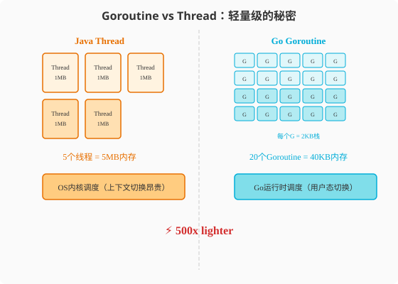

### 第8章 并发模型与Goroutine：从1:1到M:N的范式跃迁

> 📖 本章你将学会：
> - 理解Java线程(1:1)和Goroutine(M:N)的本质差异
> - 用一张架构图理解Go的GMP调度模型
> - 用`go`关键字启动Goroutine并管理其生命周期
> - 用`sync.Mutex`/`sync.WaitGroup`/`sync.Once`保护共享状态

---

#### 8.1 并发模型：从1:1到M:N

##### 8.1.1 开篇：出租车 vs 共享单车

Java的线程像出租车——贵但靠谱。每辆车需要1MB内存（栈空间），需要
操作系统分配（系统调用），需要司机（OS内核调度）。你的车队最多
几千辆，再多就堵了（内存耗尽、切换开销激增）。

Goroutine像共享单车——便宜到随手用。每辆车只要2KB内存（初始栈），
用户态分配（无系统调用），Go runtime自己调度。你可以同时停一万辆
在门口，毫无压力。

```java
// Java: 创建10000个线程——很可能OOM
for (int i = 0; i < 10000; i++) {
    new Thread(() -> {
        try { Thread.sleep(1000); } catch (Exception e) {}
    }).start(); // 每个线程~1MB栈 = 10GB内存！
}
```

```go
// Go: 创建100万个Goroutine——毫无压力
for i := 0; i < 1_000_000; i++ {
    go func() {
        time.Sleep(time.Second)
    }()
}
// 100万个Goroutine × 2KB = ~2GB，且Go runtime高效调度
```

> 💡 比喻：Java线程像出租车——贵但可靠，有司机帮你处理路线。
> Goroutine像共享单车——便宜到随手用，但你得自己管理停在哪（生命周期）。

---

#### 8.2 线程模型：1:1 vs M:N

##### 8.2.1 Java的1:1模型

Java线程和操作系统线程是1:1映射——创建一个Java线程，内核就创建
一个OS线程：

```
Java线程          OS线程
┌─────┐          ┌─────┐
│ T1  │ ───────→ │ OT1 │  内核调度
├─────┤          ├─────┤
│ T2  │ ───────→ │ OT2 │  每个线程~1MB栈
├─────┤          ├─────┤
│ T3  │ ───────→ │ OT3 │  上下文切换~1μs
└─────┘          └─────┘
```

优点：简单可靠，OS调度器成熟。缺点：创建/切换成本高，数量受限。

##### 8.2.2 Go的M:N模型

M个Goroutine映射到N个OS线程——Go runtime负责调度：

```
Goroutines          Go Runtime          OS线程
┌────┐                                 ┌─────┐
│ G1 │ ──┐                             │ OT1 │ ← M1
├────┤  │  ┌─────────────┐             ├─────┤
│ G2 │ ──┼→│  Scheduler  │ ──→ ──→ ──→│ OT2 │ ← M2
├────┤  │  │  (P×G→M)    │             ├─────┤
│ G3 │ ──┘  └─────────────┘             │ OT3 │ ← M3
├────┤                                  ├─────┤
│ G4 │ (等待)                            │ OT4 │ ← M4
├────┤                                  └─────┘
│...  │
│G100│
└────┘
```

- **G（Goroutine）**：用户态轻量协程，2KB初始栈
- **M（Machine）**：OS线程，由Go runtime管理
- **P（Processor）**：逻辑处理器，持有本地Goroutine队列，默认数量=GOMAXPROCS

Go runtime的调度器负责把G分配到P上，P绑定到M上执行。当G阻塞时
（如IO操作），调度器会把M让给其他G，避免OS线程被浪费。

---

#### 8.3 GMP调度模型详解

GMP是Go并发的核心引擎，理解它能解释很多Go的"奇怪行为"。

##### 8.3.1 GMP工作流程

```
┌──────────────────────────────────────────────────┐
│                  Go Runtime                       │
│                                                   │
│  ┌─── P0 ───┐  ┌─── P1 ───┐  ┌─── P2 ───┐       │
│  │ 本地队列  │  │ 本地队列  │  │ 本地队列  │       │
│  │ [G1→G2→G3]│  │ [G4→G5  ]│  │ [G6→G7  ]│       │
│  └────┬─────┘  └────┬─────┘  └────┬─────┘       │
│       │              │              │              │
│       ↓              ↓              ↓              │
│  ┌─── M0 ───┐  ┌─── M1 ───┐  ┌─── M2 ───┐       │
│  │ OS线程   │  │ OS线程   │  │ OS线程   │       │
│  │ 执行G1   │  │ 执行G4   │  │ 执行G6   │       │
│  └──────────┘  └──────────┘  └──────────┘       │
│                                                   │
│  全局队列: [G8→G9→G10→...]  (溢出的Goroutine)     │
│                                                   │
│  网络轮询器: [G11(netpoll), G12(netpoll)]         │
└──────────────────────────────────────────────────┘
```

> 💡 比喻：GMP像连锁健身房：G（会员）在M（教练）指导下训练，
> P（健身房）提供器械。教练不够时会员排队等候，有空闲教练立刻接手。



##### 8.3.2 调度策略

**Work Stealing（工作窃取）**：当P的本地队列空了，它会从其他P的
队列偷一半Goroutine来执行——负载均衡。

**Hand Off（交接）**：当G阻塞（系统调用），M也被阻塞。调度器
把P和M解绑，把P交给另一个空闲M或创建新M——保证其他G不饿死。

**Network Poller（网络轮询器）**：网络IO不阻塞M，而是用epoll/kqueue
异步等待。G阻塞在网络IO时，M可以去执行其他G。

##### 8.3.3 GOMAXPROCS

`GOMAXPROCS`决定P的数量——也就是同时执行Goroutine的OS线程数。
默认值是CPU核心数。

```go
runtime.GOMAXPROCS(4) // 使用4个P（4个OS线程并行执行Goroutine）
```

> ⚠️ 注意：`GOMAXPROCS`不限制Goroutine数量！100万个Goroutine可以
> 在4个P上调度执行。它只限制"同时运行的Goroutine数"。

---

#### 8.4 创建成本量化对比

| 指标 | Java Thread | Go Goroutine | 倍数 |
|------|-------------|--------------|------|
| 初始栈大小 | ~1MB | ~2KB | 500x |
| 创建时间 | ~1ms | ~1μs | 1000x |
| 上下文切换 | ~1μs（内核切换） | ~100ns（用户态切换） | 10x |
| 最大数量(8GB内存) | ~8000 | ~4,000,000 | 500x |
| 调度方式 | OS抢占式 | Go runtime协作式+信号抢占(1.14+) | 不同 |

```go
// 实测：创建10万个Goroutine
start := time.Now()
for i := 0; i < 100_000; i++ {
    go func() {
        time.Sleep(time.Second)
    }()
}
fmt.Println("创建10万Goroutine耗时:", time.Since(start))
// 输出: ~50ms（每个Goroutine约0.5μs）
```

```java
// 实测：创建1万个Thread（再多就OOM了）
long start = System.nanoTime();
for (int i = 0; i < 10_000; i++) {
    new Thread(() -> {
        try { Thread.sleep(1000); } catch (Exception e) {}
    }).start();
}
System.out.printf("创建1万Thread耗时: %dms%n", (System.nanoTime() - start) / 1_000_000);
// 输出: ~3000ms（每个Thread约0.3ms）且消耗~10GB内存
```

---

#### 8.5 CSP vs 共享内存：两种并发哲学

##### 8.5.1 Java的共享内存模型

```java
// Java: 共享变量 + 锁
public class Counter {
    private int count = 0;
    private final Object lock = new Object();

    public void increment() {
        synchronized (lock) {
            count++; // 互斥访问
        }
    }

    public int get() {
        synchronized (lock) {
            return count;
        }
    }
}
```

核心思想：**数据共享，访问互斥。** 多个线程看到同一个变量，用锁
保证同一时刻只有一个线程能修改。

##### 8.5.2 Go的CSP模型

```go
// Go: Channel传递数据所有权
func counter(in <-chan struct{}, out chan<- int) {
    count := 0
    for range in { // 收到信号
        count++
        out <- count // 通过Channel发送结果
    }
}

func main() {
    inc := make(chan struct{})
    result := make(chan int)

    go counter(inc, result) // 计数器Goroutine拥有count

    for i := 0; i < 5; i++ {
        inc <- struct{}{}        // 发送递增信号
        fmt.Println(<-result)    // 接收结果
    }
}
```

核心思想：**数据不共享，通过通信传递。** 每个Goroutine持有自己的
数据，通过Channel传递数据或信号。没有共享变量，不需要锁。

##### 8.5.3 何时用CSP，何时用共享内存

Go不是强制只用CSP——`sync.Mutex`存在且有用。选择原则：

| 场景 | 推荐方式 | 原因 |
|------|----------|------|
| Goroutine间传递数据 | Channel | CSP天然适合 |
| 保护共享配置/计数器 | sync.Mutex | 简单直接 |
| 扇出/扇入模式 | Channel | 多Goroutine合并 |
| 缓存/连接池 | sync.Mutex | 读写已存在的数据 |
| 生产者-消费者 | Channel | 天然管道 |
| 简单状态机 | sync.Mutex | 状态明确 |

> 💡 提示：Go的格言是"不要通过共享内存来通信，而要通过通信来共享内存"。
> 这不是"禁止用锁"，而是"**默认优先Channel，锁是备选**"——和Java的
> 优先级正好相反。

---

#### ⚡ 8.6 性能贴士：并发模型选择

| 场景 | Java方案 | Go方案 | Go优势 |
|------|----------|--------|--------|
| 100万并发连接 | Thread + Selector(NIO) | Goroutine(原生支持) | 代码简单10x |
| 扇出100个任务 | ThreadPool + Future | 100个Goroutine + WaitGroup | 无线程池管理 |
| 生产者-消费者 | BlockingQueue | Channel | 语言原生 |
| 定时任务 | ScheduledExecutor | time.Ticker + Goroutine | 更轻量 |
| 并发Map | ConcurrentHashMap | sync.Map / Channel | 不同场景 |

> 💡 性能口诀：**Java线程贵如金，Goroutine贱如土；百万并发不是梦，
> CSP通信最舒心。**

---

#### 8.7 并发原语：Goroutine、Mutex与WaitGroup

##### 8.7.1 开篇：从ThreadPoolExecutor到"直接go"

Java老兵写并发代码的第一反应是——"线程池在哪？"

```java
// Java: 线程池是标配
ExecutorService pool = Executors.newFixedThreadPool(100);
pool.submit(() -> doSomething());
pool.shutdown(); // 必须关闭，否则线程泄漏
```

Java需要线程池有两个原因：一是线程创建太贵（1ms+1MB），需要复用；
二是需要控制并发数量，防止资源耗尽。

Go的Goroutine太轻量（1μs+2KB），**不需要线程池**——直接`go`就行：

```go
// Go: 直接go，不需要池
go doSomething()
```

但"不需要线程池"不等于"不需要管理"——你仍然需要控制并发数量
（用Channel或semaphore）、等待完成（用WaitGroup）、保护共享状态
（用Mutex）。只是工具变了。

---

#### 8.8 Goroutine基础

##### 8.8.1 启动Goroutine

```go
// 基本启动
go func() {
    fmt.Println("Hello from Goroutine")
}()

// 带参数（注意：传值拷贝，不是引用！）
name := "Alice"
go func(n string) {
    fmt.Println("Hello,", n)
}(name) // 传值

// 启动命名函数
go processRequest(req)
```

##### 8.8.2 Goroutine的生命周期问题

```go
// ❌ 危险: 主程序可能在Goroutine完成前退出
func main() {
    go func() {
        time.Sleep(time.Second)
        fmt.Println("done") // 可能永远不执行！
    }()
    // main直接退出，Goroutine被杀
}

// ✅ 正确: 用WaitGroup等待
func main() {
    var wg sync.WaitGroup
    wg.Add(1)
    go func() {
        defer wg.Done()
        time.Sleep(time.Second)
        fmt.Println("done")
    }()
    wg.Wait() // 等待Goroutine完成
}
```

> ⚠️ 陷阱：Java的线程是daemon=false时JVM会等待，Goroutine没有这个
> 保护——main函数返回，所有Goroutine立即被杀。必须用WaitGroup或
> Channel同步。

##### 8.8.3 闭包捕获陷阱（Go 1.22修复）

```go
// Go 1.21及之前: 所有闭包共享同一个i
for i := 0; i < 5; i++ {
    go func() {
        fmt.Println(i) // 可能输出: 5 5 5 5 5
    }()
}

// Go 1.22+: 每次迭代创建新i，输出: 0 1 2 3 4（顺序随机）

// 兼容写法: 显式传参
for i := 0; i < 5; i++ {
    go func(n int) {
        fmt.Println(n)
    }(i)
}
```

---

#### 8.9 sync.WaitGroup：等待一组Goroutine

`WaitGroup`是Go版的`CountDownLatch`——等待一组操作完成。

```go
var wg sync.WaitGroup

for i := 0; i < 5; i++ {
    wg.Add(1) // 计数+1
    go func(id int) {
        defer wg.Done() // 计数-1（确保调用）
        fmt.Printf("Worker %d done\n", id)
        time.Sleep(time.Duration(id) * 100 * time.Millisecond)
    }(i)
}

wg.Wait() // 阻塞直到计数归零
fmt.Println("All workers done")
```

对比Java：

```java
CountDownLatch latch = new CountDownLatch(5);
ExecutorService pool = Executors.newFixedThreadPool(5);

for (int i = 0; i < 5; i++) {
    final int id = i;
    pool.submit(() -> {
        try {
            System.out.printf("Worker %d done%n", id);
            Thread.sleep(id * 100);
        } catch (InterruptedException e) {
        } finally {
            latch.countDown();
        }
    });
}

latch.await();
System.out.println("All workers done");
pool.shutdown();
```

Go版本不需要线程池、不需要shutdown——更简洁。

**WaitGroup的三条铁律**：

1. `Add`必须在Goroutine外部调用（不要在Goroutine内Add）
2. `Done`用`defer`确保执行
3. `Wait`只能在所有Add之后调用

```go
// ❌ 错误: Add在Goroutine内，可能Wait先执行
go func() {
    wg.Add(1) // 竞态！Wait可能已经返回
    defer wg.Done()
    // ...
}()

// ✅ 正确: Add在外部
wg.Add(1)
go func() {
    defer wg.Done()
    // ...
}()
```

---

#### 8.10 sync.Mutex：Go的锁

Go的`sync.Mutex`和Java的`ReentrantLock`用法接近，但更简单。

##### 8.10.1 基本用法

```go
type Counter struct {
    mu    sync.Mutex
    count int
}

func (c *Counter) Increment() {
    c.mu.Lock()
    defer c.mu.Unlock() // 用defer确保解锁
    c.count++
}

func (c *Counter) Get() int {
    c.mu.Lock()
    defer c.mu.Unlock()
    return c.count
}
```

```java
// Java对比
public class Counter {
    private final ReentrantLock lock = new ReentrantLock();
    private int count;

    public void increment() {
        lock.lock();
        try {
            count++;
        } finally {
            lock.unlock();
        }
    }
}
```

##### 8.10.2 RWMutex：读写锁

```go
type Cache struct {
    mu   sync.RWMutex
    data map[string]string
}

func (c *Cache) Get(key string) (string, bool) {
    c.mu.RLock()         // 读锁——允许多个并发读
    defer c.mu.RUnlock()
    v, ok := c.data[key]
    return v, ok
}

func (c *Cache) Set(key, value string) {
    c.mu.Lock()          // 写锁——独占
    defer c.mu.Unlock()
    c.data[key] = value
}
```

| 锁类型 | Java对应 | Go对应 | 差异 |
|------|----------|--------|------|
| 互斥锁 | ReentrantLock | sync.Mutex | Go不可重入 |
| 读写锁 | ReentrantReadWriteLock | sync.RWMutex | Go更简单 |
| 条件变量 | Condition | sync.Cond | 相似 |

> ⚠️ 陷阱：Go的Mutex**不可重入**！同一个Goroutine二次Lock会死锁。
> Java的ReentrantLock可重入。如果你需要重入，需要重新设计——
> 通常说明你的锁粒度不对。

##### 8.10.3 用defer解锁的陷阱

```go
// ❌ 差: defer在函数末尾才解锁，锁持有时间过长
func (c *Cache) GetAndProcess(key string) string {
    c.mu.RLock()
    defer c.mu.RUnlock() // 直到函数结束才解锁！
    val := c.data[key]
    return process(val) // process期间锁仍持有
}

// ✅ 好: 用临时变量缩小锁范围
func (c *Cache) GetAndProcess(key string) string {
    c.mu.RLock()
    val := c.data[key]
    c.mu.RUnlock() // 立即解锁
    return process(val) // process不加锁
}
```

---

#### 8.11 sync.Once：线程安全的初始化

`sync.Once`保证一段代码只执行一次——Go的单例模式。

```go
var (
    instance *Database
    once     sync.Once
)

func GetDB() *Database {
    once.Do(func() {
        instance = &Database{
            conn: connect("localhost:5432"),
        }
    })
    return instance
}
```

对比Java的双检锁：

```java
// Java: 双检锁（容易写错）
private static volatile Database instance;

public static Database getInstance() {
    if (instance == null) {
        synchronized (Database.class) {
            if (instance == null) {
                instance = new Database();
            }
        }
    }
    return instance;
}
```

Go的`sync.Once`更简洁，且没有双检锁的内存可见性问题。

---

#### 8.12 sync.Pool：对象复用

`sync.Pool`是Go版的对象池——减少GC压力。

```go
var bufPool = sync.Pool{
    New: func() interface{} {
        return new(bytes.Buffer)
    },
}

func processData(data []byte) string {
    buf := bufPool.Get().(*bytes.Buffer)
    defer bufPool.Put(buf)

    buf.Reset()
    buf.Write(data)
    // 处理...
    return buf.String()
}
```

```java
// Java: 用Apache Commons Pool或自己实现
private static final ObjectPool<ByteBuffer> pool = new GenericObjectPool<>(
    new BasePooledObjectFactory<>() {
        @Override public ByteBuffer create() { return ByteBuffer.allocate(1024); }
    }
);
```

Go的`sync.Pool`比Java对象池更轻量——但注意它**不保证对象存活**，
GC时可能被清空。适合临时对象复用，不适合做缓存。

---

#### 8.13 代码实战：并发爬虫

**场景**：并发爬取多个URL，限制并发数，收集结果。

##### 8.13.1 Go实现

```go
package main

import (
    "fmt"
    "io"
    "net/http"
    "sync"
    "time"
)

type Result struct {
    URL    string
    Length int
    Err    error
    Time   time.Duration
}

func fetch(url string) Result {
    start := time.Now()
    resp, err := http.Get(url)
    if err != nil {
        return Result{URL: url, Err: err, Time: time.Since(start)}
    }
    defer resp.Body.Close()

    data, err := io.ReadAll(resp.Body)
    if err != nil {
        return Result{URL: url, Err: err, Time: time.Since(start)}
    }

    return Result{URL: url, Length: len(data), Time: time.Since(start)}
}

func concurrentFetch(urls []string, maxConcurrency int) []Result {
    results := make([]Result, len(urls))
    var wg sync.WaitGroup

    // 用channel做semaphore限制并发
    sem := make(chan struct{}, maxConcurrency)

    for i, url := range urls {
        wg.Add(1)
        go func(idx int, u string) {
            defer wg.Done()
            sem <- struct{}{}         // 获取信号量
            defer func() { <-sem }()  // 释放信号量
            results[idx] = fetch(u)   // 直接写入对应位置，无需锁
        }(i, url)
    }

    wg.Wait()
    return results
}

func main() {
    urls := []string{
        "https://golang.org",
        "https://google.com",
        "https://github.com",
        "https://example.com",
    }

    results := concurrentFetch(urls, 2) // 最多2个并发

    for _, r := range results {
        if r.Err != nil {
            fmt.Printf("%s → 错误: %v (%v)\n", r.URL, r.Err, r.Time)
        } else {
            fmt.Printf("%s → %d bytes (%v)\n", r.URL, r.Length, r.Time)
        }
    }
}
```

##### 8.13.2 关键设计要点

1. **预分配results slice**：`make([]Result, len(urls))`，每个Goroutine
   写自己的位置，**不需要锁**——这是Go并发的经典模式。
2. **Channel做semaphore**：`chan struct{}`限制并发数，比Java的
   Semaphore更Go-idiomatic。
3. **WaitGroup等待**：所有Goroutine完成后再返回。

> 💡 提示：用预分配slice+索引写入是Go并发的"无锁收集"模式——
> 每个Goroutine写不同位置，天然无竞争。Java的ArrayList不能这样用
> （需要同步），但Go的slice底层数组可以。

---

#### ⚡ 8.14 性能贴士：锁 vs Channel vs 无锁

| 方案 | 场景 | 性能 | 复杂度 |
|------|------|------|--------|
| 无锁（预分配+索引） | 收集结果 | ★★★★★ | 低 |
| sync.Mutex | 保护共享状态 | ★★★★ | 低 |
| sync.RWMutex | 读多写少 | ★★★★ | 中 |
| Channel | Goroutine间通信 | ★★★ | 中 |
| sync.Atomic | 简单计数器 | ★★★★★ | 低 |

```go
// 最快: atomic计数器
var count int64
atomic.AddInt64(&count, 1)

// 快: Mutex保护
var mu sync.Mutex
mu.Lock(); count++; mu.Unlock()

// 中: Channel
counter := make(chan int)
go func() { count := 0; for n := range counter { count += n } }()
counter <- 1
```

> 💡 性能口诀：**无锁最快最优雅，atomic简单又高效；Mutex保护共享态，
> Channel通信别乱用。**

---

#### 本章小结

1. **Goroutine用`go`启动，不需要线程池** —— 2KB栈+1μs创建，直接go。
   但需要WaitGroup或Channel管理生命周期。

2. **WaitGroup是Go的CountDownLatch** —— Add/Done/Wait三步走。
   Add在外部、Done用defer、Wait在Add之后。

3. **sync.Mutex和RWMutex保护共享状态** —— 用法类似Java的ReentrantLock，
   但**不可重入**。RWMutex适合读多写少。

4. **sync.Once是Go的单例模式** —— 比Java双检锁更简洁安全。

5. **预分配slice+索引写入是无锁收集模式** —— 每个Goroutine写不同位置，
   天然无竞争，性能最佳。

> 🤔 思考题：用Channel做semaphore很优雅，但Channel的主要用途是
> "传递数据"。Channel传递数据的机制是什么？下一章——Channel深入。
