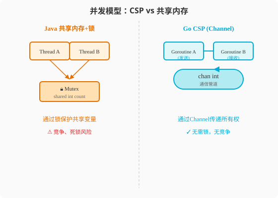

### 第9章 Channel：CSP的通信管道

> 📖 本章你将学会：
> - 理解Channel的"传送带"模型和阻塞语义
> - 区分无缓冲Channel和有缓冲Channel的使用场景
> - 用`select`实现多路复用和超时控制
> - 识别Channel的常见陷阱：死锁、泄漏、goroutine饥饿

---

#### 9.1 Channel基础：创建与收发



##### 9.1.1 开篇：银行柜台的传送带

Java的`BlockingQueue`是一个工具类——你import它，实例化它，用它。
Go的Channel是**语言内建**的——`chan`是关键字，不是库。

这个差异的深层含义是：Channel在Go里的地位和`if`、`for`一样原生。
它不是"并发工具"，而是"并发的基础语法"。

> 💡 比喻：Channel像银行柜台的传送带——你把材料放上去（发送），
> 柜员拿走处理（接收）。传送带满了你就得等，空了柜员就得等。
> 双向通道就是两边都能放材料。

```go
// 创建Channel
ch := make(chan int)    // 无缓冲
ch := make(chan int, 5) // 有缓冲，容量5

// 发送和接收
ch <- 42        // 发送
value := <-ch   // 接收

// 关闭
close(ch)
```

---

#### 9.2 无缓冲Channel：同步握手

无缓冲Channel是**同步的**——发送方和接收方必须同时在线。

```go
ch := make(chan string) // 无缓冲

go func() {
    fmt.Println("发送方准备发送...")
    ch <- "hello" // 阻塞，直到有人接收
    fmt.Println("发送完成")
}()

time.Sleep(time.Second) // 故意延迟接收
fmt.Println("接收方准备接收...")
msg := <-ch // 接收
fmt.Println("收到:", msg)
```

输出顺序：
```
发送方准备发送...
（等待1秒）
接收方准备接收...
收到: hello
发送完成
```

无缓冲Channel像**面对面交接**——发送方必须等接收方来了才能松手。

---

#### 9.3 有缓冲Channel：异步传送带

有缓冲Channel是**异步的**——发送方在缓冲区未满时不阻塞。

```go
ch := make(chan int, 3) // 缓冲容量3

ch <- 1 // 不阻塞（缓冲区有空位）
ch <- 2 // 不阻塞
ch <- 3 // 不阻塞
// ch <- 4 // 阻塞！缓冲区满了

fmt.Println(<-ch) // 1（取出一个，缓冲区有空位了）
```

有缓冲Channel像**快递柜**——你可以放进去就走（未满时），满了就
得等有人取走才能再放。

##### 9.3.1 无缓冲vs有缓冲选择

| 场景 | 用无缓冲 | 用有缓冲 |
|------|----------|----------|
| 需要严格同步 | ✅ | ❌ |
| 生产消费解耦 | ❌ | ✅ |
| 信号通知 | ✅（chan struct{}） | ❌ |
| 批处理流水线 | ❌ | ✅ |
| 限制并发数 | ❌ | ✅（semaphore） |

---

#### 9.4 Channel方向：发送-only和接收-only

Go可以限制Channel的方向——这是Java没有的类型安全特性：

```go
// 发送-only：只能写不能读
func producer(out chan<- int) {
    for i := 0; i < 5; i++ {
        out <- i
    }
    close(out)
}

// 接收-only：只能读不能写
func consumer(in <-chan int) {
    for v := range in { // range自动检测close
        fmt.Println("收到:", v)
    }
}

func main() {
    ch := make(chan int)
    go producer(ch) // 双向chan传给producer，自动转为chan<-
    consumer(ch)    // 双向chan传给consumer，自动转为<-chan
}
```

方向限制由**函数签名**约束——编译器在编译期检查，不会运行时出错。

---

#### 9.5 select：多路复用

`select`是Go版的`switch`——但匹配的不是值，而是**哪个Channel操作
准备好了**。

```go
select {
case msg := <-ch1:
    fmt.Println("从ch1收到:", msg)
case msg := <-ch2:
    fmt.Println("从ch2收到:", msg)
case ch3 <- 42:
    fmt.Println("向ch3发送成功")
default:
    fmt.Println("没有操作准备好") // 非阻塞模式
}
```

##### 9.5.1 超时控制

```go
select {
case result := <-slowOp:
    fmt.Println("收到结果:", result)
case <-time.After(3 * time.Second):
    fmt.Println("超时！") // 3秒后自动触发
}
```

这是Go超时控制的标准模式——Java需要`Future.get(timeout)`或
`ScheduledExecutor`，Go用`select + time.After`一行搞定。

##### 9.5.2 非阻塞操作

```go
select {
case msg := <-ch:
    fmt.Println("收到:", msg)
default:
    fmt.Println("没有消息") // 不阻塞
}
```

##### 9.5.3 随机选择

当多个case同时准备好，`select`**随机**选一个——防止某个Channel
一直被忽略。

```go
// 两个Channel都有数据时，随机选一个
select {
case v1 := <-ch1:
    fmt.Println("ch1:", v1)
case v2 := <-ch2:
    fmt.Println("ch2:", v2)
}
```

---

#### 9.6 经典并发模式

##### 9.6.1 生产者-消费者

```go
func producer(out chan<- int) {
    for i := 0; ; i++ {
        out <- i // 生产
        time.Sleep(time.Millisecond * 100)
    }
}

func consumer(in <-chan int) {
    for v := range in {
        fmt.Println("消费:", v)
    }
}

func main() {
    ch := make(chan int, 10) // 缓冲10
    go producer(ch)
    consumer(ch)
}
```

##### 9.6.2 扇出扇入（Fan-out/Fan-in）

```go
// 多个worker处理同一输入，结果汇总
func fanOutFanIn(inputs []int, workerCount int) []int {
    // 扇出：分发任务
    taskCh := make(chan int)
    resultCh := make(chan int)
    var wg sync.WaitGroup

    for i := 0; i < workerCount; i++ {
        wg.Add(1)
        go func() {
            defer wg.Done()
            for n := range taskCh {
                resultCh <- n * n // 处理
            }
        }()
    }

    go func() {
        for _, n := range inputs {
            taskCh <- n
        }
        close(taskCh)
    }()

    // 扇入：等待所有worker完成，关闭resultCh
    go func() {
        wg.Wait()
        close(resultCh)
    }()

    // 收集结果
    results := make([]int, 0)
    for r := range resultCh {
        results = append(results, r)
    }
    return results
}
```

##### 9.6.3 限速器（Rate Limiter）

```go
// 每秒最多处理N个请求
func rateLimiter() {
    // ticker每秒发送一次
    limiter := time.NewTicker(time.Second)
    defer limiter.Stop()

    requests := make(chan int, 5)
    go func() {
        for i := 1; i <= 5; i++ {
            requests <- i
        }
        close(requests)
    }()

    for req := range requests {
        <-limiter.C // 等待令牌
        fmt.Printf("处理请求 %d @ %v\n", req, time.Now().Format("15:04:05"))
    }
}
```

##### 9.6.4 Pipeline（管道）

```go
// 多阶段处理管道
func stage1(nums <-chan int) <-chan int {
    out := make(chan int)
    go func() {
        defer close(out)
        for n := range nums {
            out <- n + 1 // +1
        }
    }()
    return out
}

func stage2(in <-chan int) <-chan int {
    out := make(chan int)
    go func() {
        defer close(out)
        for n := range in {
            out <- n * 2 // ×2
        }
    }()
    return out
}

func main() {
    // 生成输入
    nums := make(chan int)
    go func() {
        defer close(nums)
        for i := 0; i < 5; i++ {
            nums <- i
        }
    }()

    // 管道: (i+1)*2
    result := stage2(stage1(nums))
    for r := range result {
        fmt.Println(r) // 2, 4, 6, 8, 10
    }
}
```

---

#### 9.7 Channel常见陷阱

##### 9.7.1 陷阱一：向已关闭的Channel发送会panic

```go
ch := make(chan int)
close(ch)
ch <- 1 // panic: send on closed channel!
```

**规则**：**只有发送方应该关闭Channel**，接收方关闭可能导致发送方panic。

##### 9.7.2 陷阱二：从已关闭的Channel接收得到零值

```go
ch := make(chan int, 2)
ch <- 1
ch <- 2
close(ch)

fmt.Println(<-ch) // 1
fmt.Println(<-ch) // 2
fmt.Println(<-ch) // 0（零值！不是阻塞）
v, ok := <-ch     // v=0, ok=false（检测是否关闭）
```

##### 9.7.3 陷阱三：range死锁

```go
ch := make(chan int)
go func() {
    ch <- 1
    ch <- 2
    // 忘了close(ch)!
}()

for v := range ch { // 永远不结束（等close）
    fmt.Println(v)
}
```

**规则**：用`range`遍历Channel，**必须有人close它**，否则死锁。

##### 9.7.4 陷阱四：Goroutine泄漏

```go
// ❌ 泄漏: 如果main提前退出，worker永远阻塞
func leakyWorker() {
    ch := make(chan int)
    go func() {
        val := <-ch // 永远等待...
        fmt.Println(val)
    }()
    // 如果这里return，Goroutine泄漏
}
```

**解决方案**：用Context（下一章）或带超时的select。

---

#### 9.8 代码实战：并发工作池

**场景**：固定数量的worker从任务Channel取任务处理，结果汇总。

```go
package main

import (
    "fmt"
    "sync"
    "time"
)

type Task struct {
    ID    int
    Input int
}

type Result struct {
    TaskID int
    Output int
    Err    error
}

func worker(id int, tasks <-chan Task, results chan<- Result, wg *sync.WaitGroup) {
    defer wg.Done()
    for task := range tasks {
        fmt.Printf("Worker %d 处理任务 %d\n", id, task.ID)
        time.Sleep(time.Millisecond * 100) // 模拟处理

        if task.Input < 0 {
            results <- Result{TaskID: task.ID, Err: fmt.Errorf("negative input: %d", task.Input)}
            continue
        }
        results <- Result{TaskID: task.ID, Output: task.Input * task.Input}
    }
}

func main() {
    const numWorkers = 3
    const numTasks = 10

    tasks := make(chan Task, numTasks)
    results := make(chan Result, numTasks)

    // 启动worker池
    var wg sync.WaitGroup
    for w := 1; w <= numWorkers; w++ {
        wg.Add(1)
        go worker(w, tasks, results, &wg)
    }

    // 发送任务
    for t := 1; t <= numTasks; t++ {
        tasks <- Task{ID: t, Input: t}
    }
    close(tasks) // 关闭任务Channel，worker的range会结束

    // 等待所有worker完成
    go func() {
        wg.Wait()
        close(results) // 所有worker完成后关闭结果Channel
    }()

    // 收集结果
    for result := range results {
        if result.Err != nil {
            fmt.Printf("任务 %d 失败: %v\n", result.TaskID, result.Err)
        } else {
            fmt.Printf("任务 %d 结果: %d\n", result.TaskID, result.Output)
        }
    }
}
```

---

#### ⚡ 9.9 性能贴士：Channel开销

| 操作 | 耗时 | 说明 |
|------|------|------|
| 无缓冲Channel发送+接收 | ~200ns | 含一次Goroutine调度 |
| 有缓冲Channel发送(未满) | ~50ns | 仅加锁+入队 |
| 有缓冲Channel接收(非空) | ~50ns | 仅加锁+出队 |
| Channel关闭 | ~100ns | 通知所有等待者 |
| select(2路) | ~100ns | 含随机选择逻辑 |

**优化建议**：

1. **批量发送减少Channel操作**：发送`[]int`比发送100次`int`更快
2. **合理设置缓冲大小**：缓冲过大浪费内存，过小增加阻塞
3. **避免Channel嵌套**：`chan chan int`复杂且慢，用`chan int`+协调逻辑

> 💡 性能口诀：**Channel通信有开销，批量发送更划算；缓冲大小要合理，
> 无锁收集最最快。**

---

#### 本章小结

1. **Channel是Go并发的心脏** —— `chan`是语言关键字，不是库函数。
   无缓冲=同步握手，有缓冲=异步传送带。

2. **select是多路复用利器** —— 等待多个Channel操作，随机选择就绪的。
   `select + time.After`是标准超时模式。

3. **方向限制提供类型安全** —— `chan<- T`只能发，`<-chan T`只能收。
   编译期检查，防止误操作。

4. **四大经典模式** —— 生产者-消费者、扇出扇入、限速器、Pipeline。
   这些是Go并发编程的"设计模式"。

5. **四大陷阱要警惕** —— 向关闭Channel发送（panic）、range不close（死锁）、
   接收方关闭（发送方panic）、Goroutine泄漏（无超时/取消）。

> 🤔 思考题：Channel可以取消Goroutine——但如果一个Goroutine在执行
> 长时间的计算（不是等Channel），怎么取消它？下一章——Context。
