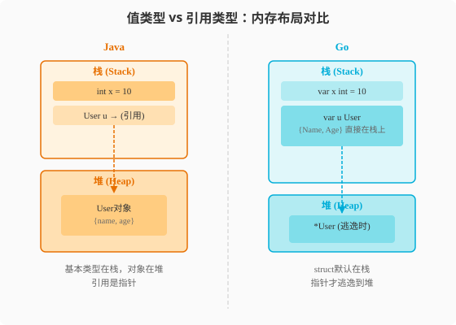

### 第3章 变量与类型系统：值与引用的分界线

> 📖 本章你将学会：
> - 理解Go值类型vs引用类型的本质区别，完成Java→Go最大的认知重构
> - 用三种姿势声明变量，掌握零值哲学
> - 区分`new`和`make`的用途，避免常见误用
> - 用指针直面内存，理解Go没有"悬垂指针"的安全保证

---

#### 3.1 变量声明与基本类型

##### 3.1.1 开篇：Java的"万物皆对象" vs Go的"该值就值"

Java有一句名言："Everything is an object"。你在Java里写`int`，
编译器给你自动装箱成`Integer`；你写`String`，它是一个堆上的对象引用。
Java程序员习惯了"变量名就是一个遥控器，指向堆上的某个对象"。

Go说：**该值就值，该引用才引用。**

```java
// Java: 基本类型值传递，对象引用传递
int a = 10;           // a就是10，存在栈上
String s = "hello";   // s是指向堆上String对象的引用
User u = new User();  // u是指向堆上User对象的引用
```

```go
// Go: 一切传值，"引用"只是指针的语法糖
a := 10               // a就是10
s := "hello"          // s是一个字符串值（底层是{指针,长度}结构体）
u := User{Name: "Alice"} // u就是User值本身，不是引用！
```

这个差异是Java→Go最大的认知重构。在Java里，`User u = new User()`
创建了一个堆对象，`u`是指向它的引用。在Go里，`u := User{Name: "Alice"}`
创建的是一个**值**——它可能分配在栈上，没有堆分配，没有GC压力。

> 💡 比喻：Java变量像邮箱编号——编号本身在栈上，但你要看信得去
> 邮政中心（堆）取。Go变量像口袋里的现金——钱就在口袋里（栈上），
> 只有你需要"让别人也看到"时才存银行（堆）。



##### 3.1.2 三种声明姿势

```go
// 姿势一：var + 类型（最显式）
var name string
var age int = 30

// 姿势二：var + 类型推断
var city = "Beijing"  // 编译器推断为string

// 姿势三：短变量声明 :=（最常用，但只能在函数内）
port := 8080
config := Config{Debug: true}
```

对比Java：

```java
// Java: 类型在前
String name;
int age = 30;
var city = "Beijing"; // Java 10+ 局部变量类型推断
```

| 声明方式 | Java | Go | 差异 |
|------|------|----|------|
| 显式类型 | `String name` | `var name string` | Go类型在后 |
| 类型推断 | `var city` (Java10+) | `city := "Beijing"` | Go用`:=`更简洁 |
| 包级变量 | `static`/实例字段 | `var` | Go用`var` |
| 局部变量 | `var`/`int x` | `:=` | Go推荐`:=` |
| 常量 | `final int PORT = 8080` | `const PORT = 8080` | Go有`const`关键字 |

> ⚠️ 陷阱：`:=`只能在函数内部使用。包级别的变量必须用`var`。
```go
// ❌ 编译错误：包级别不能用 :=
port := 8080

// ✅ 正确
var port = 8080
```

##### 3.1.3 基本类型对比

| Java类型 | Go类型 | 大小 | 差异说明 |
|------|------|------|------|
| `byte` | `byte` (`uint8`别名) | 1B | 相同 |
| `short` | `int16` | 2B | Go类型名更直观 |
| `int` | `int` | 平台相关(32/64位) | 相同策略 |
| `long` | `int64` | 8B | Go明确大小 |
| `float` | `float32` | 4B | 相同 |
| `double` | `float64` | 8B | 相同 |
| `boolean` | `bool` | 1B | 相同 |
| `char` | `rune` (`int32`别名) | 4B | Go的rune是Unicode码点 |
| `String` | `string` | 16B(header) | Go的string不可变且是值类型 |

**关键差异**：

1. **Go的`int`不是固定大小**——在32位平台是32位，64位平台是64位。
   需要明确大小时用`int32`/`int64`。

2. **Go没有自动装箱拆箱**——`int`就是`int`，不会变成`Integer`。
   这意味着Go的`[]int`是连续内存，而Java的`List<Integer>`是
   指针数组指向堆上的Integer对象。

3. **Go的`string`是值类型**——赋值会拷贝header（指针+长度），
   不会拷贝底层数据。Java的`String`是引用类型但不可变。

##### 3.1.4 零值：开箱即用哲学

Java的局部变量必须显式初始化才能使用（否则编译错误）。实例字段
有默认值（`null`/`0`/`false`）。

Go的选择：**所有类型都有零值，声明即可用。**

```go
var (
    i int        // 零值: 0
    s string     // 零值: ""（空字符串，不是null！）
    b bool       // 零值: false
    f float64    // 零值: 0.0
    p *int       // 零值: nil
    u User       // 零值: {Name:"", Age:0}
    m map[string]int // 零值: nil（不能直接写！）
    sl []int     // 零值: nil（可以读，不能写）
)
```

> 💡 比喻：Java的对象零值是`null`——一个"空盒子"，你必须`new`一个
> 放进去才能用。Go的struct零值是一个"装了默认值的好盒子"——
> `var u User`直接可用，`u.Name`是`""`，`u.Age`是`0`。

**零值的陷阱**：

```go
// ❌ nil map不能写入
var m map[string]int
m["key"] = 1 // panic: assignment to entry in nil map

// ✅ 必须用make初始化
m := make(map[string]int)
m["key"] = 1 // OK

// nil slice可以append（但推荐用make）
var s []int
s = append(s, 1) // OK，append会分配底层数组
```

| 类型 | 零值 | 能否直接用 | Java对应 |
|------|------|----------|----------|
| 基本类型 | 0/false/"" | ✅ | 0/false/null |
| struct | 字段全零值 | ✅ | null（不能用） |
| pointer | nil | ❌（需检查） | null |
| slice | nil | ✅读/✅append | null |
| map | nil | ✅读/❌写 | null |
| channel | nil | ❌（阻塞） | null |
| interface | nil | ❌（需检查） | null |

---

#### 3.2 指针：直面内存

##### 3.2.1 Java程序员的指针恐惧症疗法

Java故意隐藏了指针——你用的"引用"本质上是指针，但你看不到地址，
不能做指针运算，不用担心悬垂指针。这让Java程序员对`*`和`&`符号
有本能的恐惧。

好消息：Go的指针比C的指针安全得多——**没有指针运算，没有悬垂指针**。

```go
// & 取地址
x := 42
p := &x // p是指向x的指针，类型是 *int

// * 解引用
fmt.Println(*p) // 42（读取p指向的值）
*p = 100        // 修改p指向的值
fmt.Println(x)  // 100（x被修改了）
```

对比Java：

```java
// Java: 引用是隐式指针，你不能看到地址
User u = new User("Alice");  // u是指针，但你不能&u或*u
User u2 = u;                  // u2和u指向同一个对象
u2.setName("Bob");
System.out.println(u.getName()); // "Bob"（共享引用）
```

```go
// Go: 指针是显式的
u := User{Name: "Alice"}
u2 := u          // 值拷贝！u2是独立的副本
u2.Name = "Bob"
fmt.Println(u.Name)  // "Alice"（u没变！）

// 如果要共享，用指针
u3 := &u         // u3指向u
u3.Name = "Bob"
fmt.Println(u.Name)  // "Bob"（通过指针修改了u）
```

> 💡 比喻：Java对象变量本身就是"遥控器"（引用），你不需要关心
> 电视在哪。Go指针是"门牌号"——你看到了地址本身，但Go保证
> 这个地址不会变成"已拆除的危房"（GC不会回收还有指针引用的对象）。

##### 3.2.2 值传递 vs 指针传递

```go
// 值传递：拷贝整个struct
func modifyValue(u User) {
    u.Name = "modified" // 修改副本，不影响原始值
}

// 指针传递：只拷贝一个地址（8字节）
func modifyPointer(u *User) {
    u.Name = "modified" // 通过指针修改原始值
}

user := User{Name: "Alice"}
modifyValue(user)
fmt.Println(user.Name)  // "Alice"（未变）

modifyPointer(&user)
fmt.Println(user.Name)  // "modified"（已变）
```

**何时用指针，何时用值？**

| 场景 | 用值 | 用指针 |
|------|------|--------|
| 小struct（<64字节） | ✅ | ❌ |
| 大struct | ❌（拷贝开销） | ✅ |
| 需要修改原始值 | ❌ | ✅ |
| 不可变数据 | ✅ | ❌ |
| 方法接收者 | 看情况 | 看情况 |

##### 3.2.3 new vs make

这是Java程序员最容易搞混的一对：

```go
// new: 分配内存并返回指针，零值初始化
p := new(int)    // *int, 值为0
u := new(User)   // *User, 字段全零值

// make: 专门用于slice/map/channel，返回初始化后的值（不是指针）
s := make([]int, 0, 10)    // []int
m := make(map[string]int)  // map[string]int
ch := make(chan int, 5)    // chan int
```

| 函数 | 用途 | 返回类型 | Java对应 |
|------|------|----------|----------|
| `new(T)` | 分配零值T的内存 | `*T`（指针） | `new T()` |
| `make(T)` | 初始化slice/map/channel | `T`（值） | `new ArrayList<>()` |

> ⚠️ 陷阱：Java程序员经常误用`new(User)`创建map/slice——不行！
> `new(map[string]int)`返回的是一个nil map的指针，不能写入。
> **slice/map/channel必须用`make`。**

##### 3.2.4 Go没有悬垂指针

C语言最可怕的是悬垂指针——返回栈上变量的指针，函数返回后栈被回收，
指针指向垃圾。Go通过**逃逸分析**保证安全：

```go
// Go: 编译器会把这个变量逃逸到堆上
func create() *User {
    u := User{Name: "Alice"} // 看起来在栈上
    return &u                // 返回地址——编译器自动逃逸到堆
}

u := create()
fmt.Println(u.Name) // "Alice" — 安全！GC保证u不会被回收
```

编译器发现`&u`被返回了（逃逸了），自动把`u`分配在堆上而非栈上。
你不需要操心——GC和逃逸分析帮你兜底。

---

#### ⚡ 3.3 性能贴士：值类型vs引用类型的性能差异

**内存布局对比**：

```
Go: User值类型直接嵌入
┌──────────────────────┐
│ User struct          │
│ ├─ Name string (16B) │
│ ├─ Age int (8B)      │
│ └─ Score float64(8B) │  ← 连续内存，32B，缓存友好
└──────────────────────┘

Java: User对象在堆上
┌─────────────┐
│ User ref    │ ──→ ┌─────────────────┐
│ (8B指针)    │     │ Object header   │ 12B
└─────────────┘     │ Name ref ──────→ String对象 (堆)
                    │ Age (4B)        │
                    │ Score (8B)      │
                    └─────────────────┘ ~40B+，分散在堆上
```

| 指标 | Java对象 | Go值类型 | 倍数 |
|------|----------|----------|------|
| 内存占用 | 40B+（对象头+引用） | 32B（紧凑） | 1.3x |
| 创建开销 | 堆分配+GC | 栈分配（零开销） | 10-100x |
| 访问开销 | 指针间接 | 直接 | 缓存命中率高2-5x |
| GC压力 | 有 | 无（栈自动回收） | 0 |

**优化建议**：

1. **小struct用值类型**：<64字节的struct用值传递，避免堆分配
2. **大struct用指针**：>64字节的struct用指针传递，避免大拷贝
3. **基本类型slice无装箱**：`[]int`比Java的`List<Integer>`快10-25倍
4. **预分配减少逃逸**：`make([]T, 0, n)`避免循环中扩容

> 💡 性能口诀：**Java万物堆上建，Go值类型栈上存；零值开箱即可用，
> 指针逃逸GC管。**

---

#### 本章小结

1. **Go的变量是值，Java的变量是引用** —— 这是最大的认知重构。
   `u := User{}`创建的是值，不是引用。需要共享时显式用`&u`。

2. **三种声明姿势** —— `var name T`（显式）、`var name = val`（推断）、
   `name := val`（短声明，函数内最常用）。

3. **零值开箱即用** —— Go所有类型都有零值，struct零值可直接用。
   但nil map不能写，nil slice可以append。

4. **指针安全且显式** —— `&`取地址，`*`解引用。没有指针运算，
   没有悬垂指针。逃逸分析自动决定栈分配还是堆分配。

5. **new vs make** —— `new(T)`返回`*T`（零值指针），`make(T)`返回
   初始化后的slice/map/channel（值类型）。slice/map/channel必须用make。

> 🤔 思考题：Go的struct零值可以直接用，那"构造函数"还需要吗？
> 什么时候该用工厂函数`NewXxx()`？带着这个问题进入第4章——函数与方法。
