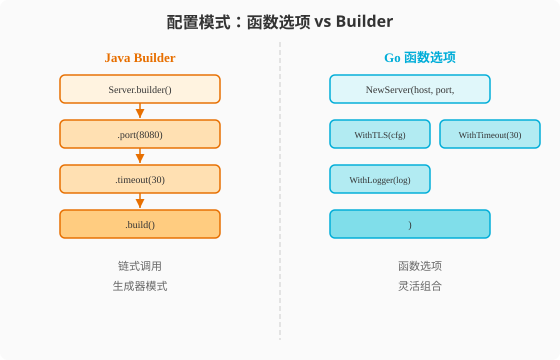

### 第4章 函数与方法：Go的一等公民

> 📖 本章你将学会：
> - 用Go的多返回值告别Java的`Result<T,E>`包装类
> - 理解值接收者vs指针接收者的性能与语义差异
> - 用闭包捕获外部变量，识别循环变量捕获陷阱
> - 用函数选项模式替代Java的Builder模式

---

#### 4.1 函数：Go的一等公民

##### 4.1.1 开篇：Java的"二等公民" vs Go的"一等公民"

Java里函数不是一等公民——你不能把一个"函数"赋值给变量，
你必须创建一个`Runnable`或`Function<T,R>`接口的匿名类（Java 8后
有Lambda，但底层仍是接口实例）。函数必须依附于类存在。

Go的函数是**一等公民**——可以赋值给变量、作为参数传递、作为返回值。
函数不需要依附于任何东西。

```java
// Java: 函数必须包装在接口里
Function<String, Integer> strLen = s -> s.length();
strLen.apply("hello"); // 5

// Runnable、Callable、Consumer、Supplier... 一堆函数式接口
```

```go
// Go: 函数就是函数
strLen := func(s string) int { return len(s) }
strLen("hello") // 5

// 函数类型可以直接声明
type StrToInt func(string) int
```

> 💡 比喻：Java函数像"编外人员"——必须挂靠在某个部门（类）下，
> 通过接口办手续才能干活。Go函数像"自由职业者"——独立执业，
> 随叫随到，不需要挂靠任何地方。

##### 4.1.2 多返回值：告别Result<T,E>

```go
// Go: 原生多返回值
func FindUser(id string) (*User, error) {
    // ...
    return user, nil
}

user, err := FindUser("123")
if err != nil {
    // 处理错误
}
```

```java
// Java: 需要包装类或异常
// 方式一: Result包装
public Result<User, Error> findUser(String id) { ... }
Result<User, Error> result = findUser("123");
if (result.isError()) { ... }

// 方式二: 抛异常
public User findUser(String id) throws UserNotFoundException { ... }
try { User u = findUser("123"); }
catch (UserNotFoundException e) { ... }

// 方式三: Optional (Java 8+)
public Optional<User> findUser(String id) { ... }
Optional<User> opt = findUser("123");
opt.orElse(null);
```

Go的多返回值是最简洁的——不需要包装类，不需要异常，不需要Optional。
`error`作为第二个返回值是Go的惯用模式。

##### 4.1.3 函数作为值和参数

```go
// 函数赋值给变量
f := func(x int) int { return x * 2 }

// 函数作为参数（高阶函数）
func apply(nums []int, fn func(int) int) []int {
    result := make([]int, len(nums))
    for i, n := range nums {
        result[i] = fn(n)
    }
    return result
}

doubled := apply([]int{1, 2, 3}, func(n int) int { return n * 2 })
// [2, 4, 6]

// 函数作为返回值
func multiplier(factor int) func(int) int {
    return func(n int) int { return n * factor }
}

double := multiplier(2)
triple := multiplier(3)
double(5) // 10
triple(5) // 15
```

##### 4.1.4 闭包：捕获外部变量

```go
func counter() func() int {
    count := 0
    return func() int {
        count++
        return count
    }
}

c := counter()
fmt.Println(c(), c(), c()) // 1 2 3
```

闭包捕获的是**变量的引用**，不是值的拷贝。这意味着：

```go
// 陷阱：循环变量捕获
for i := 0; i < 3; i++ {
    go func() {
        fmt.Println(i) // Go 1.21: 可能输出 3 3 3
    }()
}
// Go 1.22+: 每次迭代创建新i，输出 0 1 2（顺序随机）

// 兼容写法：显式传参
for i := 0; i < 3; i++ {
    go func(n int) {
        fmt.Println(n)
    }(i)
}
```

> ⚠️ 陷阱：Go 1.22修复了循环变量捕获问题，但如果你的代码需要兼容
> Go 1.21及之前版本，务必用显式传参。

---

#### 4.2 方法：带接收者的函数

##### 4.2.1 方法定义：值接收者 vs 指针接收者

Go的方法是**带接收者的函数**——接收者写在函数名前面：

```go
type User struct {
    Name string
    Age  int
}

// 值接收者：操作副本
func (u User) Greet() string {
    return "Hi, I'm " + u.Name
}

// 指针接收者：操作原始值
func (u *User) Birthday() {
    u.Age++ // 修改原始值
}

u := User{Name: "Alice", Age: 30}
fmt.Println(u.Greet())  // "Hi, I'm Alice"
u.Birthday()           // Go自动取地址 (&u).Birthday()
fmt.Println(u.Age)     // 31
```

**值接收者 vs 指针接收者的选择**：

| 维度 | 值接收者 `(u User)` | 指针接收者 `(u *User)` |
|------|------|------|
| 修改原始值 | ❌（操作副本） | ✅ |
| 拷贝开销 | 有（拷贝整个struct） | 无（拷贝8字节指针） |
| 适用struct大小 | 小struct（<64B） | 大struct |
| nil安全 | ✅（零值副本） | ❌（nil解引用panic） |
| 方法集 | 值和指针都能调用 | 只有指针能调用 |

> ⚠️ 陷阱：**一个struct的所有方法应该统一用值或指针接收者，不要混用！**
> Go社区惯例：需要修改用指针，不需要修改看大小。大多数情况用指针接收者更安全。

##### 4.2.2 Java的方法 vs Go的方法

```java
// Java: 方法属于类，this隐式绑定
public class User {
    private String name;

    public String greet() { // this隐式
        return "Hi, I'm " + this.name;
    }
}
```

```go
// Go: 方法是带接收者的函数，接收者显式
type User struct { Name string }

func (u User) Greet() string { // 接收者显式
    return "Hi, I'm " + u.Name
}

// 本质上等价于普通函数
func Greet(u User) string {
    return "Hi, I'm " + u.Name
}
```

| 维度 | Java方法 | Go方法 | 差异 |
|------|----------|--------|------|
| 归属 | 属于class | 独立函数带接收者 | Go更松散 |
| this/self | 隐式`this` | 显式接收者 | Go显式 |
| 重载 | 支持（参数不同） | 不支持 | Go无重载 |
| 覆盖 | `@Override`虚方法 | 名字遮蔽 | Go无虚方法 |
| 静态方法 | `static` | 包级函数 | Go不需要static |

##### 4.2.3 函数选项模式：替代Builder



Java常用Builder模式处理可选参数：

```java
// Java: Builder模式
Server server = Server.builder("localhost", 8080)
    .withTLS(tlsConfig)
    .withTimeout(30)
    .withMaxConnections(1000)
    .build();
```

Go用**函数选项模式**（Functional Options）：

```go
type Server struct {
    host           string
    port           int
    tls            *TLSConfig
    timeout        time.Duration
    maxConnections int
}

type Option func(*Server)

func WithTLS(config *TLSConfig) Option {
    return func(s *Server) { s.tls = config }
}

func WithTimeout(d time.Duration) Option {
    return func(s *Server) { s.timeout = d }
}

func WithMaxConnections(n int) Option {
    return func(s *Server) { s.maxConnections = n }
}

func NewServer(host string, port int, opts ...Option) *Server {
    s := &Server{
        host:           host,
        port:           port,
        timeout:        30 * time.Second, // 默认值
        maxConnections: 100,              // 默认值
    }
    for _, opt := range opts {
        opt(s)
    }
    return s
}

// 使用
server := NewServer("localhost", 8080,
    WithTLS(tlsConfig),
    WithTimeout(60*time.Second),
    WithMaxConnections(500),
)
```

| 模式 | Java Builder | Go Functional Options | 优势 |
|------|-------------|----------------------|------|
| 必填参数 | builder构造函数 | 工厂函数参数 | 相似 |
| 可选参数 | `.withXxx()` | `WithXxx()`函数 | 相似 |
| 默认值 | builder中设置 | 工厂函数中设置 | 相似 |
| 验证 | `build()`中 | 工厂函数中 | Go可返回error |
| 扩展性 | 加新with方法 | 加新Option函数 | Go更灵活 |

---

#### ⚡ 4.3 性能贴士：函数调用开销

| 调用方式 | 耗时 | 说明 |
|------|------|------|
| 直接函数调用 | ~0.3ns | 编译期地址确定 |
| 方法调用（值接收者） | ~0.5ns | 可能被内联 |
| 方法调用（指针接收者） | ~0.5ns | 可能被内联 |
| 闭包调用 | ~1ns | 额外捕获变量访问 |
| 接口方法调用 | ~2ns | itable查找 |
| 反射调用 | ~50ns | 运行时类型检查 |

**内联优化**：Go编译器会自动内联小函数。你可以用`//go:noinline`禁止内联
（调试用），或用`//go:inline`建议内联（不保证生效）。

```go
// 小函数会被自动内联——零调用开销
func add(a, b int) int { return a + b }

// 大函数不会被内联——保持函数调用
func process(data []byte) Result {
    // 很多代码...
}
```

**优化建议**：

1. **热路径用值接收者**：小struct值接收者可被内联，指针接收者不行
2. **避免不必要的闭包**：闭包有额外开销，热路径用普通函数
3. **大struct用指针**：避免值拷贝开销
4. **泛型替代接口**：泛型编译期特化，无itable开销

> 💡 性能口诀：**函数调用有内联，值接收者快如风；闭包接口多一跳，
> 热路径里要精简。**

---

#### 本章小结

1. **Go函数是一等公民** —— 可以赋值、传参、返回。不需要包装在接口里。
   多返回值告别`Result<T,E>`和Optional。

2. **闭包捕获变量引用** —— 闭包是携带外部变量的函数。Go 1.22修复了
   循环变量捕获问题，但兼容旧版本需要显式传参。

3. **方法是带接收者的函数** —— 值接收者操作副本，指针接收者操作原始值。
   一个struct的方法应统一用值或指针，不要混用。

4. **函数选项模式替代Builder** —— `NewServer(host, port, WithTLS(...))`
   是Go社区最流行的可选参数模式，比Builder更灵活且可返回error。

5. **Go没有方法重载** —— 同名方法只能有一个签名。需要"重载"用泛型或
   不同名字。

> 🤔 思考题：Go的方法定义在struct外面，意味着你可以在不修改struct的
> 情况下给它添加方法。如果struct在第三方包里，你能给它加方法吗？
> 带着这个问题进入第5章——控制流与错误处理。
