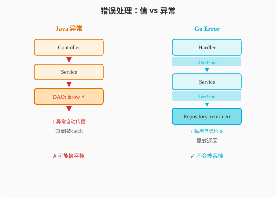

### 第5章 控制流与错误处理：一个for循环与满屏if err != nil

> 📖 本章你将学会：
> - 用Go唯一的`for`循环表达Java的三种循环（for/while/do-while）
> - 掌握`range`迭代的陷阱和性能技巧
> - 理解Go错误值机制与Java异常机制的五个本质差异
> - 用`error`接口和`errors.Is`/`errors.As`构建错误体系

---

#### 5.1 控制流：一个for循环的千种姿势

##### 5.1.1 开篇：Java的循环动物园

Java有三种循环：`for`、`while`、`do-while`。还有增强for循环`for-each`。
加上`Stream.forEach()`，一个简单的遍历有五种写法。

```java
// Java: 五种遍历方式
for (int i = 0; i < list.size(); i++) { ... }     // 传统for
for (String s : list) { ... }                      // for-each
while (it.hasNext()) { ... }                       // while + Iterator
list.forEach(s -> { ... });                        // forEach + Lambda
list.stream().filter(...).forEach(...);            // Stream
```

Go的选择是：**一个`for`搞定一切。** 没有`while`，没有`do-while`，
没有`Stream.forEach`——`for`关键字的三种形态覆盖所有循环场景。

这听起来像功能不足？实际上，当你习惯了Go的`for`后，你会发现Java的
五种循环方式反而增加了认知负担——你每次写循环都要在"用for还是while"
之间做选择，而这种选择对结果毫无影响。

---

#### 5.2 for循环的三种形态

##### 5.2.1 形态一：传统for（C风格）

```go
// Go: 和Java的for完全一样
for i := 0; i < 10; i++ {
    fmt.Println(i)
}
```

和Java唯一差异：Go没有括号（Go的所有控制流都不需要括号）。

##### 5.2.2 形态二：条件for（= while）

```go
// Go: 省略初始化和后置语句 = Java的while
n := 10
for n > 0 {
    fmt.Println(n)
    n--
}
// 等价于 Java: while (n > 0) { ... }
```

Go没有`while`关键字——`for`只写条件就是`while`。

##### 5.2.3 形态三：无限for（= while(true)）

```go
// Go: 啥都不写 = Java的while(true)
for {
    msg := receiveMessage()
    if msg == "quit" {
        break
    }
    process(msg)
}
// 等价于 Java: while (true) { ... }
```

三种形态，一个关键字。简单到不需要选择。

---

#### 5.3 range迭代：Go的for-each

Go的`for range`是遍历集合的标准方式，等价于Java的for-each：

```go
// 遍历slice
fruits := []string{"apple", "banana", "cherry"}
for index, value := range fruits {
    fmt.Printf("%d: %s\n", index, value)
}

// 只需要值（忽略索引）
for _, fruit := range fruits {
    fmt.Println(fruit)
}

// 只需要索引
for i := range fruits {
    fmt.Println(i)
}

// 遍历map（顺序随机！）
prices := map[string]int{"apple": 5, "banana": 3}
for key, value := range prices {
    fmt.Printf("%s: %d\n", key, value)
}

// 遍历字符串（按rune，不是字节！）
for i, r := range "Hello世界" {
    fmt.Printf("%d: %c\n", i, r)
}
// 输出: 0:H 1:e 2:l 3:l 4:o 5:世 8:界
// 注意索引跳了——因为UTF-8编码中"世"占3字节
```

##### 5.3.1 range的三个陷阱

**陷阱一：值拷贝**

```go
type User struct{ Name string }

users := []User{{"Alice"}, {"Bob"}}
for _, u := range users {
    u.Name = "modified" // 修改的是副本，不影响原slice！
}
fmt.Println(users[0].Name) // 仍然是 "Alice"

// 正确做法：用索引
for i := range users {
    users[i].Name = "modified" // 修改原slice
}
```

> ⚠️ 这和Java的for-each一样——`for (User u : users)`也是拷贝引用，
> 修改`u`不影响原列表。但Java的引用拷贝修改对象字段会影响原对象，
> Go的值拷贝不会。

**陷阱二：遍历map顺序随机**

```go
m := map[string]int{"a": 1, "b": 2, "c": 3}
for k, v := range m {
    fmt.Printf("%s=%d ", k, v)
}
// 可能输出: a=1 b=2 c=3
// 也可能输出: c=3 a=1 b=2
// 每次运行顺序不同！
```

Go故意随机化map遍历顺序，防止开发者依赖顺序（这会导致可移植性问题）。
如果需要有序遍历，先排序key：

```go
keys := make([]string, 0, len(m))
for k := range m {
    keys = append(keys, k)
}
sort.Strings(keys)
for _, k := range keys {
    fmt.Printf("%s=%d\n", k, m[k])
}
```

**陷阱三：range表达式的求值时机**

```go
nums := []int{1, 2, 3}
for i := range nums {
    nums = append(nums, 10) // 在循环中修改slice
    fmt.Println(i)
}
// 输出: 0 1 2
// range在循环开始时就确定了长度(3)，即使循环中append了新元素
// 也不会遍历新增的元素
```

---

#### 5.4 switch：Go的"不穿透"设计

Java的`switch`有一个著名的坑——**case穿透（fall-through）**。
忘记写`break`会导致后续case全部执行。

```java
// Java: 忘记break的灾难
switch (day) {
    case "Saturday":
        System.out.println("Weekend!");
        // 忘了break！
    case "Sunday":
        System.out.println("Weekend!");
        break;
    case "Monday":
        System.out.println("Weekday!");
        break;
}
// 输入"Saturday"会输出两行"Weekend!"
```

Go的设计是**默认不穿透**——每个case自动`break`。需要穿透时
显式写`fallthrough`：

```go
// Go: 默认不穿透
switch day {
case "Saturday", "Sunday": // 多值合并
    fmt.Println("Weekend!")
case "Monday", "Tuesday", "Wednesday", "Thursday", "Friday":
    fmt.Println("Weekday!")
}
// 不需要break！每个case自动结束
```

```go
// 需要穿透时显式声明
switch num {
case 1:
    fmt.Println("One")
    fallthrough // 显式穿透到下一个case
case 2:
    fmt.Println("Two")
}
// 输入1输出: One Two
```

> 💡 比喻：Java的switch像多米诺骨牌——推倒第一个，后面跟着全倒。
> Go的switch像电梯按钮——按了3楼就到3楼，不会顺便去4楼。

##### 5.4.1 无表达式switch

Go的`switch`可以不写表达式，等价于`if-else`链但更整洁：

```go
// 替代冗长的if-else
switch {
case score >= 90:
    grade = "A"
case score >= 80:
    grade = "B"
case score >= 70:
    grade = "C"
default:
    grade = "F"
}
```

##### 5.4.2 类型switch

Go的`switch`可以匹配接口的具体类型——这是Java没有的能力：

```go
func describe(i interface{}) {
    switch v := i.(type) {
    case int:
        fmt.Printf("整数: %d\n", v)
    case string:
        fmt.Printf("字符串: %s\n", v)
    case []byte:
        fmt.Printf("字节数组: %d bytes\n", len(v))
    case nil:
        fmt.Println("nil")
    default:
        fmt.Printf("未知类型: %T\n", v)
    }
}

describe(42)        // 整数: 42
describe("hello")   // 字符串: hello
describe(nil)       // nil
```

Java要实现类似功能需要`instanceof`链——Go的type switch更优雅且
编译器保证类型安全。

---

#### 5.5 defer：Go的资源清理利器

Java用`try-finally`或`try-with-resources`清理资源：

```java
// Java: try-with-resources
try (BufferedReader br = new BufferedReader(new FileReader("file.txt"))) {
    return br.readLine();
} // 自动关闭br

// 或try-finally
FileInputStream fis = null;
try {
    fis = new FileInputStream("file.txt");
    // 使用fis
} finally {
    if (fis != null) fis.close(); // 必须手动关闭
}
```

Go用**`defer`**——在函数返回时执行，且总是执行（即使panic）：

```go
// Go: defer
func readFile(filename string) (string, error) {
    file, err := os.Open(filename)
    if err != nil {
        return "", err
    }
    defer file.Close() // 函数返回时自动关闭

    // 正常使用file
    data, err := io.ReadAll(file)
    return string(data), err
}
```

##### 5.5.1 defer的三个关键特性

**特性一：LIFO（后进先出）**

```go
func main() {
    fmt.Println("开始")
    defer fmt.Println("第一")  // 最后执行
    defer fmt.Println("第二")  // 倒数第二执行
    defer fmt.Println("第三")  // 最先执行
    fmt.Println("结束")
}
// 输出: 开始 结束 第三 第二 第一
```

> 💡 比喻：defer像叠盘子——后放的先洗（LIFO）。穿衣服也一样：
> 先穿内衣后穿外套，脱的时候反过来——先脱外套后脱内衣。

**特性二：参数立即求值**

```go
i := 1
defer fmt.Println("i =", i) // 参数在defer声明时求值：i=1
i = 10
// 函数返回时输出: i = 1（不是10！）
```

**特性三：即使panic也执行**

```go
func safeDivide(a, b int) (result int, err error) {
    defer func() {
        if r := recover(); r != nil {
            err = fmt.Errorf("recovered: %v", r)
        }
    }()
    return a / b, nil // b=0会panic，但defer会recover
}
```

##### 5.5.2 defer vs try-finally

| 维度 | Java try-finally | Go defer | 差异 |
|------|-----------------|----------|------|
| 位置 | 包裹代码块 | 紧跟资源获取 | Go更近 |
| 多资源 | 嵌套try | 多个defer按LIFO | Go更简洁 |
| 执行时机 | try块结束时 | 函数返回时 | 相同 |
| 异常处理 | catch | recover() | 相似 |
| 性能 | 零开销 | 微小开销（注册defer） | Java略优 |

> ⚠️ 注意：defer在极热路径（每次调用纳秒级）有微小开销。Go 1.14+
> 对defer做了优化（open-coded defer），开销已极小，日常使用无需担心。

---

#### 5.6 代码实战：文件处理管道

**场景**：打开文件 → 逐行读取 → 过滤空行 → 写入结果。涉及多个资源
管理和错误处理。

##### 5.6.1 Go实现

```go
package main

import (
    "bufio"
    "fmt"
    "os"
    "strings"
)

func processFile(inputPath, outputPath string) error {
    // 打开输入文件
    inputFile, err := os.Open(inputPath)
    if err != nil {
        return fmt.Errorf("打开输入文件失败: %w", err)
    }
    defer inputFile.Close() // 确保关闭

    // 创建输出文件
    outputFile, err := os.Create(outputPath)
    if err != nil {
        return fmt.Errorf("创建输出文件失败: %w", err)
    }
    defer outputFile.Close() // 确保关闭

    // defer的LIFO顺序：outputFile先关，inputFile后关
    // 这通常没问题，但如果有关闭顺序依赖需要注意

    scanner := bufio.NewScanner(inputFile)
    writer := bufio.NewWriter(outputFile)
    defer writer.Flush() // 确保缓冲区写入！在Close之前flush

    lineNum := 0
    for scanner.Scan() {
        lineNum++
        line := scanner.Text()

        // 跳过空行和注释
        trimmed := strings.TrimSpace(line)
        if trimmed == "" || strings.HasPrefix(trimmed, "#") {
            continue
        }

        // 写入处理后的行
        _, err := fmt.Fprintf(writer, "%d: %s\n", lineNum, line)
        if err != nil {
            return fmt.Errorf("写入失败: %w", err)
        }
    }

    if err := scanner.Err(); err != nil {
        return fmt.Errorf("扫描错误: %w", err)
    }

    return nil
}

func main() {
    // 创建测试文件
    os.WriteFile("input.txt", []byte("hello\n\n# comment\nworld\n"), 0644)

    err := processFile("input.txt", "output.txt")
    if err != nil {
        fmt.Println("处理失败:", err)
        return
    }

    // 读取结果
    result, _ := os.ReadFile("output.txt")
    fmt.Println("处理结果:")
    fmt.Println(string(result))
    // 输出:
    // 1: hello
    // 3: world
}
```

##### 5.6.2 Java对比

```java
public class FileProcessor {
    public static void processFile(String inputPath, String outputPath) throws IOException {
        // try-with-resources: 自动关闭
        try (BufferedReader reader = new BufferedReader(new FileReader(inputPath));
             BufferedWriter writer = new BufferedWriter(new FileWriter(outputPath))) {

            String line;
            int lineNum = 0;
            while ((line = reader.readLine()) != null) {
                lineNum++;
                String trimmed = line.trim();
                if (trimmed.isEmpty() || trimmed.startsWith("#")) {
                    continue;
                }
                writer.write(String.format("%d: %s%n", lineNum, line));
            }
        } // 自动关闭reader和writer（按声明逆序）
    }
}
```

##### 5.6.3 关键差异解读

| 维度 | Java | Go | 差异 |
|------|------|----|------|
| 资源清理 | try-with-resources | defer | 机制不同 |
| 关闭顺序 | 声明逆序 | LIFO | 行为一致 |
| 错误处理 | 异常自动传播 | 显式return err | Go更显式 |
| 循环 | while + readLine | for + scanner.Scan | 相似 |
| 跳过空行 | continue | continue | 相同 |

---

#### ⚡ 5.7 性能贴士：循环优化

##### 5.7.1 range vs 索引循环

```go
// 方式1: range（每次拷贝值）
var sum int
for _, v := range slice {
    sum += v
}

// 方式2: 索引访问（不拷贝）
for i := range slice {
    sum += slice[i]
}
```

对基本类型slice，两种方式性能几乎相同（Go编译器会优化range拷贝）。
但对大struct slice，方式2更高效（避免struct拷贝）。

##### 5.7.2 预分配slice容量

```go
// 差: 频繁扩容
var result []int
for i := 0; i < 10000; i++ {
    result = append(result, i*2) // 多次扩容+拷贝
}

// 好: 预分配
result := make([]int, 0, 10000)
for i := 0; i < 10000; i++ {
    result = append(result, i*2) // 无扩容
}
```

##### 5.7.3 defer在热路径的开销

```go
// 慢: 热路径中每次调用都注册defer
func processItem(item Item) error {
    mu.Lock()
    defer mu.Unlock() // 每次调用注册defer
    // ...
}

// 快: 批量处理减少defer次数
func processBatch(items []Item) error {
    mu.Lock()
    defer mu.Unlock() // 一次defer处理全部
    for _, item := range items {
        // ...
    }
}
```

| 优化 | 场景 | 性能提升 |
|------|------|----------|
| 预分配slice | 已知大小的循环 | 2-5x |
| 索引循环 | 大struct slice | 1.2-2x |
| 批量处理减少defer | 热路径锁操作 | 1.3-1.5x |

> 💡 性能口诀：**循环千万遍，预分配省一半；defer好用别滥用，
> 热路径里要收减。**

---

---

#### 5.8 错误处理：没有异常的世界



##### 5.8.1 开篇：消防喷淋 vs 快递签收

Java的异常处理像消防喷淋系统——一旦某个地方"着火"（throw异常），
整栋楼的水管爆裂（栈展开），水从着火点一路喷到顶层（调用链），
直到有人拿桶接住（catch）或者水淹全楼（程序崩溃）。

```java
// Java: 异常自动向上传播
public User findUser(String id) throws UserNotFoundException {
    return repository.findById(id); // 如果findById抛异常，自动传播给调用者
}

// 调用者
public String getUserName(String id) {
    try {
        return findUser(id).getName(); // 可能在findUser处抛异常
    } catch (UserNotFoundException e) {
        return "Unknown"; // 接住
    }
}
```

Go的error处理像快递签收——每一站都要当面拆开检查，不检查就丢掉了，
没有自动传播。你必须在每一层手动处理：

```go
// Go: error必须显式传递
func FindUser(id string) (*User, error) {
    user, err := repository.FindByID(id) // 必须当场检查
    if err != nil {
        return nil, err // 必须手动返回给调用者
    }
    return user, nil
}

// 调用者
func GetUserName(id string) string {
    user, err := FindUser(id)
    if err != nil {
        return "Unknown" // 必须手动检查err
    }
    return user.Name
}
```

哪个更好？没有绝对答案。Java的异常**写起来爽**（少写代码），但
**调试痛苦**（控制流隐式跳转）。Go的error**写起来烦**（满屏`if err != nil`），
但**调试清晰**（每一步都看得见）。

> 💡 比喻：Java异常像消防喷淋——一旦触发，水淹全场（栈展开）。
> Go error像快递签收——逐件检查，麻烦但可控。

---

#### 5.9 error接口：Go的错误本质

Go的错误不是一个特殊的语言机制——它只是一个**接口**：

```go
type error interface {
    Error() string
}
```

任何实现了`Error() string`方法的类型都是error。这意味着你可以
自定义错误类型，携带任意信息：

```go
// 最简单的错误
err := errors.New("file not found")

// 带格式化的错误
err := fmt.Errorf("user %s not found", userID)

// 自定义错误类型
type ValidationError struct {
    Field   string
    Message string
}

func (e *ValidationError) Error() string {
    return fmt.Sprintf("validation error: %s - %s", e.Field, e.Message)
}

err := &ValidationError{Field: "email", Message: "invalid format"}
```

对比Java的异常是一个类层次（`Throwable` → `Exception` → ...），
Go的错误是**任何实现了`Error()`方法的类型**——更灵活，也更扁平。

---

#### 5.10 五大本质差异

##### 5.10.1 差异一：控制流 vs 值

```
Java异常: 控制流跳转（隐式）
  throw → 栈展开 → 跳到最近的catch → 如果没有catch，线程崩溃

Go error: 值传递（显式）
  return err → 调用者接收err → 调用者决定怎么处理 → 不会自动跳转
```

Java的异常**改变了控制流**——`throw`之后的代码不执行，直接跳到`catch`。
Go的error是**普通返回值**——函数正常返回，调用者正常接收，之后怎么
处理由调用者决定。

##### 5.10.2 差异二：性能开销

```go
// Go: error是值，零开销
result, err := doSomething()
if err != nil {
    return err
}
```

```java
// Java: 异常有栈展开开销
try {
    result = doSomething();
} catch (SomeException e) {
    // 异常创建时捕获调用栈，开销大
}
```

Java异常的创建需要捕获调用栈（`fillInStackTrace`），开销约1-5μs。
Go的error只是一个值，创建开销约几十纳秒——**快100倍**。

##### 5.10.3 差异三：强制处理 vs 可忽略

Java的Checked Exception强制调用者处理（`throws`声明）。
Go的error**不强制处理**——你可以忽略`err`，但这是bug的温床。

```go
// Go: 可以忽略err（但这是bug！）
result, _ := doSomething() // _丢弃了err
```

```java
// Java: Checked Exception强制处理
public void doSomething() throws IOException { ... }
// 调用者必须try-catch或继续throws
```

Go用工具（`errcheck` linter）来弥补这个缺陷——静态检查未处理的error。

##### 5.10.4 差异四：错误链

Java异常有**cause链**（`e.getCause()`），可以追溯原始异常。
Go 1.13+引入了**错误包装（wrapping）**：

```go
// 包装错误
if err := processFile(path); err != nil {
    return fmt.Errorf("failed to process %s: %w", path, err) // %w包装
}

// 解包错误链
if errors.Is(err, os.ErrNotExist) {
    // 检查错误链中是否包含os.ErrNotExist
}

var pathErr *os.PathError
if errors.As(err, &pathErr) {
    // 提取错误链中的特定类型
    fmt.Println(pathErr.Path)
}
```

##### 5.10.5 差异五：panic/recover vs try-catch

Go有`panic`/`recover`，但它**不是try-catch的等价物**——只用于
真正异常的情况（数组越界、nil解引用、不可恢复的bug）：

```go
// panic: 不可恢复的错误
func mustDivide(a, b int) int {
    if b == 0 {
        panic("division by zero") // 程序崩溃
    }
    return a / b
}

// recover: 只在defer中有效
func safeCall() {
    defer func() {
        if r := recover(); r != nil {
            log.Printf("recovered: %v", r)
        }
    }()
    mustDivide(1, 0) // 会panic，但被recover接住
}
```

| 维度 | Java异常 | Go error+panic | 差异 |
|------|----------|----------------|------|
| 正常错误 | Exception | error值 | 控制流vs值 |
| 不可恢复 | RuntimeException | panic | 相似 |
| 捕获机制 | try-catch | defer+recover | 机制不同 |
| 性能开销 | 1-5μs（栈捕获） | ~50ns（值创建） | 100x |
| 强制处理 | Checked Exception | 无（靠linter） | Java强制 |

---

#### 5.11 错误处理最佳实践

##### 5.11.1 不要忽略error

```go
// ❌ 差: 忽略error
result, _ := doSomething()

// ✅ 好: 总是处理error
result, err := doSomething()
if err != nil {
    return err // 或 log、fallback等
}
```

##### 5.11.2 错误包装提供上下文

```go
// ❌ 差: 丢失上下文
func loadConfig(path string) error {
    data, err := os.ReadFile(path)
    if err != nil {
        return err // 调用者不知道是哪个文件出错
    }
    // ...
}

// ✅ 好: 包装错误添加上下文
func loadConfig(path string) error {
    data, err := os.ReadFile(path)
    if err != nil {
        return fmt.Errorf("loadConfig(%s): %w", path, err)
    }
    // ...
}
```

##### 5.11.3 用自定义错误类型提供结构化信息

```go
type NotFoundError struct {
    Resource string
    ID       string
}

func (e *NotFoundError) Error() string {
    return fmt.Sprintf("%s not found: %s", e.Resource, e.ID)
}

func FindUser(id string) (*User, error) {
    user, ok := db[id]
    if !ok {
        return nil, &NotFoundError{Resource: "user", ID: id}
    }
    return user, nil
}

// 调用者可以类型断言获取结构化信息
user, err := FindUser("123")
if err != nil {
    var nfe *NotFoundError
    if errors.As(err, &nfe) {
        fmt.Printf("%s %s 不存在\n", nfe.Resource, nfe.ID)
        // 可以返回404
    }
    return
}
```

##### 5.11.4 不要用panic做流程控制

```go
// ❌ 差: 用panic模拟throw
func validate(user *User) {
    if user.Name == "" {
        panic("name is required")
    }
}

func createUser() {
    defer func() {
        if r := recover(); r != nil {
            log.Println(r)
        }
    }()
    validate(user)
}

// ✅ 好: 用error
func validate(user *User) error {
    if user.Name == "" {
        return errors.New("name is required")
    }
    return nil
}

func createUser() error {
    if err := validate(user); err != nil {
        return err
    }
    // ...
}
```

> ⚠️ 陷阱：Java程序员最容易犯的错误——用panic/recover模拟try-catch。
> 这是Go的反模式。panic应该只用于"不应该发生"的情况（编程错误），
> 不是"可能失败"的业务错误。

---

#### 5.12 代码实战：多层错误处理

**场景**：用户注册流程——验证输入 → 检查唯一性 → 创建用户 → 发送邮件。
每一步都可能失败，需要完整的错误链。

##### 5.12.1 Go实现

```go
package main

import (
    "errors"
    "fmt"
    "log"
)

// --- 自定义错误类型 ---

type ValidationError struct {
    Field   string
    Message string
}

func (e *ValidationError) Error() string {
    return fmt.Sprintf("validation error: field=%s, msg=%s", e.Field, e.Message)
}

type ConflictError struct {
    Resource string
    Key      string
}

func (e *ConflictError) Error() string {
    return fmt.Sprintf("conflict: %s already exists: %s", e.Resource, e.Key)
}

type ServiceError struct {
    Op  string
    Err error // 包装的底层错误
}

func (e *ServiceError) Error() string {
    return fmt.Sprintf("%s: %v", e.Op, e.Err)
}

func (e *ServiceError) Unwrap() error { return e.Err }

// --- 业务逻辑 ---

type User struct {
    Email string
    Name  string
}

func validateInput(email, name string) error {
    if email == "" {
        return &ValidationError{Field: "email", Message: "required"}
    }
    if name == "" {
        return &ValidationError{Field: "name", Message: "required"}
    }
    if len(name) > 50 {
        return &ValidationError{Field: "name", Message: "too long"}
    }
    return nil
}

var existingEmails = map[string]bool{"existing@test.com": true}

func checkUnique(email string) error {
    if existingEmails[email] {
        return &ConflictError{Resource: "user", Key: email}
    }
    return nil
}

func saveUser(user *User) error {
    // 模拟数据库错误
    return nil
}

func sendWelcomeEmail(email string) error {
    // 模拟邮件发送
    return nil
}

// 注册流程：每一层包装错误
func register(email, name string) (*User, error) {
    // Step 1: 验证
    if err := validateInput(email, name); err != nil {
        return nil, &ServiceError{Op: "register.validate", Err: err}
    }

    // Step 2: 唯一性检查
    if err := checkUnique(email); err != nil {
        return nil, &ServiceError{Op: "register.checkUnique", Err: err}
    }

    // Step 3: 保存
    user := &User{Email: email, Name: name}
    if err := saveUser(user); err != nil {
        return nil, &ServiceError{Op: "register.save", Err: err}
    }

    // Step 4: 发邮件（失败不影响注册结果）
    if err := sendWelcomeEmail(email); err != nil {
        log.Printf("warning: sendWelcomeEmail failed: %v", err)
    }

    return user, nil
}

// --- 错误处理 ---
func main() {
    // 测试1: 验证失败
    _, err := register("", "")
    handleErr(err)

    // 测试2: 冲突
    _, err = register("existing@test.com", "Alice")
    handleErr(err)

    // 测试3: 成功
    user, err := register("new@test.com", "Bob")
    handleErr(err)
    if user != nil {
        fmt.Printf("注册成功: %+v\n", user)
    }
}

func handleErr(err error) {
    if err == nil {
        return
    }

    // 用errors.As提取特定错误类型
    var ve *ValidationError
    if errors.As(err, &ve) {
        fmt.Printf("输入验证失败 → 字段: %s, 原因: %s\n", ve.Field, ve.Message)
        fmt.Printf("  (应该返回HTTP 400)\n")
        return
    }

    var ce *ConflictError
    if errors.As(err, &ce) {
        fmt.Printf("资源冲突 → %s: %s\n", ce.Resource, ce.Key)
        fmt.Printf("  (应该返回HTTP 409)\n")
        return
    }

    // 其他错误
    fmt.Printf("服务错误: %v\n", err)
    fmt.Printf("  (应该返回HTTP 500)\n")

    // 打印完整错误链
    fmt.Printf("  完整错误链: ")
    current := err
    for current != nil {
        fmt.Printf("[%T: %v]", current, current)
        current = errors.Unwrap(current)
        if current != nil {
            fmt.Printf(" → ")
        }
    }
    fmt.Println()
}
```

##### 5.12.2 关键设计要点

1. **自定义错误类型携带结构化信息**：`ValidationError`有Field和Message，
   调用者可以精确提取信息返回对应的HTTP状态码。
2. **每层包装添加上下文**：`ServiceError`包装底层错误，添加操作名
   （`register.validate`），便于追踪。
3. **`Unwrap()`支持错误链**：`errors.As`可以穿透包装层找到原始错误类型。
4. **非关键错误不中断流程**：邮件发送失败只记日志，不影响注册结果。

---

#### ⚡ 5.13 性能贴士：error vs 异常的性能差距

##### 5.13.1 创建开销对比

```go
// Go: 创建error
err := errors.New("test error") // ~50ns

// Java: 创建Exception
throw new RuntimeException("test"); // ~2000ns (fillInStackTrace)
```

| 操作 | Java Exception | Go error | 倍数 |
|------|---------------|----------|------|
| 创建 | 2000-5000ns | 50-100ns | 40-50x |
| 传递（正常路径） | ~0ns（无异常时） | ~1ns（返回值） | - |
| 传递（异常路径） | 1000-3000ns（栈展开） | ~1ns（同正常路径） | 1000x |
| 捕获 | 500-1000ns（catch块） | ~0ns（if判断） | - |

**Java异常在"异常路径"的开销巨大**——栈展开需要逐层查找catch块，
而Go的error传递在正常路径和异常路径开销相同。

##### 5.13.2 优化建议

1. **不要在热路径频繁创建error**：用预定义的全局error变量
2. **避免在循环中throw异常**：Java的热路径异常是性能杀手
3. **用`errors.Is`比较哨兵错误**：比类型断言更快

```go
// 预定义哨兵错误
var ErrNotFound = errors.New("not found")

func Find(id string) (*Item, error) {
    if item, ok := db[id]; ok {
        return item, nil
    }
    return nil, ErrNotFound // 复用，不每次创建
}

// 调用者用errors.Is比较
if errors.Is(err, ErrNotFound) {
    // 处理not found
}
```

> 💡 性能口诀：**Java异常创建贵，栈展开开销如流水；Go的error就是值，
> 正常异常路径同价费。**

---

#### 本章小结

1. **控制流只有一个for** —— 三种形态覆盖for/while/无限循环，range是
   for-each但有值拷贝陷阱。switch默认不穿透，defer是LIFO资源清理。

2. **Go的error是值，不是控制流** —— 一个实现了`Error() string`的接口值，
   和普通返回值一样传递。没有栈展开，没有隐式跳转。

3. **error vs 异常的五大差异** —— 控制流vs值、性能开销100x、强制处理vs
   可忽略、错误链用`%w`包装、panic/recover只用于不可恢复的错误。

4. **错误处理最佳实践** —— 不忽略error、包装添加上下文、用自定义类型
   提供结构化信息、不用panic做流程控制。

> 🤔 思考题：Go的error机制"满屏if err != nil"确实冗长，但它换来了
> 显式性和性能。有没有办法在保持显式性的同时减少样板代码？
> 带着这个问题进入第6章——面向对象与接口。
