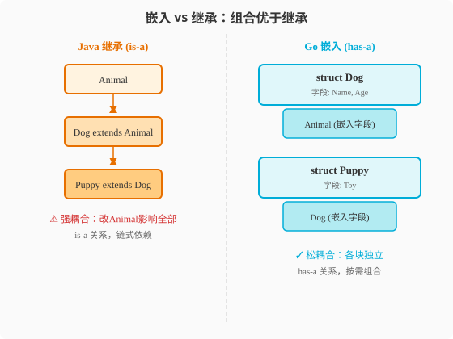

### 第6章 面向对象与接口：没有继承的OOP

> 📖 本章你将学会：
> - 理解Go用struct+嵌入+方法实现"OOP without classes"的设计逻辑
> - 区分Go嵌入和Java继承的五个本质差异
> - 理解Go隐式接口与Java显式接口的本质差异和设计动因
> - 用"接口定义在使用方"原则写出松耦合代码

---

#### 6.1 struct与嵌入：Go的组合复用

##### 6.1.1 开篇：Java老兵的"继承焦虑症"

如果你在Java里写过任何稍大的项目，你的代码里一定有一棵继承树：

```
BaseEntity
  └─ BaseAuditable
       └─ BaseModel
            └─ User
            └─ Order
                 └─ SpecialOrder
```

这棵树看起来很"优雅"——公共逻辑放在`BaseEntity`，子类自动复用。
但维护过这种代码的人都知道它的痛苦：改`BaseEntity`的一个方法，
二十个子类可能全炸；想给`User`加个功能，发现要往上改三层。

Go的处方很简单：**砍掉整棵树。** 没有继承，没有`extends`，没有
`abstract class`，没有`super()`。复用代码靠**嵌入（Embedding）**，
多态靠**接口（Interface）**——两者是完全独立的机制。

> 💡 比喻：Java继承像家族企业——子承父业，改一代影响三代。
> Go嵌入像乐高积木——每块独立，想拼就拼，想拆就拆，不牵连。



---

#### 6.2 struct + method = Go的"类"

Go没有`class`关键字，但`struct`+`method`组合提供了等价能力。

##### 6.2.1 Java的class vs Go的struct+method

```java
// Java: 一切在class中
public class User {
    private String name;
    private int age;

    public User(String name, int age) {
        this.name = name;
        this.age = age;
    }

    public String greet() {
        return "Hi, I'm " + this.name;
    }

    public String getName() { return name; }
    public void setName(String name) { this.name = name; }
}
```

```go
// Go: struct定义数据，method定义行为，两者分开
type User struct {
    Name string  // 公开字段（首字母大写）
    Age  int
}

// 方法是独立定义的函数，带接收者
func (u User) Greet() string {
    return "Hi, I'm " + u.Name
}

// 使用
u := User{Name: "Alice", Age: 30}  // 无需构造函数
fmt.Println(u.Greet())              // "Hi, I'm Alice"
```

核心差异：

| 维度 | Java class | Go struct+method | 差异 |
|------|-----------|-------------------|------|
| 定义 | 数据和行为在同一个代码块 | struct定义数据，method独立定义 | 分离 |
| 构造 | 构造函数`new` | 零值或工厂函数`NewXxx` | Go更灵活 |
| this/self | 隐式`this` | 显式接收者`(u User)` | Go显式 |
| 封装 | private字段+getter/setter | 公开字段直接访问 | Go更简洁 |
| 继承 | `extends` | 无（用嵌入） | Go无继承 |
| 多态 | 虚方法+继承 | 接口（独立机制） | Go解耦 |

##### 6.2.2 为什么方法定义在struct外面？

Java程序员可能觉得"方法定义在struct外面"很奇怪。但这个设计有深意：

1. **数据和行为解耦**：struct是数据布局，method是行为。两者可以独立演化——
   你可以在不修改struct的情况下添加method（甚至在不同文件、不同包）。
2. **接收者显式**：`(u User)`明确告诉你是谁的方法，没有`this`的歧义。
3. **统一函数模型**：方法本质是"带接收者参数的函数"——`func (u User) Greet()`
   等价于`func Greet(u User)`，编译器只是做了语法糖。

---

#### 6.3 嵌入：Go的"组合复用"

##### 6.3.1 基本嵌入语法

```go
type Address struct {
    City    string
    ZipCode string
}

func (a Address) FullAddress() string {
    return a.City + " " + a.ZipCode
}

type User struct {
    Name    string
    Address // 匿名嵌入——字段名就是类型名
}

u := User{
    Name: "Alice",
    Address: Address{City: "Beijing", ZipCode: "100000"},
}

// 嵌入字段的字段和方法可以直接访问——"提升"
fmt.Println(u.City)          // "Beijing"（Address.City被提升）
fmt.Println(u.FullAddress()) // "Beijing 100000"（Address.FullAddress被提升）

// 也可以显式访问
fmt.Println(u.Address.City)  // "Beijing"
```

看起来像继承？`u.City`直接访问，`u.FullAddress()`直接调用——
和Java的`class User extends Address`一样方便。

但本质完全不同：

##### 6.3.2 嵌入 vs 继承：五个本质差异

**差异一：关系语义**

```
Java: User IS-A Address（用户是一个地址）→ 逻辑荒谬但语法允许
Go:   User HAS-A Address（用户有一个地址）→ 逻辑合理
```

Java的继承是is-a关系——`Dog extends Animal`表示"狗是一种动物"。
Go的嵌入是has-a关系——`User`嵌入了`Address`表示"用户有一个地址组件"。

**差异二：方法分派**

```go
// Go: 嵌入类型的方法不会被子类型覆盖（没有虚方法表）
type Base struct{}
func (b Base) Hello() { fmt.Println("Base.Hello") }

type Child struct{ Base }
func (c Child) Hello() { fmt.Println("Child.Hello") } // 覆盖

c := Child{}
c.Hello()        // "Child.Hello" — 直接调Child的方法
c.Base.Hello()   // "Base.Hello"  — 显式调Base的方法
```

```java
// Java: 虚方法分派，子类覆盖父类方法
class Base { void hello() { System.out.println("Base"); } }
class Child extends Base { @Override void hello() { System.out.println("Child"); } }

Child c = new Child();
c.hello();        // "Child" — 虚方法分派
// Base b = c; b.hello(); // 也是"Child" — 多态！
```

Go的"覆盖"只是名字遮蔽——`c.Hello()`调Child的方法，但`c.Base.Hello()`
始终调Base的方法。没有虚方法表，没有多态分派。

**差异三：接口实现**

Go的嵌入**不会继承接口实现**——如果`Base`实现了`Stringer`接口，
`Child`嵌入`Base`后，`Child`的值也满足`Stringer`（因为方法被提升），
但这不是"继承接口实现"，而是"Child也拥有了String()方法"。

**差异四：初始化**

```go
// Go: 嵌入字段需要显式初始化
u := User{
    Name: "Alice",
    Address: Address{City: "Beijing", ZipCode: "100000"},
}

// Java: 父类字段由父类构造函数初始化
public User(String name, String city, String zip) {
    super(); // 调用父类构造函数
    this.name = name;
}
```

**差异五：层级深度**

```go
// Go: 可以多层嵌入，但没有"层级"概念
type A struct{}
type B struct{ A }  // B嵌入A
type C struct{ B }  // C嵌入B

var c C
c.A // 可以直接访问最底层（编译器帮你找）
// 但没有"super"概念，没有"三层继承链"的耦合
```

| 维度 | Java继承 | Go嵌入 | 差异 |
|------|----------|--------|------|
| 关系 | is-a | has-a | 语义不同 |
| 多态 | 虚方法分派 | 无（名字遮蔽） | Go无多态 |
| 耦合 | 强（改父类影响子类） | 弱（可替换组件） | Go松耦合 |
| 层级 | 有继承树 | 无层级概念 | Go扁平 |
| super | 有 | 无（但可显式访问） | Go无super |

---

#### 6.4 实战：用组合替代继承体系

**场景**：Java里常见的`BaseService` → `UserService` / `OrderService`
继承体系，在Go里怎么设计？

##### 6.4.1 Java的继承方案

```java
// Java: 继承体系
public abstract class BaseService<T> {
    protected Logger logger;
    protected Repository<T> repo;

    public BaseService(Repository<T> repo) {
        this.logger = Logger.getLogger(getClass());
        this.repo = repo;
    }

    public T find(String id) {
        logger.info("Finding: " + id);
        return repo.findById(id);
    }

    public void save(T entity) {
        logger.info("Saving");
        repo.save(entity);
    }

    protected abstract void validate(T entity); // 模板方法
}

public class UserService extends BaseService<User> {
    public UserService(Repository<User> repo) {
        super(repo);
    }

    @Override
    protected void validate(User user) {
        if (user.getName() == null) throw new IllegalArgumentException();
    }
}
```

##### 6.4.2 Go的组合方案

```go
// Go: 组合方案
type Logger struct{}

func (l *Logger) Info(msg string) { fmt.Println("[INFO]", msg) }

type Repository[T any] interface {
    FindByID(id string) (T, error)
    Save(entity T) error
}

// BaseService 不是一个"父类"，而是一个可嵌入的组件
type BaseService[T any] struct {
    Logger *Logger
    Repo   Repository[T]
}

func (s *BaseService[T]) Find(id string) (T, error) {
    s.Logger.Info("Finding: " + id)
    return s.Repo.FindByID(id)
}

func (s *BaseService[T]) Save(entity T) error {
    s.Logger.Info("Saving")
    return s.Repo.Save(entity)
}

// UserService 嵌入BaseService，获得其方法
type UserService struct {
    *BaseService[User] // 嵌入指针——可以修改BaseService的状态
}

func NewUserService(repo Repository[User]) *UserService {
    return &UserService{
        BaseService: &BaseService[User]{
            Logger: &Logger{},
            Repo:   repo,
        },
    }
}

// UserService自己的方法
func (s *UserService) Validate(user *User) error {
    if user.Name == "" {
        return errors.New("name is required")
    }
    return nil
}

// 可以覆盖（遮蔽）BaseService的方法
func (s *UserService) Save(user *User) error {
    if err := s.Validate(user); err != nil {
        return err
    }
    return s.BaseService.Save(user) // 显式调用嵌入类型的方法
}
```

##### 6.4.3 关键差异解读

| 维度 | Java继承方案 | Go组合方案 | 优势 |
|------|-------------|------------|------|
| 复用方式 | extends | 嵌入 | Go松耦合 |
| 覆盖 | @Override虚方法 | 名字遮蔽+显式调用 | Go显式 |
| 模板方法 | abstract方法 | 接口或函数字段 | Go更灵活 |
| 耦合度 | 强（改Base影响所有子类） | 弱（可替换BaseService） | Go可替换 |
| 测试 | 难（继承链mock困难） | 易（注入Repo+Logger） | Go可测试性更好 |

> 💡 提示：Go的组合方案比Java的继承方案多几行代码（手动写
> `s.BaseService.Save(user)`），但换来了**松耦合**和**可测试性**。
> 你可以轻松把`BaseService`换成另一个实现，这在Java继承体系里几乎不可能。

---

#### 6.5 构造与初始化

Java用构造函数初始化对象。Go没有构造函数——用**零值**和**工厂函数**。

##### 6.5.1 零值初始化

```go
// 零值可直接用
type Config struct {
    Host    string        // 零值: ""
    Port    int           // 零值: 0
    Debug   bool          // 零值: false
    Timeout time.Duration // 零值: 0 (0纳秒)
}

var c Config // 直接可用，无需构造函数
```

##### 6.5.2 工厂函数

当零值不够用时（需要必填字段、需要验证），用工厂函数：

```go
type Server struct {
    host string
    port int
    tls  *TLSConfig // 可选
}

// 工厂函数：强制必填字段
func NewServer(host string, port int) (*Server, error) {
    if host == "" {
        return nil, errors.New("host is required")
    }
    if port <= 0 || port > 65535 {
        return nil, errors.New("invalid port")
    }
    return &Server{host: host, port: port}, nil
}

// 可选配置：函数选项模式
type Option func(*Server)

func WithTLS(config *TLSConfig) Option {
    return func(s *Server) { s.tls = config }
}

func NewServerWithOptions(host string, port int, opts ...Option) (*Server, error) {
    s, err := NewServer(host, port)
    if err != nil {
        return nil, err
    }
    for _, opt := range opts {
        opt(s)
    }
    return s, nil
}

// 使用
server, err := NewServerWithOptions("localhost", 8080, WithTLS(tlsConfig))
```

##### 6.5.3 函数选项模式（Functional Options）

这是Go社区最流行的构造模式——类似Java的Builder模式，但更灵活：

```go
// 对比Java的Builder
Server server = Server.builder("localhost", 8080)
    .withTLS(tlsConfig)
    .withTimeout(30)
    .build();

// Go的函数选项
server, err := NewServer("localhost", 8080,
    WithTLS(tlsConfig),
    WithTimeout(30*time.Second),
)
```

| 模式 | Java Builder | Go Functional Options | 差异 |
|------|-------------|----------------------|------|
| 必填参数 | builder构造函数 | 工厂函数参数 | 相似 |
| 可选参数 | .withXxx() | WithXxx()选项函数 | 相似 |
| 返回值 | build()返回对象 | 直接返回对象+error | Go有error |
| 验证 | build()中验证 | 工厂函数中验证 | 相似 |
| 扩展性 | 加新withXxx方法 | 加新WithXxx函数 | Go更灵活 |

---

#### 6.6 常见反模式：Java程序员在Go里模拟继承

##### 6.6.1 反模式一：深层嵌入链

```go
// ❌ 差: 模拟Java的多层继承
type BaseEntity struct { ID string; CreatedAt time.Time }
type BaseAuditable struct { BaseEntity; UpdatedAt time.Time }
type BaseModel struct { BaseAuditable; CreatedBy string }
type User struct { BaseModel; Name string }

// 三层嵌入，访问字段需要理解整个链
u := User{}
u.ID         // 从BaseEntity提升
u.CreatedAt  // 从BaseEntity提升
u.UpdatedAt  // 从BaseAuditable提升
u.CreatedBy  // 从BaseModel提升
u.Name       // User自己的
```

```go
// ✅ 好: 扁平化，用组合
type Timestamps struct {
    CreatedAt time.Time
    UpdatedAt time.Time
}

type User struct {
    ID         string
    Timestamps // 只嵌入一层
    Name       string
}
```

##### 6.6.2 反模式二：为了"多态"而嵌入接口

```go
// ❌ 差: 在struct里嵌入接口来模拟"抽象类"
type BaseService struct {
    repo Repository // 嵌入接口，类似Java的abstract class
}

type UserService struct {
    BaseService
}

// 问题：BaseService.repo是nil，需要在外部设置，容易忘
```

```go
// ✅ 好: 接口定义在使用方，struct通过依赖注入
type UserService struct {
    repo Repository // 明确的依赖
}

func NewUserService(repo Repository) *UserService {
    return &UserService{repo: repo}
}
```

##### 6.6.3 反模式三：过度使用getter/setter

```go
// ❌ 差: Java风格getter/setter
type User struct {
    name string
}
func (u *User) GetName() string { return u.name }
func (u *User) SetName(name string) { u.name = name }

// ✅ 好: 公开字段直接访问
type User struct {
    Name string // 首字母大写=公开
}
u.Name = "Alice" // 直接访问
```

> ⚠️ 陷阱：Go社区约定只在以下情况用getter/setter：
> 1. 字段需要验证逻辑（`SetAge`检查范围）
> 2. 字段需要计算（`GetFullName`拼接姓和名）
> 3. 字段需要隐藏实现细节（内部是`map`，外部是`Get`方法）
> 单纯的读写字段不需要getter/setter。

---

#### ⚡ 6.7 性能贴士：嵌入 vs 继承的内存影响

##### 6.7.1 内存布局对比

```
Go嵌入（连续内存）:
┌────────────────────────────┐
│ User struct                │
│ ├─ Name string (16B)       │
│ ├─ Age int (8B)            │
│ └─ Address (嵌入)          │
│    ├─ City string (16B)    │  ← 内存连续，缓存友好
│    └─ ZipCode string (16B) │
└────────────────────────────┘
总共 ~56 bytes，一次内存访问

Java继承（对象分散）:
┌──────────────┐
│ User object  │
│ ├─ name ref  │ ──→ String对象 (堆)
│ ├─ age (4B)  │
│ └─ address ref│ ──→ Address对象 (堆)
└──────────────┘    ├─ city ref ──→ String (堆)
                    └─ zipCode ref──→ String (堆)
4个对象分散在堆上，4次内存访问+对象头开销
```

##### 6.7.2 性能数据

| 指标 | Java继承 | Go嵌入 | 倍数 |
|------|----------|--------|------|
| 内存占用 | 120B+（4个对象头+引用） | 56B（连续） | 2x |
| 访问字段 | 2次间接（对象→字段对象） | 0次间接（连续内存） | 缓存命中率2-5x |
| 创建开销 | 4次堆分配 | 1次栈/堆分配 | 4x |
| GC压力 | 4个对象需回收 | 1个对象需回收 | 4x |

> 💡 性能口诀：**Java继承对象散，Go嵌入内存连；缓存友好少分配，
> 性能翻倍不是梦。**

---

#### 6.8 接口：Go的隐式契约

##### 6.8.1 开篇：一份不需要签字的合同

Java的接口像入职合同——你必须拿着合同去找HR，在`implements`一栏
签字，才算正式员工。编译器就是HR，没签字不认你。

```java
// Java: 显式声明实现
public class FileLogger implements Logger {
    @Override
    public void log(String message) {
        // ...
    }
}
```

Go的接口像免试上岗——只要你的技能（方法）匹配岗位要求（接口定义），
系统自动录用你。你甚至不需要知道这个岗位（接口）的存在。

```go
// Go: 隐式实现
type Logger interface {
    Log(message string)
}

type FileLogger struct{ file *os.File }

func (f *FileLogger) Log(message string) {
    fmt.Fprintln(f.file, message)
}

// FileLogger自动满足Logger接口！不需要声明"implements"
```

这个差异看似只是语法糖，但它深刻影响了Go代码的组织方式——
**接口定义在使用方，而不是实现方。**

> 💡 比喻：Java接口像考公——你得explicit填表声明"我符合条件"。
> Go接口像免试上岗——只要你的能力（方法签名）匹配岗位要求（接口定义），
> 自动录用，不用申请。

---

#### 6.9 接口基础：语法对比

##### 6.9.1 定义接口

```go
// Go: 接口是一组方法签名的集合
type Reader interface {
    Read(p []byte) (n int, err error)
}

type Writer interface {
    Write(p []byte) (n int, err error)
}

// 接口可以组合
type ReadWriter interface {
    Reader
    Writer
}
```

```java
// Java: 接口是一组方法签名的集合
public interface Reader {
    int read(byte[] p) throws IOException;
}

public interface Writer {
    int write(byte[] p) throws IOException;
}

// 接口可以继承
public interface ReadWriter extends Reader, Writer {}
```

语法相似，但Go的接口组合（嵌入其他接口）和Java的接口继承语义不同——
Go是"组合"，Java是"继承"。

##### 6.9.2 实现接口

```go
// Go: 隐式实现——不需要任何声明
type File struct{ fd *os.File }

func (f *File) Read(p []byte) (int, error) {
    return f.fd.Read(p)
}

func (f *File) Write(p []byte) (int, error) {
    return f.fd.Write(p)
}

// File自动满足Reader、Writer、ReadWriter接口
var r Reader = &File{}
var w Writer = &File{}
var rw ReadWriter = &File{}
```

```java
// Java: 显式声明implements
public class File implements ReadWriter {
    @Override
    public int read(byte[] p) throws IOException { ... }

    @Override
    public int write(byte[] p) throws IOException { ... }
}
// 必须在class声明中写implements，否则编译器不认
```

##### 6.9.3 接口的核心差异表

| 维度 | Java接口 | Go接口 | 差异本质 |
|------|----------|--------|----------|
| 实现方式 | 显式`implements` | 隐式（鸭子类型） | 契约驱动 vs 能力驱动 |
| 定义位置 | 通常在实现方 | 通常在使用方 | 耦合方向不同 |
| 方法数量 | 倾向多方法 | 倾向少方法（1-3个） | 胖接口 vs 小接口 |
| 默认方法 | 有`default`方法 | 无 | Java有后向兼容 |
| 继承 | `extends`多继承 | 嵌入组合 | 继承 vs 组合 |
| 多态 | 继承链+接口 | 仅接口 | Go更纯粹 |
| 运行时 | 虚方法表 | itable查找 | 机制不同 |

---

#### 6.10 "接口定义在使用方"原则

这是Go接口设计最重要的原则，也是Java程序员最难转变的思维。

##### 6.10.1 Java的方式：接口在实现方

Java程序员习惯在写实现类时同时定义接口：

```java
// Java: 接口和实现放在一起
package com.example.user;

public interface UserRepository {
    User findById(String id);
    void save(User user);
}

@Repository
public class JpaUserRepository implements UserRepository {
    @Override
    public User findById(String id) { ... }

    @Override
    public void save(User user) { ... }
}
```

问题：`UserService`依赖`UserRepository`——但`UserRepository`是
`com.example.user`包定义的，`UserService`被迫依赖这个包。如果
`UserRepository`加一个方法，所有实现都要改，所有使用方也要改。

##### 6.10.2 Go的方式：接口在使用方

```go
// Go: 接口定义在使用方
package user

// 实现方不需要定义接口——直接写struct
type JpaUserRepository struct {
    db *gorm.DB
}

func (r *JpaUserRepository) FindByID(id string) (*User, error) {
    // ...
}

func (r *JpaUserRepository) Save(user *User) error {
    // ...
}

// --- 使用方（另一个包）---
package service

// 在使用方定义接口——只包含自己需要的方法
type UserFinder interface {
    FindByID(id string) (*User, error)
}

type UserService struct {
    repo UserFinder // 只依赖自己定义的接口
}

func NewUserService(repo UserFinder) *UserService {
    return &UserService{repo: repo}
}
```

关键变化：`UserService`定义了自己的`UserFinder`接口——只有`FindByID`
一个方法，因为`UserService`只需要查找用户，不需要保存。`JpaUserRepository`
自动满足`UserFinder`，不需要声明`implements`。

**好处**：

1. **松耦合**：`UserService`不依赖`user`包的接口定义，只依赖自己的小接口
2. **可测试**：测试时mock一个只有`FindByID`方法的类型即可
3. **可替换**：换一个`RedisUserRepository`（也实现了`FindByID`），
   `UserService`完全无感知

> 💡 提示：Go标准库就是这种模式的典范——`io.Reader`和`io.Writer`
> 各只有一个方法，被`os.File`、`bytes.Buffer`、`net.Conn`等无数类型
> 隐式实现。`fmt.Println`接收`io.Writer`，任何有`Write`方法的类型
> 都能传进去。

---

#### 6.11 接口越小越好

Go社区的黄金法则：**接口应该只包含你真正需要的方法。**

| 接口 | 方法数 | 理由 |
|------|--------|------|
| `io.Reader` | 1 | 只读 |
| `io.Writer` | 1 | 只写 |
| `fmt.Stringer` | 1 | 只需字符串表示 |
| `sort.Interface` | 3 | 排序需要Len/Less/Swap |
| `error` | 1 | 只需Error()返回描述 |

对比Java的接口通常包含5-20个方法（`List`有25个方法、`Map`有20个），
Go的接口极小——这意味着实现门槛极低，任何类型只要实现1-3个方法
就能满足接口。

> ⚠️ 陷阱：Java程序员习惯写"胖接口"（一个接口包含CRUD全套方法）。
> 在Go里这是反模式——把`Reader`和`Writer`拆成两个接口，让只需要
> 读的使用方只依赖`Reader`，而不是被迫依赖一个胖接口。

---

#### 6.12 类型断言与type switch

接口值在Go里是"动态类型"——编译期不知道具体类型，运行时可以提取。

##### 6.12.1 类型断言

```go
var i interface{} = "hello"

// 类型断言：从接口值中提取具体类型
s := i.(string)        // 如果i确实是string，s="hello"
fmt.Println(s)

// 安全的类型断言：带ok检查
s, ok := i.(string)    // ok=true, s="hello"
n, ok := i.(int)       // ok=false, n=0（零值）

// 不安全的断言会panic
n := i.(int) // panic: interface conversion
```

##### 6.12.2 type switch

```go
func describe(i interface{}) string {
    switch v := i.(type) {
    case int:
        return fmt.Sprintf("整数 %d", v)
    case string:
        return fmt.Sprintf("字符串 %q", v)
    case []byte:
        return fmt.Sprintf("字节 %d bytes", len(v))
    case nil:
        return "nil"
    default:
        return fmt.Sprintf("未知类型 %T", v)
    }
}

describe(42)         // "整数 42"
describe("hello")    // "字符串 \"hello\""
```

##### 6.12.3 接口值的内部结构

Go的接口值在运行时是一个**两个字的指针对**：

```
interface value:
┌─────────────┬─────────────┐
│ type pointer│ data pointer │
└─────────────┴─────────────┘
      ↓               ↓
  itab               具体数据
(type+方法表)       (或指向数据的指针)
```

- `type pointer`：指向`itab`（接口表），包含具体类型信息和方法分派表
- `data pointer`：指向具体数据，或直接存小数据

这就是为什么接口调用比直接调用慢——需要通过itable查找方法地址。

---

#### 6.13 空接口与泛型

##### 6.13.1 空接口`interface{}`/`any`

Go 1.18之前，`interface{}`（空接口）是唯一能持有任意类型的方式：
```go
var i interface{} = 42
var j interface{} = "hello"
```

Go 1.18给`interface{}`起了别名`any`：
```go
var i any = 42 // 等价于 interface{}
```

##### 6.13.2 泛型 vs 空接口

Go 1.18引入泛型后，很多之前用`interface{}`的场景可以改用泛型，
获得编译期类型安全：

```go
// ❌ 旧方式: 空接口，运行时类型断言
func Max(values []interface{}) interface{} {
    if len(values) == 0 {
        return nil
    }
    m := values[0]
    for _, v := range values[1:] {
        if v.(int) > m.(int) { // 运行时类型断言，不安全
            m = v
        }
    }
    return m
}

// ✅ 新方式: 泛型，编译期类型安全
func Max[T int | int64 | float64](values []T) T {
    if len(values) == 0 {
        var zero T
        return zero
    }
    m := values[0]
    for _, v := range values[1:] {
        if v > m { // 直接比较，无需断言
            m = v
        }
    }
    return m
}

Max([]int{1, 3, 2})        // 返回 int 3
Max([]float64{1.5, 2.5})   // 返回 float64 2.5
// Max([]string{"a", "b"})  // 编译错误！string不满足约束
```

##### 6.13.3 何时用空接口，何时用泛型

| 场景 | 用空接口`any` | 用泛型`[T]` |
|------|--------------|------------|
| 需要持有任意类型 | ✅ | ❌ |
| 需要类型安全 | ❌ | ✅ |
| JSON序列化 | ✅ | 看情况 |
| 容器/集合 | ❌ | ✅ |
| 反射场景 | ✅ | ❌ |
| 类型已知 | ❌ | ✅ |

> 💡 提示：Go的泛型比Java的泛型更"真"——Java是类型擦除（运行时无类型信息），
> Go是部分单态化（运行时保留类型信息）。但Go泛型的约束机制不如Java灵活，
> 复杂场景仍需配合接口。

---

#### 6.14 代码实战：插件式日志系统

**场景**：设计一个日志系统，支持多种输出（文件、控制台、网络），
且使用方可以自由组合。

##### 6.14.1 Go实现

```go
package main

import (
    "fmt"
    "os"
    "time"
)

// --- 接口定义在使用方 ---

// 日志系统只需要一个Write方法
type LogWriter interface {
    Write(level string, message string) error
}

// --- 实现方（各自独立）---

type ConsoleWriter struct{}

func (w *ConsoleWriter) Write(level, msg string) error {
    fmt.Printf("[%s] %s\n", level, msg)
    return nil
}

type FileWriter struct {
    File *os.File
}

func (w *FileWriter) Write(level, msg string) error {
    _, err := fmt.Fprintf(w.File, "[%s] [%s] %s\n",
        time.Now().Format("2006-01-02 15:04:05"), level, msg)
    return err
}

// --- 使用方：Logger ---

type Logger struct {
    writers []LogWriter // 可以组合多个writer
}

func NewLogger(writers ...LogWriter) *Logger {
    return &Logger{writers: writers}
}

func (l *Logger) Log(level, msg string) {
    for _, w := range l.writers {
        w.Write(level, msg) // 通过接口调用
    }
}

func (l *Logger) Info(msg string)  { l.Log("INFO", msg) }
func (l *Logger) Error(msg string) { l.Log("ERROR", msg) }

// --- 使用 ---
func main() {
    // 组合：同时输出到控制台和文件
    file, _ := os.Create("app.log")
    defer file.Close()

    logger := NewLogger(
        &ConsoleWriter{},
        &FileWriter{File: file},
    )

    logger.Info("服务启动")
    logger.Error("数据库连接失败")
}
```

##### 6.14.2 Java对比

```java
// Java: 接口在实现方定义，使用方依赖该接口
public interface LogWriter {
    void write(String level, String message) throws IOException;
}

public class ConsoleWriter implements LogWriter { ... }
public class FileWriter implements LogWriter { ... }

public class Logger {
    private final List<LogWriter> writers;

    public Logger(LogWriter... writers) {
        this.writers = Arrays.asList(writers);
    }

    public void log(String level, String msg) {
        for (LogWriter w : writers) {
            try { w.write(level, msg); }
            catch (IOException e) { /* 异常处理 */ }
        }
    }
}
```

##### 6.14.3 关键差异解读

| 维度 | Java | Go | 差异 |
|------|------|----|------|
| 接口定义 | 在LogWriter接口文件中 | 在Logger使用方 | Go更松耦合 |
| 实现声明 | `implements LogWriter` | 无需声明 | Go更简洁 |
| 新增Writer | 实现接口+声明implements | 只需实现Write方法 | Go更灵活 |
| 错误处理 | 异常 | error值 | Go显式 |
| 多writer组合 | 构造函数传数组 | 函数选项/可变参数 | 相似 |

---

#### ⚡ 6.15 性能贴士：接口调用的开销

##### 6.15.1 直接调用 vs 接口调用

```go
// 直接调用（编译期已知类型）
func directAdd(a, b int) int { return a + b }

// 接口调用（运行时通过itable查找）
type Adder interface { Add(int, int) int }
func interfaceAdd(a Adder, x, y int) int { return a.Add(x, y) }
```

| 调用类型 | 耗时 | 原因 |
|------|------|------|
| 直接函数调用 | ~0.3ns | 编译期地址确定 |
| 方法调用（值接收者） | ~0.5ns | 编译期地址确定 |
| 方法调用（指针接收者） | ~0.5ns | 编译期地址确定 |
| 接口调用 | ~2ns | 运行时itable查找 |
| 反射调用 | ~50ns | 运行时类型检查+查找 |

**接口调用的额外开销**：

1. **itable查找**：运行时通过接口的type指针找到方法地址
2. **间接跳转**：CPU分支预测可能失效
3. **阻止内联**：编译器无法内联接口方法

##### 6.15.2 优化建议

1. **热路径避免接口**：性能关键代码用具体类型，不用接口
2. **小接口有利内联**：单方法接口可能被编译器特殊优化
3. **泛型替代接口**：泛型在编译期特化，无itable开销

```go
// 慢: 接口调用
func sumAll(items []fmt.Stringer) int { ... }

// 快: 泛型（编译期特化）
func sumAll[T fmt.Stringer](items []T) int { ... }
```

> 💡 性能口诀：**接口调用多一跳，itable查找有开销；热路径用具体类，
> 泛型编译期最帅。**

---

#### 本章小结

1. **struct+嵌入替代继承** —— Go没有继承，嵌入是has-a组合。方法被提升
   可直接调用，但没有虚方法表，没有多态分派。组合比继承更松耦合。

2. **接口是隐式实现** —— 不需要`implements`声明，只要方法签名匹配
   就自动满足。这改变了接口的组织方式——**接口定义在使用方**。

3. **接口越小越好** —— `io.Reader`只有一个方法。小接口门槛低、
   组合灵活、实现容易。空接口vs泛型：需要持有任意类型用`any`，
   需要类型安全用泛型。

4. **类型断言和type switch是动态类型工具** —— 从接口值中提取具体类型。
   带`ok`检查是安全用法，不加`ok`会panic。

> 🤔 思考题：Go的接口是隐式的，意味着你可以在不知道接口存在的情况下
> 实现它。但如果两个人独立定义了相同方法签名的接口，会发生什么？
> 带着这个问题进入第7章——泛型与集合。
