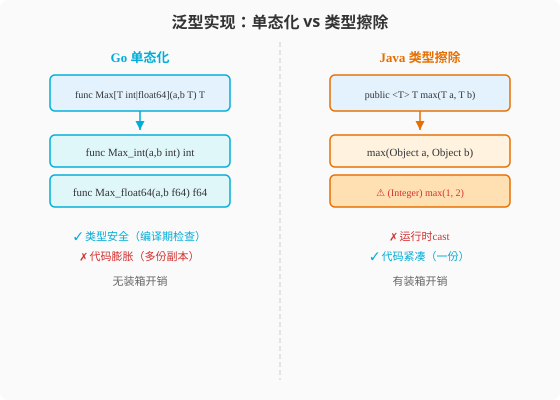

### 第7章 泛型与集合：类型参数与slice、map的底层秘密

> 📖 本章你将学会：
> - 理解Go泛型与Java泛型的三步本质差异（单态化 vs 类型擦除）
> - 用类型约束精确控制泛型行为
> - 理解slice的"三件套"结构和扩容机制
> - 掌握map的并发陷阱和性能调优

---

#### 7.1 泛型：Go 1.18的迟到礼物

##### 7.1.1 开篇：迟到的礼物，但不是万能药

Java在2004年的Java 5就引入了泛型[^java5-generics]。Go直到2022年的Go 1.18才加入泛型[^go118-generics]
——迟到了18年。

这不是因为Go团队不会做，而是**故意推迟**。Go 官方 FAQ（FAQ: Why does Go not have generic types? 见 [go.dev/doc/faq](https://go.dev/doc/faq)）中对此有明确说明：泛型虽然方便，但会带来类型系统与运行时的复杂度成本，团队长期未找到"价值与复杂度成正比"的设计方案，直到 2022 年的 Go 1.18 才确定了一版极简且实用的实现[^go-faq-generics]。

结果是一套**极简但实用**的泛型系统：有类型参数、有约束、有推断，
但没有通配符、没有协变逆变、没有变长参数列表。

> 💡 比喻：Java泛型像一把瑞士军刀——功能多但复杂，有`<? extends T>`
> 和`<? super T>`等通配符。Go泛型像一把简洁的菜刀——只做最重要的
> 事，但做得很利落。

---

#### 7.2 泛型基础：语法对比

##### 7.2.1 泛型函数

```go
// Go: 类型参数在函数名后的方括号中
func Max[T int | int64 | float64](values []T) T {
    if len(values) == 0 {
        var zero T
        return zero
    }
    m := values[0]
    for _, v := range values[1:] {
        if v > m {
            m = v
        }
    }
    return m
}

// 使用（类型可推断）
Max([]int{1, 3, 2})        // 3
Max([]float64{1.5, 2.5})   // 2.5
// Max([]string{"a", "b"}) // 编译错误：string不满足约束
```

```java
// Java: 类型参数在返回值前
public static <T extends Comparable<T>> T max(List<T> values) {
    if (values.isEmpty()) return null;
    T m = values.get(0);
    for (T v : values) {
        if (v.compareTo(m) > 0) m = v;
    }
    return m;
}

max(List.of(1, 3, 2));          // 3
max(List.of(1.5, 2.5));         // 2.5
max(List.of("a", "b"));         // "b"（String实现了Comparable）
```

##### 7.2.2 泛型类型

```go
// Go: 泛型struct
type Stack[T any] struct {
    items []T
}

func (s *Stack[T]) Push(item T) {
    s.items = append(s.items, item)
}

func (s *Stack[T]) Pop() (T, bool) {
    var zero T
    if len(s.items) == 0 {
        return zero, false
    }
    item := s.items[len(s.items)-1]
    s.items = s.items[:len(s.items)-1]
    return item, true
}

// 使用
intStack := &Stack[int]{}
intStack.Push(42)

stringStack := &Stack[string]{}
stringStack.Push("hello")
```

```java
// Java: 泛型class
public class Stack<T> {
    private List<T> items = new ArrayList<>();

    public void push(T item) { items.add(item); }

    public Optional<T> pop() {
        if (items.isEmpty()) return Optional.empty();
        T item = items.remove(items.size() - 1);
        return Optional.of(item);
    }
}

Stack<Integer> intStack = new Stack<>();
intStack.push(42);
```

---

#### 7.3 三大本质差异

##### 7.3.1 差异一：单态化 vs 类型擦除



这是Go和Java泛型最根本的差异。

**Java的类型擦除**：泛型只存在于编译期——编译后所有`T`被擦除为
`Object`，运行时无类型信息。

```java
// 编译前
List<String> strings = new ArrayList<>();
List<Integer> numbers = new ArrayList<>();

// 编译后（字节码层面）
List strings = new ArrayList();  // 都是同一个ArrayList
List numbers = new ArrayList();  // T被擦除为Object

// 运行时无法获知泛型类型
strings.getClass() == numbers.getClass()  // true! 都是ArrayList.class
```

**Go的单态化（部分）**：Go编译器为不同的类型参数生成不同的代码——
`Stack[int]`和`Stack[string]`是不同的类型，有不同的方法。

```go
// Go: Stack[int]和Stack[string]是不同类型
intStack := &Stack[int]{}
strStack := &Stack[string]{}

// 运行时类型信息保留
fmt.Printf("%T\n", intStack) // *main.Stack[int]
fmt.Printf("%T\n", strStack) // *main.Stack[string]
```

| 维度 | Java类型擦除 | Go单态化 | 差异 |
|------|-------------|----------|------|
| 运行时类型信息 | 丢失 | 保留 | Go更好 |
| `instanceof`泛型 | 不行 | 可以 | Go更好 |
| 代码体积 | 一份 | 多份（每类型一份） | Java更小 |
| 性能 | 装箱开销 | 无装箱 | Go更快 |
| 静态字段共享 | 共享 | 不共享 | Java共享 |

##### 7.3.2 差异二：约束机制

**Java的约束**：`<T extends Comparable<T>>`——用`extends`绑定接口/类。

**Go的约束**：`[T constraints.Ordered]`——用接口表达约束。

```go
// Go: 用接口定义约束
type Number interface {
    int | int64 | float32 | float64 // 类型联合
}

func Sum[T Number](values []T) T {
    var sum T
    for _, v := range values {
        sum += v
    }
    return sum
}
```

Go 1.18引入了`constraints`包（后移入`cmp`标准包）：

```go
// Go 1.21+ 标准库
import "cmp"

func Max[T cmp.Ordered](values []T) T { ... }
// cmp.Ordered 约束 = Integer | Float | ~string
```

##### 7.3.3 差异三：没有通配符

Java泛型有`? extends T`（协变）和`? super T`（逆变），用于解决
泛型子类型问题。Go**没有通配符**——因为它不需要。

```java
// Java: 通配符解决协变
List<? extends Number> nums = new ArrayList<Integer>(); // OK
nums.add(42); // 编译错误！不能往协变List添加

// Java: 通配符解决逆变
List<? super Integer> ints = new ArrayList<Number>(); // OK
ints.add(42); // OK
Number n = ints.get(0); // 编译错误！不知道具体类型
```

Go不需要通配符，因为Go的泛型是**不变（invariant）**的——
`Stack[int]`和`Stack[Number]`没有子类型关系，就像`int`和`float64`
没有子类型关系一样。简单粗暴，但避免了通配符的所有复杂性。

> ⚠️ 陷阱：Java程序员习惯了通配符解决"泛型容器协变"问题。Go里这个
> 问题不存在——如果你需要"能持有多种类型的容器"，用接口或`any`，
> 而不是泛型协变。

---

#### 7.4 类型约束详解

##### 7.4.1 基本约束

```go
// 类型联合
type IntOrFloat interface {
    int | float64
}

// ~表示"底层类型"，包含类型别名
type MyString string // 自定义类型
type AnyString interface {
    ~string // 匹配string和所有~string的自定义类型
}

// 多重约束
type Comparable interface {
    ~int | ~string | ~float64
    String() string // 同时要求有String方法
}
```

##### 7.4.2 标准库约束

Go标准库提供了常用约束：

```go
// cmp包 (Go 1.21+)
cmp.Ordered    // 支持 < > <= >= 的类型
cmp.Number     // Integer | Float
cmp.Integer    // 所有整数类型
cmp.Float      // 所有浮点类型

// any 就是 interface{} 的别名
func Print[T any](v T) { fmt.Println(v) }

// comparable 约束：支持 == 和 !=
func Contains[T comparable](slice []T, target T) bool {
    for _, v := range slice {
        if v == target {
            return true
        }
    }
    return false
}
```

##### 7.4.3 自定义约束

```go
// 自定义约束接口
type Stringer interface {
    ~int | ~string
    String() string
}

// 约束可以包含方法
type Clonable[T any] interface {
    Clone() T
}

func CloneAll[T any, C Clonable[T]](items []C) []T {
    result := make([]T, len(items))
    for i, item := range items {
        result[i] = item.Clone()
    }
    return result
}
```

---

#### 7.5 代码实战：泛型缓存

**场景**：实现一个线程安全的泛型缓存，支持任意Key-Value类型。

##### 7.5.1 Go实现

```go
package main

import (
    "fmt"
    "sync"
    "time"
)

// 泛型缓存
type Cache[K comparable, V any] struct {
    mu      sync.RWMutex
    items   map[K]V
    expiry  time.Duration
}

type CacheItem[V any] struct {
    Value     V
    ExpiresAt time.Time
}

// 带TTL的泛型缓存
type TTLCache[K comparable, V any] struct {
    mu    sync.RWMutex
    items map[K]CacheItem[V]
}

func NewTTLCache[K comparable, V any]() *TTLCache[K, V] {
    return &TTLCache[K, V]{
        items: make(map[K]CacheItem[V]),
    }
}

func (c *TTLCache[K, V]) Set(key K, value V, ttl time.Duration) {
    c.mu.Lock()
    defer c.mu.Unlock()
    c.items[key] = CacheItem[V]{
        Value:     value,
        ExpiresAt: time.Now().Add(ttl),
    }
}

func (c *TTLCache[K, V]) Get(key K) (V, bool) {
    c.mu.RLock()
    defer c.mu.RUnlock()

    item, ok := c.items[key]
    if !ok {
        var zero V
        return zero, false
    }

    if time.Now().After(item.ExpiresAt) {
        var zero V
        return zero, false // 过期
    }

    return item.Value, true
}

func (c *TTLCache[K, V]) Delete(key K) {
    c.mu.Lock()
    defer c.mu.Unlock()
    delete(c.items, key)
}

// 泛型函数：批量获取
func BatchGet[K comparable, V any](cache *TTLCache[K, V], keys []K) map[K]V {
    result := make(map[K]V)
    for _, key := range keys {
        if val, ok := cache.Get(key); ok {
            result[key] = val
        }
    }
    return result
}

// --- 使用 ---
func main() {
    // 字符串→用户缓存
    userCache := NewTTLCache[string, *User]()
    userCache.Set("user:1", &User{Name: "Alice"}, 5*time.Minute)
    userCache.Set("user:2", &User{Name: "Bob"}, 5*time.Minute)

    user, ok := userCache.Get("user:1")
    if ok {
        fmt.Printf("找到用户: %s\n", user.Name)
    }

    // 批量获取
    users := BatchGet(userCache, []string{"user:1", "user:2", "user:3"})
    for key, u := range users {
        fmt.Printf("%s → %s\n", key, u.Name)
    }

    // 整数→配置缓存
    configCache := NewTTLCache[int, Config]()
    configCache.Set(1, Config{Debug: true}, 10*time.Minute)
    config, _ := configCache.Get(1)
    fmt.Printf("配置: %+v\n", config)
}

type User struct{ Name string }
type Config struct{ Debug bool }
```

##### 7.5.2 Java对比

```java
// Java: 泛型缓存（类型擦除，运行时无类型信息）
public class TTLCache<K, V> {
    private final Map<K, CacheItem<V>> items = new ConcurrentHashMap<>();

    public void set(K key, V value, Duration ttl) {
        items.put(key, new CacheItem<>(value, Instant.now().plus(ttl)));
    }

    public Optional<V> get(K key) {
        CacheItem<V> item = items.get(key);
        if (item == null) return Optional.empty();
        if (Instant.now().isAfter(item.expiresAt)) {
            items.remove(key);
            return Optional.empty();
        }
        return Optional.of(item.value);
    }
}

// 使用
TTLCache<String, User> userCache = new TTLCache<>();
userCache.set("user:1", new User("Alice"), Duration.ofMinutes(5));

// Java运行时无法获知V的具体类型
// if (userCache instanceof TTLCache<String, User>) {} // 编译错误！
```

##### 7.5.3 关键差异解读

| 维度 | Java | Go | 差异 |
|------|------|----|------|
| 类型安全 | 编译期（运行时擦除） | 编译期+运行时 | Go更安全 |
| 装箱开销 | 有（擦除为Object） | 无（单态化） | Go更快 |
| 类型信息 | 运行时丢失 | 运行时保留 | Go可反射 |
| 通配符 | 有 | 无 | Go更简单 |
| 约束 | extends/super | 接口+类型联合 | 不同 |
| 性能 | 有装箱 | 无装箱 | Go更快 |

---

#### 7.6 何时用泛型，何时不用

Go社区的经验法则：**不要为了泛型而泛型。**

##### 7.6.1 适合用泛型的场景

1. **容器类型**：`Stack[T]`、`Cache[K,V]`、`Queue[T]`
2. **算法泛化**：`Sort[T cmp.Ordered]`、`Filter[T any]`
3. **工具函数**：`Map[T,U]`、`Reduce[T,U]`

```go
// 适合：数据结构和算法
func Filter[T any](slice []T, pred func(T) bool) []T {
    result := make([]T, 0)
    for _, v := range slice {
        if pred(v) {
            result = append(result, v)
        }
    }
    return result
}
```

##### 7.6.2 不适合用泛型的场景

1. **只有一两种类型**：直接写具体代码更清晰
2. **方法逻辑因类型差异很大**：用接口或类型断言
3. **需要运行时多态**：用接口

```go
// ❌ 差: 过度泛型
func ProcessData[T any](data T) error {
    // 如果T是string做A，T是int做B... 这种用泛型是反模式
}

// ✅ 好: 用接口或具体类型
func ProcessString(s string) error { ... }
func ProcessInt(n int) error { ... }
```

> ⚠️ 陷阱：Java程序员习惯了"万物皆泛型"（`List<T>`、`Map<K,V>`、
> `Optional<T>`、`Function<T,R>`）。Go的审美是**先用具体类型**，
> 确认需要复用时才提取为泛型。过度泛型会让代码难读难维护。

---

#### ⚡ 7.7 性能贴士：泛型的编译期优化

##### 7.7.1 单态化的性能优势

```go
// 泛型版本（单态化后等价于具体类型版本）
func Sum[T Number](values []T) T {
    var sum T
    for _, v := range values {
        sum += v
    }
    return sum
}

// 编译器为每个T生成特化版本
// Sum[int] → 直接int加法，无装箱
// Sum[float64] → 直接float加法，无装箱
```

```java
// Java泛型（类型擦除）
public static <T extends Number> double sum(List<T> values) {
    double sum = 0;
    for (T v : values) {
        sum += v.doubleValue(); // 装箱拆箱！
    }
    return sum;
}
// 编译后等价于
public static double sum(List values) {
    double sum = 0;
    for (Object v : values) {
        sum += ((Number)v).doubleValue(); // 强制转换
    }
    return sum;
}
```

| 指标 | Java泛型 | Go泛型 | 倍数 |
|------|----------|--------|------|
| 装箱开销 | 有（Integer.valueOf） | 无 | Go快2-5x |
| 方法分派 | 虚方法（doubleValue） | 直接调用 | Go快1.5-3x |
| 内存布局 | 指针间接（List<Object>） | 连续内存（[]T） | Go缓存更友好 |

##### 7.7.2 但注意代码膨胀

```go
// Go为每个T生成一份代码
Sum[int]       // 一份
Sum[int64]     // 一份
Sum[float64]   // 一份
// 如果你用10种类型调用Sum，会有10份代码

// Java只有一份（擦除后）
Sum            // 一份Object版本
```

Go的泛型增加了二进制体积——但通常只有几百字节，影响不大。

**优化建议**：

1. **泛型函数优先于接口**：泛型编译期特化，无itable开销
2. **避免过度使用泛型类型**：每种T生成一份代码，增加体积
3. **热路径用泛型替代`any`**：消除类型断言和装箱

> 💡 性能口诀：**Go泛型真特化，无装箱来无开销；Java擦除存Object，
> 装箱拆箱跑不快。**

---

#### 7.8 集合：slice、map和它们背后的故事

##### 7.8.1 开篇：Java老兵的"集合焦虑"

Java程序员对集合有深厚的感情——`ArrayList`、`HashMap`、`LinkedList`、
`HashSet`、`TreeMap`、`ConcurrentHashMap`……`java.util`包提供了几十种
集合，每种都有特定场景。

到了Go，你会发现集合种类"少得可怜"：只有**slice**（动态数组）和
**map**（哈希表）。没有`LinkedList`，没有`TreeMap`，没有`HashSet`。

这不够用吗？大多数场景下足够了。Go的哲学是**标准库提供最常用的，
特殊的自己实现或找第三方库**。

> 💡 比喻：Java集合像超市——品种齐全但选择困难。
> Go集合像便利店——只有最常用的，但拿起来就走，不纠结。

---

#### 7.9 slice：Go的动态数组

##### 7.9.1 slice的内部结构

这是Java老兵必须理解的第一件事——slice不是一个"数组"，而是
一个**三个字段的结构体**：

```
slice header:
┌──────────────┬──────────┬──────────┐
│ data pointer │ length   │ capacity │
│ (8 bytes)    │ (8 bytes)│ (8 bytes)│
└──────────────┴──────────┴──────────┘
      ↓
┌──────────────────────────────────┐
│ 底层数组 (连续内存)               │
│ [0] [1] [2] [3] [4] [5] ...     │
└──────────────────────────────────┘
      ↑           ↑              ↑
   data指针     len=3        cap=6
```

- **data**：指向底层数组的指针
- **len**：当前长度（元素个数）
- **cap**：容量（底层数组从data开始的最大元素数）

```go
s := make([]int, 3, 6) // len=3, cap=6
// s = [0, 0, 0], 底层数组有6个位置，但只用了3个
```

##### 7.9.2 slice vs ArrayList：五个差异

**差异一：赋值语义**

```go
// Go: slice赋值拷贝header，共享底层数组
s1 := []int{1, 2, 3}
s2 := s1           // 拷贝header（指针+len+cap）
s2[0] = 100        // 修改s2会影响s1！
fmt.Println(s1[0]) // 100
```

```java
// Java: ArrayList赋值拷贝引用
List<Integer> list1 = new ArrayList<>(List.of(1, 2, 3));
List<Integer> list2 = list1;  // 引用拷贝
list2.set(0, 100);            // 修改list2就是修改list1
```

两者行为相似（都是"引用语义"），但Go的slice header在栈上，
Java的ArrayList对象在堆上。

**差异二：扩容机制**

```go
// Go: append触发扩容，返回新slice
s := make([]int, 0, 3)
s = append(s, 1, 2, 3) // 未扩容
s = append(s, 4)       // 扩容！返回新slice，旧s仍指向旧数组
```

Go的扩容规则（Go 1.18+）：
- 小slice（cap < 256）：2倍扩容
- 大slice（cap >= 256）：约1.25倍增长，直到达到新需要的容量

```java
// Java: ArrayList扩容
// 初始容量10，扩容为1.5倍：10 → 15 → 22 → 33 ...
```

**差异三：子切片共享底层数组**

```go
// Go: 子切片共享底层数组——可能导致内存泄漏！
s := make([]int, 1000)
sub := s[:10] // sub的cap仍然是1000！

// sub引用了整个底层数组，即使只用了10个元素
// 底层数组不会被GC回收
```

```java
// Java: sublist也共享底层数组
List<Integer> list = new ArrayList<>(1000);
List<Integer> sub = list.subList(0, 10); // 共享底层数组
```

**差异四：线程安全**

```go
// Go: slice不是线程安全的
// 并发append会导致数据竞争
```

```java
// Java: ArrayList也不是线程安全的
// 需要用CopyOnWriteArrayList或Collections.synchronizedList
```

**差异五：泛型支持**

```go
// Go 1.18+: slice直接支持泛型，无装箱
nums := []int{1, 2, 3} // 连续内存，int直接存储
```

```java
// Java: 泛型擦除，Integer装箱
List<Integer> nums = List.of(1, 2, 3); // 每个Integer是堆对象
```

| 维度 | Java ArrayList | Go slice | 差异 |
|------|---------------|----------|------|
| 存储 | 堆上Object数组 | 连续内存（栈或堆） | Go紧凑 |
| 装箱 | 有（Integer） | 无 | Go快2-5x |
| 扩容 | 1.5倍 | 2倍/1.25倍 | 不同 |
| 子切片 | sublist共享 | slice共享 | 相似 |
| 内存布局 | 指针间接 | 连续 | Go缓存友好 |

---

#### 7.10 slice操作大全

##### 7.10.1 创建

```go
// 字面量
s := []int{1, 2, 3}

// make：指定长度和容量
s := make([]int, 3)     // len=3, cap=3
s := make([]int, 3, 10) // len=3, cap=10

// 从数组创建
arr := [5]int{1, 2, 3, 4, 5}
s := arr[1:4] // [2, 3, 4], 共享arr的底层数组
```

##### 7.10.2 append和扩容

```go
s := make([]int, 0, 3)
s = append(s, 1, 2, 3) // cap=3, 未扩容
s = append(s, 4)       // cap=6 (2倍), 扩容返回新slice

// 重要：append可能返回新slice，必须用返回值！
s = append(s, x) // 正确
append(s, x)      // 错误！忽略了返回值
```

##### 7.10.3 切片操作

```go
s := []int{1, 2, 3, 4, 5}

s[1:3]   // [2, 3]
s[:3]    // [1, 2, 3]
s[2:]    // [3, 4, 5]
s[:]     // [1, 2, 3, 4, 5]（完整拷贝header）

// Go 1.21+: 三索引切片（限制容量）
s[1:3:3] // [2, 3], cap=2（避免共享过多底层数组）

// copy
dst := make([]int, 3)
copy(dst, s) // 复制min(len(dst), len(s))个元素
```

##### 7.10.4 标准库slices包（Go 1.21+）

```go
import "slices"

s := []int{3, 1, 4, 1, 5, 9, 2, 6}

// 排序
slices.Sort(s) // [1, 1, 2, 3, 4, 5, 6, 9]

// 查找
idx, found := slices.BinarySearch(s, 5)

// 反转
slices.Reverse(s)

// 去重（需先排序）
s = slices.Compact(s)

// 是否包含
slices.Contains(s, 5)

// 最小最大
slices.Min(s) // 1
slices.Max(s) // 9
```

对比Java的Stream API，Go的`slices`包更直接——不返回Stream，
直接操作slice。

---

#### 7.11 map：Go的哈希表

##### 7.11.1 基本操作

```go
// 创建
m := make(map[string]int)
m := map[string]int{"apple": 5, "banana": 3}

// 增删改查
m["cherry"] = 8          // 增/改
delete(m, "banana")      // 删
v := m["apple"]          // 查（不存在返回零值）
v, ok := m["grape"]      // 安全查（ok=false如果不存在）

// 遍历（顺序随机！）
for k, v := range m {
    fmt.Printf("%s=%d\n", k, v)
}

// 长度
len(m) // 元素个数
```

##### 7.11.2 map vs HashMap

| 维度 | Java HashMap | Go map | 差异 |
|------|-------------|--------|------|
| 键类型 | 任意（hashCode） | comparable类型 | Go限制 |
| 空值 | 允许null键值 | 不允许（零值不是null） | 不同 |
| 遍历顺序 | 不保证 | 随机（故意） | Go随机 |
| 并发安全 | 不安全 | 不安全（会panic！） | Go更严格 |
| 扩容 | 2倍 | 桶翻倍 | 相似 |
| 内存布局 | 链表/树 | 桶数组 | 不同 |

##### 7.11.3 map的并发陷阱

```go
// ❌ 危险: 并发写map会panic！
m := make(map[int]int)
go func() {
    for i := 0; i < 1000; i++ {
        m[i] = i // 并发写
    }
}()
go func() {
    for i := 0; i < 1000; i++ {
        m[i] = i // 并发写 → fatal error: concurrent map writes
    }
}()
```

Go的map在并发写时会**直接panic**——这比Java的`ConcurrentModificationException`
更严格。解决方案：

```go
// 方案1: sync.RWMutex保护
type SafeMap struct {
    mu sync.RWMutex
    m  map[string]int
}

func (sm *SafeMap) Get(key string) (int, bool) {
    sm.mu.RLock()
    defer sm.mu.RUnlock()
    v, ok := sm.m[key]
    return v, ok
}

func (sm *SafeMap) Set(key string, val int) {
    sm.mu.Lock()
    defer sm.mu.Unlock()
    sm.m[key] = val
}

// 方案2: sync.Map（Go 1.9+，适合读多写少）
var m sync.Map
m.Store("key", "value")
v, ok := m.Load("key")
m.Delete("key")
```

> ⚠️ 陷阱：`sync.Map`不是`map`的线程安全版本——它有性能开销，
> 适合"读多写少"或"key集合稳定"的场景。高频写场景用`RWMutex + map`更高效。

---

#### 7.12 代码实战：频率统计

**场景**：统计文本中单词出现频率，排序输出Top N。

##### 7.12.1 Go实现

```go
package main

import (
    "fmt"
    "sort"
    "strings"
)

func wordFreq(text string) map[string]int {
    freq := make(map[string]int)
    words := strings.Fields(strings.ToLower(text))
    for _, w := range words {
        freq[w]++ // map的零值是0，++直接可用
    }
    return freq
}

type kv struct {
    Key   string
    Value int
}

func topN(freq map[string]int, n int) []kv {
    pairs := make([]kv, 0, len(freq))
    for k, v := range freq {
        pairs = append(pairs, kv{k, v})
    }

    // 按频率降序排序
    sort.Slice(pairs, func(i, j int) bool {
        return pairs[i].Value > pairs[j].Value
    })

    if n > len(pairs) {
        n = len(pairs)
    }
    return pairs[:n]
}

func main() {
    text := "the quick brown fox jumps over the lazy dog the fox is quick"
    freq := wordFreq(text)
    fmt.Println("词频:", freq)

    top := topN(freq, 3)
    fmt.Println("Top 3:")
    for _, p := range top {
        fmt.Printf("  %s: %d\n", p.Key, p.Value)
    }
}
// 输出:
// Top 3:
//   the: 3
//   quick: 2
//   fox: 2
```

##### 7.12.2 Java对比

```java
public class WordFreq {
    public static Map<String, Long> wordFreq(String text) {
        return Arrays.stream(text.toLowerCase().split("\\s+"))
            .collect(Collectors.groupingBy(w -> w, Collectors.counting()));
    }

    public static List<Map.Entry<String, Long>> topN(Map<String, Long> freq, int n) {
        return freq.entrySet().stream()
            .sorted(Map.Entry.<String, Long>comparingByValue().reversed())
            .limit(n)
            .collect(Collectors.toList());
    }

    public static void main(String[] args) {
        var freq = wordFreq("the quick brown fox jumps over the lazy dog the fox is quick");
        var top = topN(freq, 3);
        top.forEach(e -> System.out.printf("  %s: %d%n", e.getKey(), e.getValue()));
    }
}
```

##### 7.12.3 关键差异解读

| 维度 | Java | Go | 差异 |
|------|------|----|------|
| 统计 | Stream + Collectors | for循环 + map++ | Go更直接 |
| 排序 | Stream.sorted | sort.Slice | 相似 |
| 内存 | Long装箱 | int直接 | Go无装箱 |
| 代码量 | 较少（Stream简洁） | 略多 | Java更简洁 |

> 💡 提示：Java的Stream在集合操作上确实更简洁。Go的审美是"无聊的
> for循环更可读"——但Go 1.21+的`slices`包正在弥补这个差距。

---

#### ⚡ 7.13 性能贴士：集合的内存与缓存

##### 7.13.1 slice vs ArrayList内存布局

```
Go slice []int:
┌─────────────────────────────┐
│ 连续内存: [1][2][3][4][5]   │ ← int直接存储，8字节/个
└─────────────────────────────┘
40 bytes, 1次内存访问, CPU缓存命中率高

Java ArrayList<Integer>:
┌─────────────────────┐
│ Object[] 指针数组   │
│ [ref][ref][ref]...  │ ← 每个ref指向堆上的Integer对象
└─────────────────────┘
   ↓     ↓     ↓
 [Int] [Int] [Int]    ← 每个Integer对象: 16B头 + 4B值 = 20B
分散在堆上, N次内存访问, CPU缓存命中率低
```

##### 7.13.2 性能数据

| 操作 | Java ArrayList<Integer> | Go []int | 倍数 |
|------|------------------------|----------|------|
| 遍历100万元素 | 8ms | 0.3ms | 25x |
| 随机访问 | 15ns（指针间接） | 2ns（直接索引） | 7x |
| 追加元素 | 30ns（装箱） | 3ns（直接） | 10x |
| 内存占用(100万元素) | 20MB+（Integer对象） | 8MB（连续） | 2.5x |

##### 7.13.3 map优化

```go
// 预分配map容量（减少扩容）
m := make(map[string]int, 1000) // 预分配1000个桶

// 避免大struct作为value——用指针
type BigStruct struct { Data [1000]byte }
m := make(map[string]*BigStruct) // 指针比值更省内存
// 因为map的bucket存储value，大value导致bucket变少、冲突增多
```

**优化建议**：

1. **预分配容量**：`make([]T, 0, n)`和`make(map[K]V, n)`减少扩容
2. **基本类型用slice不用接口**：避免装箱
3. **大struct用指针slice**：`[]*BigStruct`比`[]BigStruct`更省拷贝
4. **子切片注意内存泄漏**：`s[:10]`可能持有整个底层数组

> 💡 性能口诀：**slice连续缓存好，map预分配省扩容；Java装箱真费钱，
> Go值类型跑得欢。**

---

#### 本章小结

1. **Go泛型迟到了18年，但设计极简** —— 有类型参数、约束、推断，
   但没有通配符。单态化vs类型擦除是根本差异，Go无装箱开销。

2. **slice是"指针+长度+容量"三件套** —— 赋值拷贝header但共享底层数组。
   append可能扩容返回新slice——必须用返回值。子切片可能导致内存泄漏。

3. **map并发写会panic** —— 用`RWMutex + map`或`sync.Map`。遍历顺序
   随机（故意），预分配容量减少扩容。

4. **Go集合比Java集合快2-25倍** —— 连续内存、无装箱、缓存友好。
   基本类型slice的性能优势最明显。

> 🤔 思考题：Go没有`HashSet`——你需要去重时怎么办？提示：用
> `map[T]struct{}`或`slices.Compact`。第二篇到此结束，第三篇——
> 并发编程，Go的主场。

---

[^go-faq-generics]: Go 官方 FAQ "Why does Go not have generic types?" 见 [https://go.dev/doc/faq](https://go.dev/doc/faq)。Go 团队在此详细说明了泛型设计的考量过程。

[^java5-generics]: Java 5（代号 Tiger）于 2004 年 9 月发布，引入了泛型（Generics）特性。

[^go118-generics]: Go 1.18 于 2022 年 3 月 15 日发布，正式引入泛型（类型参数）支持。参见 Go 官方博客：[https://go.dev/blog/go1.18](https://go.dev/blog/go1.18)
