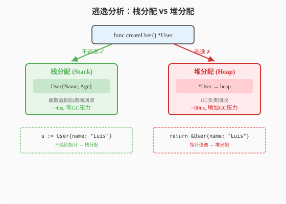

### 第14章 内存模型与逃逸分析：栈与堆的博弈

> 📖 本章你将学会：
> - 理解Go内存分配器与JVM内存模型的本质差异
> - 用`go build -gcflags="-m"`找出每个逃逸点
> - 识别常见逃逸场景并写出零逃逸代码
> - 对比Java对象头开销与Go struct紧凑布局

---

#### 14.1 内存模型：Go vs JVM

##### 14.1.1 开篇：JVM的"物业管家" vs Go的"自助快递"

JVM的内存管理像一个全包式物业管家——你只需要`new User()`，
管家帮你决定放在哪（堆），什么时候打扫（GC），怎么压缩整理。
你看不到内存布局，也不需要关心。

Go的内存管理更像自助快递——编译器会帮你决定放栈还是放堆
（逃逸分析），但你可以通过代码风格影响这个决定。你可以看到
内存布局（struct就是字节排列），也可以手动控制分配。



```
JVM内存布局:
┌───────────┐
│  Heap     │ ← 所有对象都在这里，GC管理
│ (Eden/Survivor/Old) │
├───────────┤
│  Stack    │ ← 只有基本类型和引用
├───────────┤
│  Metaspace │ ← 类元数据
└───────────┘

Go内存布局:
┌───────────┐
│  Stack    │ ← 值类型、不逃逸的变量（无需GC！）
│  (per-goroutine) │
├───────────┤
│  Heap     │ ← 逃逸的变量，GC管理
│  (mcache/mcentral/mheap) │
└───────────┘
```

> 💡 比喻：Java对象像快递包裹——每个都要打包（对象头12-16B），
> 送到仓库（堆），等快递员来收（GC）。Go值类型像口袋里的现金——
> 随身携带（栈），用完就走，不需要快递员。

##### 14.1.2 Go分配器：TCMalloc风格

Go的堆分配器借鉴了TCMalloc（Thread-Caching Malloc）的设计：
每个P（逻辑处理器）有一个本地缓存`mcache`，分配小对象直接从
本地缓存取——无需加锁，无系统调用。

```
┌─────────────────────────────────────┐
│           mheap (全局堆)             │
│  ┌─────────┐  ┌─────────┐           │
│  │mcentral │  │mcentral │  ...      │
│  │(span级) │  │(span级) │           │
│  └────┬────┘  └────┬────┘           │
│       │            │                 │
│  ┌────▼────┐  ┌────▼────┐           │
│  │mcache P0│  │mcache P1│  ...      │
│  │(无锁!)  │  │(无锁!)  │           │
│  └─────────┘  └─────────┘           │
└─────────────────────────────────────┘
```

| 分配大小 | Java (TLAB) | Go (mcache) | 差异 |
|------|------|------|------|
| 小对象(<16B) | TLAB缓存 | mcache无锁 | 相似 |
| 中对象(16B-32KB) | TLAB→堆 | mcache→mcentral | 相似 |
| 大对象(>32KB) | 直接堆 | 直接mheap | 相似 |
| 对象头 | 12-16B | 0B | Go无开销 |

---

#### 14.2 逃逸分析：编译器的栈堆决策

##### 14.2.1 逃逸分析是什么

逃逸分析是**编译器**在编译期决定每个变量放栈还是放堆的过程。
Java也有逃逸分析（JIT做），但Go的是**编译期**的——更可预测。

> 💡 比喻：逃逸分析像快递打包决策——能装口袋里随身带（栈分配）
> 就别用快递盒（堆分配+GC）。编译器检查每个变量：如果它只在当前
> 函数用，就放栈上（快且无需GC）；如果被外部引用了（逃逸了），
> 就放堆上（慢且需GC回收）。

##### 14.2.2 让编译器告诉你逃逸了什么

```bash
go build -gcflags="-m" main.go
# 或更详细
go build -gcflags="-m -m" main.go
```

```go
// 示例代码
func noEscape() int {
    x := 42
    return x // x不逃逸——返回值是拷贝
}

func escape() *int {
    x := 42
    return &x // x逃逸！返回了地址，编译器把x放堆上
}
```

```bash
$ go build -gcflags="-m" main.go
# ./main.go:3:6: moved to heap: x    ← x逃逸到堆
# ./main.go:7:9: &x escapes to heap  ← &x导致逃逸
```

##### 14.2.3 常见逃逸场景

**场景一：返回指针**

```go
func newUser() *User {
    u := User{Name: "Alice"} // 逃逸！因为返回了&u
    return &u
}
```

**场景二：interface参数**

```go
func print(v interface{}) { // 传interface会装箱
    fmt.Println(v)
}
print(42) // 42逃逸（装箱为interface{}）
```

**场景三：闭包捕获**

```go
func counter() func() int {
    count := 0 // 逃逸！闭包捕获了count的引用
    return func() int {
        count++
        return count
    }
}
```

**场景四：slice append超过容量**

```go
func grow() []int {
    s := make([]int, 0, 3)
    for i := 0; i < 10; i++ {
        s = append(s, i) // 扩容时底层数组可能逃逸
    }
    return s
}
```

##### 14.2.4 减少逃逸的技巧

```go
// ❌ 逃逸：返回指针
func newConfig() *Config {
    c := Config{Port: 8080}
    return &c // 逃逸
}

// ✅ 不逃逸：返回值
func newConfig() Config {
    return Config{Port: 8080} // 不逃逸
}

// ❌ 逃逸：interface参数
func log(v interface{}) { fmt.Println(v) }
log(42) // 42装箱逃逸

// ✅ 不逃逸：泛型（Go 1.18+）
func log[T any](v T) { fmt.Println(v) }
log(42) // 42不装箱，不逃逸

// ❌ 逃逸：动态分配大小
s := make([]int, n) // n是变量，可能逃逸

// ✅ 不逃逸：常量大小
s := make([]int, 100) // 编译期已知大小，不逃逸
```

---

#### ⚡ 14.3 性能贴士：逃逸分析实战

**对象内存开销对比**：

```
Java User对象:
┌─────────────────────────┐
│ Object Header  (12-16B) │ ← JVM对象头
│ Name ref       (8B)     │ ──→ String对象(堆)
│ Age            (4B)     │
│ Padding        (4B)     │ ← 对齐填充
└─────────────────────────┘ 总计 ~32B + String对象

Go User struct:
┌─────────────────────────┐
│ Name string   (16B)     │ ← {指针,长度}，无对象头
│ Age int       (8B)      │
└─────────────────────────┘ 总计 24B，连续内存
```

| 指标 | Java对象 | Go struct(栈) | Go struct(堆) | 倍数 |
|------|----------|--------------|--------------|------|
| 内存占用 | 32B+ | 24B | 24B | 1.3x |
| 对象头 | 12-16B | 0B | 0B | 无 |
| 分配开销 | 堆分配~100ns | 栈分配~5ns | 堆分配~50ns | 20x |
| GC压力 | 有 | 无 | 有 | - |

**优化建议**：

1. **用`-gcflags="-m"`定期检查逃逸**：CI中加入逃逸分析
2. **小struct返回值而非指针**：`return Config{}`比`return &Config{}`快
3. **预分配slice容量**：`make([]T, 0, n)`避免循环中扩容逃逸
4. **热路径避免interface**：用泛型或具体类型替代`interface{}`
5. **用sync.Pool复用堆对象**：减少GC压力

> 💡 性能口诀：**逃逸分析编译期，栈上分配零GC费；返回指针要三思，
> interface装箱是刺客。**

---

#### 本章小结

1. **Go分配器是TCMalloc风格** —— 每个P有mcache无锁缓存，小对象
   分配极快。没有Java的对象头开销。

2. **逃逸分析在编译期决定栈/堆** —— 比Java JIT逃逸分析更可预测。
   用`-gcflags="-m"`查看逃逸点。

3. **四大逃逸场景** —— 返回指针、interface装箱、闭包捕获、slice扩容。
   每种都有对应的减少逃逸技巧。

4. **Go struct比Java对象省内存** —— 无对象头、连续内存、栈分配可选。
   热路径零逃逸代码性能可提升10-20倍。

> 🤔 思考题：如果逃逸分析这么好，为什么不把所有变量都放栈上？
> 什么时候编译器"不得不"把变量放堆上？下一章——垃圾回收。
