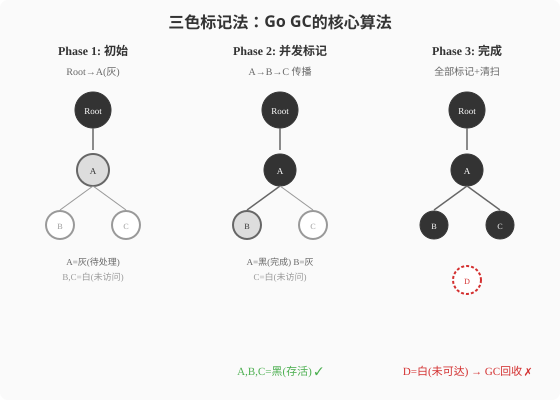

### 第15章 垃圾回收：三色标记与亚毫秒STW

> 📖 本章你将学会：
> - 理解Go三色标记并发GC与JVM G1/ZGC的设计差异
> - 用`GODEBUG=gctrace=1`分析GC行为
> - 调优GOGC参数和软内存限制（Go 1.19+）
> - 用编码实践减少GC压力

---

#### 15.1 GC算法：三色标记 vs 分代回收

##### 15.1.1 开篇：小区物业 vs 扫地机器人

Java GC像小区物业定期大扫除——通知所有住户别出门（STW），
然后逐户检查哪些东西该扔。G1/ZGC虽然缩短了停楼时间，但
"大扫除"的本质没变——只是从"封楼1秒"变成"封楼10毫秒"。

Go GC像扫地机器人——边走边扫（并发标记），几乎不停机。
但它不做"压缩"（不整理内存碎片），因为Go的分配器设计让
碎片问题不严重。



```
Java G1 GC (分代+-region):
  Young GC: STW ~10ms (停年轻代)
  Mixed GC:  STW ~50ms (停部分老年代)
  Full GC:   STW ~1s+ (全堆，尽量避免)

Go GC (三色标记并发):
  STW ~0.1-0.5ms (仅标记开始/结束阶段)
  并发标记: ~与堆大小成正比，但不停程序
```

> 💡 比喻：Java GC像小区物业大扫除——STW=封楼，住户（应用线程）
> 必须等扫完才能活动。Go GC像扫地机器人——大部分时间边走边扫
>（并发标记），只在开始和结束时停0.几毫秒。代价是不整理房间
>（不压缩内存）。

##### 15.1.2 三色标记法详解

Go使用**三色标记并发清除**算法：

```
白色: 未检查（候选垃圾）
灰色: 已发现，但引用还没全检查（待查队列）
黑色: 已确认存活（保留）

流程:
1. 初始: 所有对象白色
2. 根对象(栈/全局变量)标记灰色
3. 取灰色对象，扫描它的引用:
   - 被引用对象标灰
   - 自己标黑
4. 重复3直到没有灰色对象
5. 剩余白色对象 = 垃圾，清除
```

**写屏障（Write Barrier）**：并发标记时，应用线程还在跑——如果它
修改了引用关系（黑色对象突然引用了白色对象），白色对象会被误清除。
写屏障在每次指针赋值时记录这个变更，确保不漏标。

##### 15.1.3 Go GC vs JVM GC对比

| 维度 | Java G1/ZGC | Go GC | 差异 |
|------|-------------|-------|------|
| 算法 | 分代+region | 三色标记清除 | 不同 |
| STW | G1:~10ms, ZGC:<1ms | ~0.1-0.5ms | Go更稳定 |
| 压缩 | 有（整理碎片） | 无 | Java更好 |
| 分代 | 有（Young/Old） | 无（全堆标记） | Java更精细 |
| 并发 | 部分（G1）/全并发(ZGC) | 全并发标记 | 相似 |
| 调优 | 几十个参数 | GOGC一个参数 | Go极简 |

---

#### 15.2 GC调优与实战分析

##### 15.2.1 GODEBUG=gctrace=1

```bash
GODEBUG=gctrace=1 ./myapp
```

输出示例：
```
gc 1 @0.045s 1%: 0.012+0.38+0.004 ms clock, 0.097+0.17/0.38/0.76+0.032 ms cpu, 4->4->2 MB, 5 MB goal, 0 MB stacks, 0 MB globals, 4 P
gc 2 @0.089s 1%: 0.008+0.52+0.003 ms clock, 0.064+0.26/0.52/1.0+0.024 ms cpu, 2->2->1 MB, 3 MB goal, ...
```

关键指标：
- `1%`：GC占CPU时间比例
- `0.012+0.38+0.004 ms`：STW标记开始+并发标记+STW标记结束
- `4->4->2 MB`：GC前堆→标记后存活→GC后堆

##### 15.2.2 GOGC参数

`GOGC`控制GC触发频率——当堆增长到上次GC后存活大小的`(100+GOGC)%`
时触发GC。默认`GOGC=100`（堆翻倍时触发）。

```bash
GOGC=50   # 更频繁GC（堆增长50%触发），CPU高但内存低
GOGC=200  # 更少GC（堆增长200%触发），CPU低但内存高
GOGC=off  # 关闭GC（仅测试用！）
```

##### 15.2.3 软内存限制（Go 1.19+）

```bash
GOMEMLIMIT=512MiB ./myapp  # 软内存上限512MB
```

`GOMEMLIMIT`让GC在接近内存上限时更积极地回收——适合容器环境
（K8s有内存limit）。

##### 15.2.4 减少GC压力的编码实践

```go
// ❌ 差: 频繁分配
func process(items []Item) []Result {
    var results []Result
    for _, item := range items {
        r := transform(item) // 每次分配新对象
        results = append(results, r)
    }
    return results
}

// ✅ 好: 预分配
func process(items []Item) []Result {
    results := make([]Result, len(items)) // 一次分配
    for i, item := range items {
        results[i] = transform(item)
    }
    return results
}

// ✅ 更好: sync.Pool复用
var bufPool = sync.Pool{
    New: func() any { return new(bytes.Buffer) },
}

func handle(data []byte) string {
    buf := bufPool.Get().(*bytes.Buffer)
    defer bufPool.Put(buf)
    buf.Reset()
    buf.Write(data)
    return buf.String()
}
```

---

#### ⚡ 15.3 性能贴士：GC调优实战

| 场景 | GOGC建议 | GOMEMLIMIT建议 | 说明 |
|------|----------|---------------|------|
| 低延迟服务 | 200 | 容器limit的80% | 减少GC频率 |
| 批处理 | 50 | 无 | 频繁GC控制内存 |
| 内存敏感 | 50 | 设定硬上限 | 牺牲CPU换内存 |
| 吞吐优先 | off(测试) | 无 | 关GC只用于基准 |

> 💡 性能口诀：**Go GC亚毫秒，三色标记并发扫；GOGC调频GOMEMLIMIT调上限，
> sync.Pool减GC压。**

---

#### 本章小结

1. **Go用三色标记并发GC** —— STW仅0.1-0.5ms，适合低延迟场景。
   不做压缩（Go分配器碎片不严重），不分代（全堆标记）。

2. **GOGC一个参数调优** —— 默认100（堆翻倍触发），增大减少频率，
   减小增加频率。Go 1.19+的GOMEMLIMIT设定软内存上限。

3. **减少GC压力靠编码** —— 预分配slice、sync.Pool复用、避免
   不必要逃逸。`GODEBUG=gctrace=1`是分析工具。

> 🤔 思考题：Go不做内存压缩，碎片不会成为问题吗？提示：
> Go的分配器用size-class（固定大小桶）分配，同尺寸对象聚集，
> 碎片影响远小于JVM。
