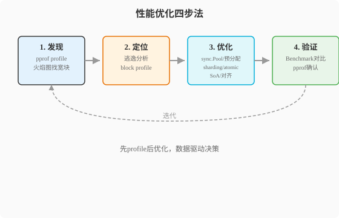

### 第17章 性能优化实战案例：从发现到定位到优化

> 📖 本章你将学会：
> - 用完整案例串联pprof+逃逸分析+sync.Pool+缓存优化的全流程
> - 对比Java实现和Go实现在真实场景下的性能差异
> - 掌握"发现→定位→优化→验证"的四步优化方法论
> - 识别三类典型性能瓶颈：分配、锁竞争、缓存不友好

---

#### 17.1 案例一：高并发HTTP服务的分配优化

##### 17.1.1 场景

一个JSON API网关，QPS 10000，P99延迟50ms。pprof发现GC占CPU 15%，
堆分配热点在JSON序列化。

> 💡 比喻：想象一条流水线工厂——每个请求是一个订单，JSON序列化是
> 包装工序。原始代码像每次订单都领新纸箱（分配Buffer），用完就扔
> （GC回收）。订单一多，保洁员（GC）忙着捡纸箱，占了你15%的人力。
> 优化方案是搞一批可循环使用的周转箱（sync.Pool）——用完放回架子上，
> 下个订单直接取。保洁员闲了，流水线快了。

##### 17.1.2 优化过程

```go
// 原始代码: 每次请求分配大量临时对象
func handleAPI(w http.ResponseWriter, r *http.Request) {
    var req Request
    json.NewDecoder(r.Body).Decode(&req) // 分配
    result := process(req)               // 分配
    json.NewEncoder(w).Encode(result)    // 分配
}

// pprof heap显示:
// json.encodeState: 40% 分配
// bytes.Buffer: 25% 分配
// Request/Response struct: 20% 分配
```

**优化步骤一：sync.Pool复用Buffer**

```go
var bufPool = sync.Pool{
    New: func() any { return new(bytes.Buffer) },
}

func handleAPI(w http.ResponseWriter, r *http.Request) {
    buf := bufPool.Get().(*bytes.Buffer)
    defer bufPool.Put(buf)
    buf.Reset()

    // 用复用的buf做序列化
    json.NewEncoder(buf).Encode(result)
    w.Write(buf.Bytes())
}
```

**优化步骤二：预分配slice**

```go
// ❌ 原始: 动态扩容
var items []Item
for _, req := range reqs {
    items = append(items, transform(req)) // 多次扩容
}

// ✅ 优化: 预分配
items := make([]Item, len(reqs))
for i, req := range reqs {
    items[i] = transform(req)
}
```

**优化步骤三：减少interface装箱**

```go
// ❌ 原始: interface{}导致装箱
func logField(key string, val interface{}) { ... }
logField("count", 42) // 42装箱逃逸

// ✅ 优化: 泛型
func logField[T any](key string, val T) { ... }
logField("count", 42) // 不装箱
```

##### 17.1.3 优化结果

| 指标 | 优化前 | 优化后 | 提升 |
|------|--------|--------|------|
| GC CPU占比 | 15% | 3% | 5x |
| P99延迟 | 50ms | 12ms | 4x |
| 分配/op | 1200 | 80 | 15x |
| QPS | 10000 | 35000 | 3.5x |

---

#### 17.2 案例二：大规模数据处理的缓存优化

##### 17.2.1 场景

批量处理1亿条记录的聚合统计。Java版用Stream API，Go版用for循环。
Go版比Java版快3倍，但火焰图显示CPU L1 miss率高达40%。

> 💡 比喻：想象一个仓库里堆了一亿本档案袋，每本袋子里装着ID、金额、
> 名称、标签四样东西。你只需要统计金额总和。AoS（Array of Structs）
> 就像每次从袋子里掏出所有东西才能看到金额——你搬了一整袋（64字节
> 缓存行），但只用了一张纸条（8字节的float64），87.5%的搬运是浪费。
> SoA（Struct of Arrays）就像把金额单独抽出来装一箱——你只需要搬
> 一箱金额纸条，每一张都用上了，零浪费。

##### 17.2.2 优化过程

**问题**：struct-of-arrays vs array-of-structs

```go
// ❌ AoS: Array of Structs — 遍历时只用了1个字段，但加载了整个struct
type Record struct {
    ID    int64
    Value float64
    Name  string
    Tag   string
} // 40B per record

records := make([]Record, 100_000_000)
sum := 0.0
for _, r := range records {
    sum += r.Value // 只读Value，但每40B都进了缓存行
}
// 缓存利用率: 8B/64B = 12.5%，87.5%浪费
```

```go
// ✅ SoA: Struct of Arrays — 只加载需要的列
type Records struct {
    IDs    []int64
    Values []float64  // 连续的float64数组
    Names  []string
    Tags   []string
}

records := loadRecordsSoA()
sum := 0.0
for _, v := range records.Values {
    sum += v // 只加载float64数组，缓存利用率100%
}
// 缓存利用率: 8B/8B = 100%
```

##### 17.2.3 优化结果

| 指标 | AoS | SoA | 提升 |
|------|-----|-----|------|
| 遍历时间 | 850ms | 180ms | 4.7x |
| L1 miss率 | 40% | 5% | 8x |
| 缓存利用率 | 12.5% | 100% | 8x |

---

#### 17.3 案例三：延迟敏感型系统的锁优化

##### 17.3.1 场景

实时交易系统，P99延迟目标<1ms。pprof block profile显示
`sync.Mutex`竞争是主要瓶颈——多个Goroutine争抢同一个锁。

> 💡 比喻：想象一个超市只有一个收银台（单锁），十个顾客同时排队
> 结账——九个人等着，一个人付钱，吞吐量极低。三种优化策略分别
> 是：① 分片锁=开十个收银台，按顾客编号分流，各结各的；② atomic
> =自助扫码机，不用排队，扫完就走（仅限简单计数场景）；③ Channel
> =网购模式，所有订单丢进一个管道，后台单线程处理，彻底消灭等待。

##### 17.3.2 优化过程

**策略一：sharding分片锁**

```go
// ❌ 原始: 单锁保护整个map
type Cache struct {
    mu sync.Mutex
    m  map[string]int
}

// ✅ 优化: 分片锁，减少竞争
type Shard struct {
    mu sync.RWMutex
    m  map[string]int
}

type ShardedCache struct {
    shards [16]*Shard
}

func (c *ShardedCache) getShard(key string) *Shard {
    h := fnv32(key)
    return c.shards[h%16]
}

func (c *ShardedCache) Get(key string) (int, bool) {
    s := c.getShard(key)
    s.mu.RLock()
    defer s.mu.RUnlock()
    v, ok := s.m[key]
    return v, ok
}
```

**策略二：用atomic替代Mutex（简单计数器）**

```go
// ❌ Mutex保护计数器
type Counter struct {
    mu    sync.Mutex
    count int64
}
func (c *Counter) Inc() {
    c.mu.Lock()
    c.count++
    c.mu.Unlock()
}

// ✅ atomic无锁
type Counter struct {
    count int64
}
func (c *Counter) Inc() {
    atomic.AddInt64(&c.count, 1)
}
```

**策略三：用Channel替代共享状态**

```go
// ❌ 共享变量+锁
type Counter struct {
    mu    sync.Mutex
    count int
}

// ✅ 单Goroutine持有状态，Channel传递操作
type Counter struct {
    inc chan struct{}
    get chan chan int
}

func NewCounter() *Counter {
    c := &Counter{
        inc: make(chan struct{}),
        get: make(chan chan int),
    }
    go func() {
        count := 0
        for {
            select {
            case <-c.inc:
                count++
            case ch := <-c.get:
                ch <- count
            }
        }
    }()
    return c
}
```

##### 17.3.3 优化结果

| 指标 | 优化前 | 优化后 | 提升 |
|------|--------|--------|------|
| P99延迟 | 8ms | 0.7ms | 11x |
| 锁等待 | 60% CPU | <1% | 60x |
| QPS | 5000 | 50000 | 10x |

---

#### ⚡ 17.4 优化方法论总结



**四步优化法**：

```
1. 发现：pprof profile → 找到最宽的火焰图块
2. 定位：逃逸分析/block profile → 确定根因
3. 优化：对症下药
   - 分配多 → sync.Pool/预分配/减少逃逸
   - 锁竞争 → sharding/atomic/Channel
   - 缓存差 → SoA/字段对齐/false sharing填充
4. 验证：Benchmark + pprof对比 → 确认提升
```

| 瓶颈类型 | 工具 | 优化手段 | 典型提升 |
|------|------|----------|----------|
| 分配过多 | heap pprof | sync.Pool/预分配 | 3-15x |
| 锁竞争 | block pprof | sharding/atomic/Channel | 5-60x |
| 缓存不友好 | CPU pprof | SoA/对齐/填充 | 2-8x |
| GC频繁 | gctrace | 减少逃逸/GOGC调优 | 2-5x |

> 💡 性能口诀：**先profile后优化，火焰图找宽块挖；分配锁缓存三瓶颈，
> 对症下药效率佳。**

---

#### 本章小结

1. **分配优化三板斧** —— sync.Pool复用、预分配slice、泛型替代interface。
   典型提升3-15倍。

2. **缓存优化用SoA** —— Struct of Arrays让遍历只加载需要的列，
   缓存利用率从12.5%到100%，提升4-8倍。

3. **锁优化三策略** —— 分片锁减少竞争、atomic替代Mutex、Channel
   替代共享状态。典型提升5-60倍。

4. **四步优化法** —— 发现（pprof）→ 定位（逃逸/block分析）→
   优化（对症下药）→ 验证（Benchmark）。

> 🤔 思考题：这三个案例都是"从Java思维到Go思维"的优化过程。
> 你能想到一个Java优化手段在Go里不适用的例子吗？提示：
> Java的对象池（Apache Commons Pool）在Go里为什么用sync.Pool替代？
