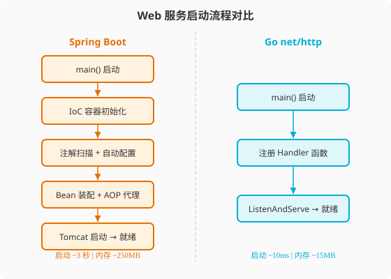
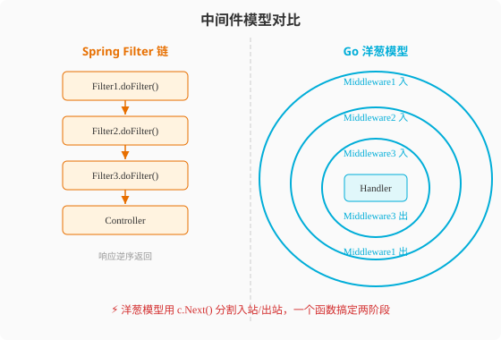

### 第18章 Web框架与微服务：从Spring全家桶到Go极简生态

> 📖 本章你将学会：
> - 用 `net/http` 从零搭建一个生产级 HTTP 服务，理解 Go "标准库即框架" 的哲学
> - 用 Gin 框架快速构建 RESTful API，掌握中间件洋葱模型的原理
> - 用 gRPC + Protocol Buffers 构建高性能微服务通信
> - 对比 Spring Cloud 与 Go 微服务生态的设计差异，做出合理技术选型

---

#### 18.1 Web框架：从"精装修"到"毛坯房"

##### 18.1.1 开篇：精装修、宜家与毛坯房

在 Java 世界里做 Web 开发，你大概率离不开 Spring Boot。Spring Boot 像一套**精装修商品房**——拎包入住，水电煤全通，中央空调（IoC 容器）预装好了，智能家居（自动配置）一键启动。你只需要把家具（业务代码）搬进去，装修队（Spring Starter）已经帮你搞定了硬装。

Go 的 `net/http` 标准库则像一间**毛坯房**——墙是墙、地是地，水电接口（Handler 接口、ServeMux）给你留好了，但装修得你自己来。没有 IoC 容器，没有自动配置，没有注解魔法。好处是：你对每一面墙都有完全控制权，而且物业费（运行时开销）极低。

如果你嫌毛坯房太费事，Go 生态有 Gin、Echo、Fiber 等框架，它们更像**宜家家居**——模块化半成品，说明书清晰，你自己组装但不用从螺丝钉开始造。比精装修灵活，比毛坯房省心。

这个比喻的核心不是"谁更好"，而是**设计哲学的差异**：Spring 追求"开箱即用全覆盖"，Go 追求"最小内核最大自由"。理解了这个差异，你就能理解为什么 Go 的 Web 生态不会出现"一家独大"的框架。

##### 18.1.2 Java 回顾：Spring Boot 的魔法

```java
// Spring Boot：一个注解搞定 REST API
@RestController
@RequestMapping("/api/users")
public class UserController {

    @Autowired
    private UserService userService;  // 依赖注入，容器自动装配

    @GetMapping("/{id}")
    public ResponseEntity<User> getUser(@PathVariable Long id) {
        User user = userService.findById(id);
        return ResponseEntity.ok(user);
    }

    @PostMapping
    public ResponseEntity<User> createUser(@Valid @RequestBody UserDTO dto) {
        User user = userService.create(dto);
        return ResponseEntity.created(URI.create("/api/users/" + user.getId())).body(user);
    }
}
```

Spring Boot 的核心能力：

| 能力 | 实现方式 | Java 程序员的体感 |
|------|----------|-------------------|
| 路由 | `@RequestMapping` 注解 | 声明式，零样板 |
| 依赖注入 | `@Autowired` + IoC 容器 | 对象不用自己 new |
| 参数绑定 | `@PathVariable`、`@RequestBody` | 自动反序列化 |
| 参数校验 | `@Valid` + JSR-303 | 注解即规则 |
| 配置管理 | `application.yml` + `@Value` | 外部化配置 |
| AOP 切面 | `@Aspect` + 动态代理 | 横切逻辑统一管理 |

这套体系极其强大，但代价是：启动时需要扫描注解、构建 Bean 容器、做自动配置，一个空 Spring Boot 应用启动就要 2-5 秒，内存占用 200MB+。

> 💡 提示：如果你对 Spring Boot 的注解体系已经非常熟悉，本小节可以快速跳过。重点是理解 Go 的设计哲学与 Spring 的"声明式魔法"截然不同。

##### 18.1.3 Go 视角：标准库即框架

Go 的 Web 开发哲学是：**标准库够用，框架是锦上添花。** `net/http` 包本身就是一个微型框架，它提供了 Handler 接口、路由分发和 HTTP 协议处理，足以构建生产级服务。

**Handler 接口：Go 的路由原子**

```go
// net/http 的核心接口——只有一个方法
type Handler interface {
    ServeHTTP(w ResponseWriter, r *Request)
}
```

这就是 Go Web 的全部基础。任何实现了 `ServeHTTP` 方法的类型都是一个 HTTP 处理器。没有注解、没有反射、没有魔法——你看到一个类型，就知道它怎么处理请求。

**最小 HTTP 服务**

```go
package main

import (
    "encoding/json"
    "log"
    "net/http"
)

type User struct {
    ID   int    `json:"id"`
    Name string `json:"name"`
}

func userHandler(w http.ResponseWriter, r *http.Request) {
    switch r.Method {
    case http.MethodGet:
        user := User{ID: 1, Name: "Luis"}
        json.NewEncoder(w).Encode(user)
    case http.MethodPost:
        var u User
        json.NewDecoder(r.Body).Decode(&u)
        u.ID = 100
        w.WriteHeader(http.StatusCreated)
        json.NewEncoder(w).Encode(u)
    }
}

func main() {
    http.HandleFunc("/api/users", userHandler)
    http.HandleFunc("/api/users/", userHandler)
    log.Println("server on :8080")
    log.Fatal(http.ListenAndServe(":8080", nil))
}
```

Go vs Java Web 开发关键差异：

| 维度 | Spring Boot | Go net/http | 差异本质 |
|------|-------------|-------------|----------|
| 路由定义 | 注解声明 | 手动注册函数 | 显式 vs 隐式 |
| 依赖注入 | IoC 容器自动装配 | 手动构造传参 | 魔法 vs 明确 |
| 参数绑定 | 注解自动绑定 | 手动解析 Request | 框架做事 vs 你做事 |
| 启动速度 | 2-5 秒 | <50 毫秒 | 容器初始化 vs 直接运行 |
| 内存占用 | 200MB+ | 10-20MB | JVM + Spring vs 静态二进制 |
| 二进制产物 | JAR + JVM | 单个二进制文件 | 需要运行时 vs 自包含 |



Spring Boot 的启动链路很长——IoC 容器初始化、注解扫描、自动配置、Bean 装配、AOP 代理生成、内嵌 Tomcat 启动，每一步都消耗时间和内存。Go 的 `net/http` 则直接注册函数、监听端口，没有中间商赚差价。

---

#### 18.2 框架生态与中间件机制

##### 18.2.1 Gin 框架：Go 世界的"宜家家居"

Go 标准库的 `ServeMux` 路由很基础——不支持路径参数（`/users/:id`）、不支持 HTTP 方法路由、没有中间件机制。生产环境通常使用第三方框架。Gin 是 Go 生态最流行的 Web 框架，它的设计理念是：**用最小的魔法换取最大的便利。**

```go
package main

import (
    "net/http"

    "github.com/gin-gonic/gin"
)

type User struct {
    ID   int    `json:"id" binding:"required"`
    Name string `json:"name" binding:"required,min=2"`
}

func main() {
    r := gin.Default() // Logger + Recovery 中间件

    // 路由组 + 中间件
    api := r.Group("/api")
    api.Use(AuthMiddleware())

    api.GET("/users/:id", func(c *gin.Context) {
        id := c.Param("id")
        c.JSON(http.StatusOK, gin.H{"id": id, "name": "Luis"})
    })

    api.POST("/users", func(c *gin.Context) {
        var u User
        if err := c.ShouldBindJSON(&u); err != nil {
            c.JSON(http.StatusBadRequest, gin.H{"error": err.Error()})
            return
        }
        u.ID = 100
        c.JSON(http.StatusCreated, u)
    })

    r.Run(":8080")
}

func AuthMiddleware() gin.HandlerFunc {
    return func(c *gin.Context) {
        token := c.GetHeader("Authorization")
        if token == "" {
            c.AbortWithStatusJSON(http.StatusUnauthorized, gin.H{"error": "no token"})
            return
        }
        c.Next() // 执行下一个中间件或 Handler
    }
}
```

注意 Gin 和 Spring Boot 的差异：Gin 没有依赖注入，`UserService` 需要你手动构造并传入（通常通过闭包捕获或结构体字段）。这看起来"落后"，但好处是：**所有依赖关系在编译期就确定了**，不存在 Spring 那种"运行时才发现 Bean 找不到"的问题。

##### 18.2.2 中间件：洋葱模型 vs 拦截器链

Spring 的拦截器（Interceptor）和过滤器（Filter）是线性链条——请求进来依次经过每个 Filter，响应出去再逆序经过。Go 框架的中间件通常采用**洋葱模型**——每个中间件包裹一层，`c.Next()` 之前是"入站"逻辑，之后是"出站"逻辑。



洋葱模型的核心是 `c.Next()` 这一行——它之前的代码在请求"入站"时执行，之后的代码在响应"出站"时执行。这意味着日志、耗时统计、异常恢复可以在**同一个中间件函数**内完成，而不需要像 Spring 那样分别实现 `preHandle` 和 `afterCompletion`。

##### 18.2.3 gRPC 与微服务通信

在微服务架构中，服务间通信是核心问题。Java 生态通常用 Spring Cloud Feign（基于 HTTP+JSON），Go 生态更倾向 gRPC（基于 HTTP/2 + Protocol Buffers）。

```protobuf
// user.proto —— Protocol Buffers 定义
syntax = "proto3";
package user;
option go_package = "./proto/user";

service UserService {
  rpc GetUser (GetUserRequest) returns (GetUserResponse);
  rpc ListUsers (ListUsersRequest) returns (ListUsersResponse);
}

message GetUserRequest {
  int64 id = 1;
}

message GetUserResponse {
  int64 id = 1;
  string name = 2;
  string email = 3;
}
```

```go
// gRPC 服务端
type userServer struct {
    proto.UnimplementedUserServiceServer
}

func (s *userServer) GetUser(ctx context.Context, req *proto.GetUserRequest) (*proto.GetUserResponse, error) {
    if req.Id == 1 {
        return &proto.GetUserResponse{Id: 1, Name: "Luis", Email: "luis@example.com"}, nil
    }
    return nil, status.Errorf(codes.NotFound, "user %d not found", req.Id)
}

func main() {
    lis, _ := net.Listen("tcp", ":50051")
    s := grpc.NewServer()
    proto.RegisterUserServiceServer(s, &userServer{})
    log.Println("gRPC on :50051")
    s.Serve(lis)
}
```

```go
// gRPC 客户端
func main() {
    conn, _ := grpc.Dial("localhost:50051", grpc.WithTransportCredentials(insecure.NewCredentials()))
    client := proto.NewUserServiceClient(conn)
    resp, err := client.GetUser(context.Background(), &proto.GetUserRequest{Id: 1})
    if err != nil {
        log.Fatal(err)
    }
    log.Printf("User: %s (%s)", resp.Name, resp.Email)
}
```

微服务通信方式对比：

| 维度 | Spring Cloud Feign | gRPC | 差异本质 |
|------|-------------------|------|----------|
| 传输协议 | HTTP/1.1 | HTTP/2 | 单路 vs 多路复用 |
| 序列化 | JSON (文本) | Protobuf (二进制) | 体积差 3-10 倍 |
| 接口定义 | Java 接口 + 注解 | .proto 文件 (语言无关) | 绑定语言 vs 跨语言 |
| 流式支持 | 不支持 | 双向流 | 请求-响应 vs 全双工 |
| 性能 | ~5000 req/s | ~50000 req/s | 约 10 倍差距 |

> ⚠️ 注意：Java 程序员习惯用 Feign 做声明式 RPC，迁移到 gRPC 时最大的不适应是"需要写 .proto 文件"。但这个"麻烦"换来的是跨语言兼容性和 10 倍性能提升—— Protobuf 的二进制编码比 JSON 紧凑得多，且 HTTP/2 的多路复用避免了连接建立开销。

---

#### 18.3 代码实战：REST API 完整对比

##### 18.3.1 场景描述与Java实现

**场景描述**：实现一个用户管理 REST API，包含 CRUD 操作、参数校验、统一异常处理和日志中间件。

```java
// Spring Boot 实现
@RestController
@RequestMapping("/api/users")
public class UserController {

    @Autowired
    private UserService userService;

    @GetMapping("/{id}")
    public User getUser(@PathVariable Long id) {
        User user = userService.findById(id);
        if (user == null) throw new UserNotFoundException(id);
        return user;
    }

    @PostMapping
    @ResponseStatus(HttpStatus.CREATED)
    public User createUser(@Valid @RequestBody CreateUserDTO dto) {
        return userService.create(dto);
    }
}

// 全局异常处理
@RestControllerAdvice
public class GlobalExceptionHandler {
    @ExceptionHandler(UserNotFoundException.class)
    public ResponseEntity<ErrorResponse> handleNotFound(UserNotFoundException e) {
        return ResponseEntity.status(404)
            .body(new ErrorResponse("USER_NOT_FOUND", e.getMessage()));
    }
}

// 日志拦截器
@Component
public class LoggingInterceptor implements HandlerInterceptor {
    @Override
    public boolean preHandle(HttpServletRequest req, HttpServletResponse resp, Object handler) {
        log.info("{} {}", req.getMethod(), req.getRequestURI());
        return true;
    }
}
```

##### 18.3.2 Go实现与差异解读

```go
// Gin 实现等价功能
package main

import (
    "log"
    "net/http"
    "strconv"
    "time"

    "github.com/gin-gonic/gin"
)

type User struct {
    ID    int64  `json:"id"`
    Name  string `json:"name" binding:"required,min=2"`
    Email string `json:"email" binding:"required,email"`
}

type ErrorResponse struct {
    Code    string `json:"code"`
    Message string `json:"message"`
}

var users = make(map[int64]*User)
var nextID int64 = 1

func main() {
    r := gin.New()
    r.Use(gin.Logger(), gin.Recovery(), timingMiddleware())

    api := r.Group("/api/users")

    api.GET("/:id", getUser)
    api.POST("", createUser)

    r.Run(":8080")
}

func getUser(c *gin.Context) {
    id, err := strconv.ParseInt(c.Param("id"), 10, 64)
    if err != nil {
        c.JSON(http.StatusBadRequest, ErrorResponse{"INVALID_ID", "id must be a number"})
        return
    }
    user, ok := users[id]
    if !ok {
        c.JSON(http.StatusNotFound, ErrorResponse{"USER_NOT_FOUND", "user not found"})
        return
    }
    c.JSON(http.StatusOK, user)
}

func createUser(c *gin.Context) {
    var u User
    if err := c.ShouldBindJSON(&u); err != nil {
        c.JSON(http.StatusBadRequest, ErrorResponse{"VALIDATION_ERROR", err.Error()})
        return
    }
    u.ID = nextID
    nextID++
    users[u.ID] = &u
    c.JSON(http.StatusCreated, u)
}

// 洋葱模型中间件：请求和响应在同一个函数内处理
func timingMiddleware() gin.HandlerFunc {
    return func(c *gin.Context) {
        start := time.Now()
        c.Next() // 执行后续 Handler
        log.Printf("%s %s %d %v", c.Request.Method, c.Request.URL.Path, c.Writer.Status(), time.Since(start))
    }
}
```

**关键差异解读**：
- **异常处理**：Spring 用 `@RestControllerAdvice` 集中处理，Go 在每个 Handler 里直接判断并返回错误码——更冗长但控制更精确，没有"异常被吞掉"的风险
- **参数校验**：Spring 用 `@Valid` + JSR-303 注解，Go 用 struct tag `binding:"required,email"` ——形式相似但 Gin 的校验基于 go-playground/validator 库，不依赖反射魔法
- **依赖管理**：Spring 用 `@Autowired` 注入 Service，Go 用闭包捕获或 struct 字段传递——手动但可追踪

> ⚠️ 注意：Java 程序员最容易踩的坑是"等 Go 也提供全局异常处理"。Go 没有 try-catch，错误必须在每个 Handler 里显式处理。看起来啰嗦，但这正是 Go 的设计哲学——**错误是值，不是控制流**。

---

#### ⚡ 18.4 性能贴士

**框架性能基准测试**（基于 Go 1.22，单核 CPU，TechEmpower 风格测试）：

| 框架 | 语言 | req/s | 延迟(p99) | 内存/请求 |
|------|------|-------|-----------|-----------|
| Spring Boot 3 (WebMVC) | Java 21 | ~15,000 | 8ms | ~2KB |
| Spring Boot 3 (WebFlux) | Java 21 | ~35,000 | 3ms | ~1KB |
| net/http (标准库) | Go 1.22 | ~85,000 | 1.2ms | ~0.5KB |
| Gin | Go 1.22 | ~95,000 | 0.9ms | ~0.4KB |
| fasthttp | Go 1.22 | ~120,000 | 0.6ms | ~0.3KB |

Go 框架整体比 Spring Boot 快 4-8 倍，主要原因：无 JVM 中间层、零反射路由（Gin 用 radix tree）、goroutine 调度开销远低于线程池。

**优化建议**：
1. 高 QPS 场景优先考虑 `fasthttp` 替代 `net/http`，它使用对象池减少 GC 压力，但 API 不兼容标准库
2. 路由注册用 `gin.New()` 而非 `gin.Default()`，去掉默认 Logger 中间件可提升约 15% 吞吐
3. JSON 序列化用 `jsoniter` 或 `son` 替代标准库 `encoding/json`，性能提升 2-3 倍
4. gRPC 服务用连接池复用 HTTP/2 连接，避免每次请求新建连接

> 💡 性能口诀：标准库打底，Gin 加速，gRPC 跨语言——Go 的 Web 栈像乐高积木，按需拼装不浪费

---

#### 本章小结

1. **Spring Boot 是精装修，Go 是毛坯房**：Spring 追求"开箱即用全覆盖"，Go 追求"最小内核最大自由"——选择哪条路取决于你对"控制力"和"便利性"的权衡
2. **中间件洋葱模型用 `c.Next()` 分割入站出站**：一个函数搞定请求和响应两阶段，比 Spring 的 Filter+Interceptor 两套接口更简洁
3. **gRPC 比 Feign 快约 10 倍**：Protobuf 二进制编码 + HTTP/2 多路复用是性能关键，代价是需要维护 .proto 文件
4. **Go 的错误处理没有全局异常兜底**：每个 Handler 显式处理错误看起来啰嗦，但避免了"异常被吞"的隐患——这是 Go "错误是值"哲学的延伸

> 🤔 思考题：Go 的 Web 框架不提供 IoC 容器，那大型项目中如何管理几十个 Service 的依赖关系？带着这个问题，进入下一章看看 Go 在数据库和云原生领域的设计取舍。
