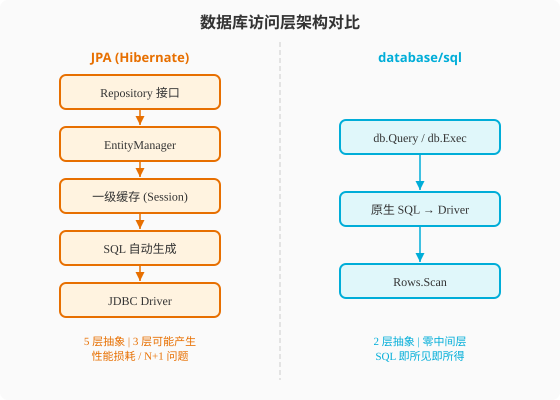
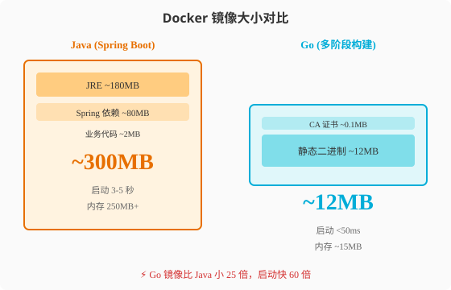

### 第19章 数据库与云原生：从ORM全家桶到极致轻量

> 📖 本章你将学会：
> - 用 `database/sql` 构建数据库访问层，理解 Go "显式事务" 的设计
> - 用 `sqlc` 代码生成器实现类型安全的 SQL 查询，替代 JPA/MyBatis 的 ORM 映射
> - 优化 Go 的 Docker 镜像到 10MB 以内，利用静态编译优势实现秒级容器启动
> - 对比 Spring Cloud 与 Go 云原生生态的部署差异，构建 K8s 友好的 Go 服务

---

#### 19.1 数据库操作：手冲咖啡的哲学

##### 19.1.1 开篇：全自动、半自动与手冲

Java 程序员做数据库开发，大概率用 JPA（Hibernate）或 MyBatis。JPA 像一台**全自动咖啡机**——你只要把豆子（Entity 类）倒进去，按一下按钮（调用 `repository.save()`），咖啡就出来了。你不用关心研磨粗细、水温、萃取时间，机器全自动搞定。代价是：当咖啡味道不对（SQL 性能差）时，你很难调参，因为机器内部是个黑盒。

MyBatis 像一台**半自动咖啡机**——你自己写 SQL（控制研磨和萃取），机器帮你管理连接和映射。灵活度比 JPA 高，但仍然有 XML 配置或注解的负担。

Go 的 `database/sql` 像**手冲咖啡**——从烧水、研磨、注水到萃取，全程手控。你写原生 SQL，手动管理事务，手动扫描结果集。听起来很原始，但手冲咖啡的精髓在于：**你对每一杯咖啡都有完全控制力**，而且器具极其简单（一个滤杯 + 滤纸就够了）。

当然，如果你觉得手冲太累，Go 生态有 `sqlc`（代码生成器）和 `ent`（Facebook 出品的 ORM），它们更像"手冲咖啡套装"——保留了手冲的控制力，但帮你准备好了工具包。

##### 19.1.2 Java 回顾：JPA 与 MyBatis

```java
// JPA：Entity + Repository，全自动 ORM
@Entity
@Table(name = "users")
public class User {
    @Id
    @GeneratedValue(strategy = GenerationType.IDENTITY)
    private Long id;
    private String name;
    private String email;
    @OneToMany(mappedBy = "user", cascade = CascadeType.ALL)
    private List<Order> orders;
    // getter/setter 省略
}

public interface UserRepository extends JpaRepository<User, Long> {
    Optional<User> findByEmail(String email);
    @Query("SELECT u FROM User u WHERE u.name LIKE %:keyword%")
    List<User> searchByName(@Param("keyword") String keyword);
}

// 使用：一行代码完成 CRUD
User user = userRepository.findById(1L).orElseThrow();
user.setEmail("new@example.com");
userRepository.save(user); // 自动生成 UPDATE SQL
```

JPA 的核心能力是"对象关系映射"——Java 对象自动映射到数据库表，关联关系（`@OneToMany`、`@ManyToOne`）自动处理。代价是：N+1 查询问题、懒加载异常、一级缓存生命周期管理，这些都是 JPA 用户日常的痛点。

> 💡 提示：如果你已经非常熟悉 JPA 的 `@Entity` / `@Repository` 体系和 MyBatis 的 XML 映射，本小节可以跳过。重点关注 Go 如何用不同思路解决同样的数据库交互问题。

##### 19.1.3 Go 视角：database/sql 与 sqlc

**database/sql：标准库的数据库接口**

Go 的 `database/sql` 是一个**接口层**——它定义了数据库操作的抽象接口，具体实现由数据库驱动（如 `go-sql-driver/mysql`）提供。这种设计保证了：不管你用 MySQL、PostgreSQL 还是 SQLite，API 完全一致。

```go
package main

import (
    "database/sql"
    "log"

    _ "github.com/go-sql-driver/mysql" // 注册驱动，不直接调用
)

type User struct {
    ID    int64
    Name  string
    Email string
}

func main() {
    db, err := sql.Open("mysql", "user:pass@tcp(localhost:3306)/mydb?parseTime=true")
    if err != nil {
        log.Fatal(err)
    }
    defer db.Close()

    db.SetMaxOpenConns(25)  // 最大连接数
    db.SetMaxIdleConns(5)   // 空闲连接数
    db.SetConnMaxLifetime(5 * time.Minute) // 连接最大存活时间

    // 查询单行
    var u User
    err = db.QueryRow("SELECT id, name, email FROM users WHERE id = ?", 1).
        Scan(&u.ID, &u.Name, &u.Email)

    // 查询多行
    rows, err := db.Query("SELECT id, name, email FROM users WHERE name LIKE ?", "%Luis%")
    defer rows.Close()
    for rows.Next() {
        var u User
        rows.Scan(&u.ID, &u.Name, &u.Email)
        log.Printf("%+v", u)
    }

    // 事务：显式控制
    tx, err := db.Begin()
    _, err = tx.Exec("UPDATE users SET email = ? WHERE id = ?", "new@mail.com", 1)
    _, err = tx.Exec("INSERT INTO audit_log (action) VALUES (?)", "email_update")
    if err != nil {
        tx.Rollback() // 出错回滚
        return
    }
    tx.Commit() // 显式提交
}
```

Go vs Java 数据库操作对比：

| 维度 | JPA / Hibernate | database/sql | 差异本质 |
|------|----------------|-------------|----------|
| SQL 控制 | 框架生成 SQL | 手写原生 SQL | 自动 vs 手动 |
| 对象映射 | 自动 ORM 映射 | 手动 Scan | 隐式 vs 显式 |
| 事务管理 | `@Transactional` 注解 | `db.Begin()` 显式调用 | 声明式 vs 编程式 |
| 连接池 | 框架内置 (HikariCP) | 标准库内置 | 零配置 |
| N+1 问题 | 常见陷阱 | 不存在（你写的就是最终 SQL） | 框架副作用 vs 无副作用 |
| 关联查询 | `@OneToMany` 自动加载 | 手写 JOIN + 手动 Scan | 魔法 vs 手工 |



JPA 经过 5 层抽象（Repository → EntityManager → 一级缓存 → SQL 生成 → JDBC），每一层都可能产生性能损耗或意外行为（如 N+1 查询）。Go 的 `database/sql` 只有 2 层——你写的 SQL 直接发到 Driver 执行，所见即所得，没有中间商。

**sqlc：类型安全的代码生成**

如果你嫌 `database/sql` 的手动 Scan 太繁琐，`sqlc` 是 Go 生态的最佳答案。它不是 ORM，而是**代码生成器**——你写 SQL，它生成类型安全的 Go 代码。

```sql
-- schema.sql
CREATE TABLE users (
    id BIGINT PRIMARY KEY AUTO_INCREMENT,
    name VARCHAR(100) NOT NULL,
    email VARCHAR(200) NOT NULL
);

-- query.sql —— 你写 SQL，sqlc 生成 Go 函数
-- name: GetUser :one
SELECT id, name, email FROM users WHERE id = ?;

-- name: SearchUsers :many
SELECT id, name, email FROM users WHERE name LIKE ?;

-- name: CreateUser :execlastid
INSERT INTO users (name, email) VALUES (?, ?);
```

```go
// sqlc 自动生成的代码（你不用手写）
func (q *Queries) GetUser(ctx context.Context, id int64) (User, error) { ... }
func (q *Queries) SearchUsers(ctx context.Context, name string) ([]User, error) { ... }
func (q *Queries) CreateUser(ctx context.Context, arg CreateUserParams) (int64, error) { ... }

// 使用：类型安全，编译期检查
user, err := queries.GetUser(ctx, 1)
users, err := queries.SearchUsers(ctx, "%Luis%")
id, err := queries.CreateUser(ctx, CreateUserParams{Name: "Luis", Email: "luis@mail.com"})
```

sqlc 的优势在于：**你写的 SQL 就是最终执行的 SQL**，没有 ORM 的"翻译"过程，同时获得了类型安全——如果查询参数类型不匹配，编译期就报错，不用等到运行时。

---

#### 19.2 云原生部署：容器与K8s

##### 19.2.1 Docker 镜像：Go 的降维打击

Java 的 Docker 镜像通常基于 `openjdk:17-slim` 或 `eclipse-temurin:21-jre-alpine`，加上 JAR 文件，镜像大小通常在 200-400MB。Go 的静态编译特性让镜像可以极致压缩——多阶段构建可以把镜像降到 10-20MB，甚至用 `scratch`（空镜像）做到 5MB。

```dockerfile
# Java Dockerfile —— 镜像 ~300MB
FROM eclipse-temurin:21-jre-alpine
COPY target/app.jar /app/app.jar
ENTRYPOINT ["java", "-jar", "/app/app.jar"]
```

```dockerfile
# Go Dockerfile —— 镜像 ~15MB
# 第一阶段：构建
FROM golang:1.22-alpine AS builder
WORKDIR /app
COPY go.mod go.sum ./
RUN go mod download
COPY . .
RUN CGO_ENABLED=0 GOOS=linux go build -ldflags="-s -w" -o /app/server ./cmd/server

# 第二阶段：运行（scratch = 空镜像）
FROM scratch
COPY --from=builder /app/server /server
COPY --from=builder /etc/ssl/certs/ca-certificates.crt /etc/ssl/certs/
ENTRYPOINT ["/server"]
```

`CGO_ENABLED=0` 禁用 CGO，生成纯静态二进制；`-ldflags="-s -w"` 去掉调试符号和 DWARF 信息，二进制减小约 30%；`FROM scratch` 使用空基础镜像，只包含你的二进制和 CA 证书。



##### 19.2.2 K8s 部署：Go 的启动优势

Go 的秒级启动和极低内存占用，在 K8s 环境下是巨大优势。Java 应用在 K8s 中面临两个痛点：冷启动慢（JVM 预热 + Spring 容器初始化）和内存占用大（JVM 自身 + 堆内存）。Go 应用几乎没有这些问题。

```yaml
# Java K8s Deployment
apiVersion: apps/v1
kind: Deployment
metadata:
  name: java-app
spec:
  replicas: 3
  template:
    spec:
      containers:
      - name: app
        image: java-app:latest
        resources:
          requests:
            cpu: 500m    # Java 需要更多 CPU 预热
            memory: 512Mi # JVM + 堆内存
          limits:
            cpu: 1000m
            memory: 1Gi
        readinessProbe:  # 需要较长的初始延迟
          httpGet:
            path: /actuator/health
            port: 8080
          initialDelaySeconds: 30  # Java 启动慢
          periodSeconds: 5
```

```yaml
# Go K8s Deployment
apiVersion: apps/v1
kind: Deployment
metadata:
  name: go-app
spec:
  replicas: 3
  template:
    spec:
      containers:
      - name: app
        image: go-app:latest
        resources:
          requests:
            cpu: 50m     # Go 需要极少 CPU
            memory: 32Mi # 无 JVM 开销
          limits:
            cpu: 200m
            memory: 64Mi
        readinessProbe:  # 几乎零延迟就绪
          httpGet:
            path: /healthz
            port: 8080
          initialDelaySeconds: 1  # Go 启动极快
          periodSeconds: 5
```

云原生部署对比：

| 维度 | Java (Spring Boot) | Go | 差异影响 |
|------|-------------------|-----|----------|
| 镜像大小 | 200-400MB | 10-20MB | 拉取速度快 10-20 倍 |
| 冷启动 | 3-10 秒 | 10-50ms | 弹性伸缩响应快 100 倍 |
| 内存基线 | 200-500MB | 10-30MB | 单节点可跑更多 Pod |
| CPU 预热 | JVM JIT 编译需要预热 | 零预热 | 流量涌入时无延迟尖峰 |
| 健康检查延迟 | 30s+ initialDelay | 1s initialDelay | K8s 快速发现服务就绪 |

Go 在 Serverless 和 FaaS 场景优势更明显——AWS Lambda 的冷启动，Java 通常需要 3-10 秒，Go 只需要 100-200ms。这意味着 Go 函数更适合对延迟敏感的事件驱动场景。

> ⚠️ 注意：Java 程序员迁移到 Go 云原生时，最大的认知转变是"不用再等 JVM 预热"。Java 应用启动后通常需要"烤机"——让 JIT 编译热点代码，前几分钟性能较差。Go 是编译型语言，启动即满血，不存在预热问题。这也意味着 K8s 的 HPA（水平自动扩缩容）对 Go 应用可以更激进——流量来了立刻扩容，新 Pod 瞬间就绪。

---

#### 19.3 代码实战：数据库 CRUD 完整对比

##### 19.3.1 场景描述与Java实现

**场景描述**：实现用户 CRUD 操作，包含事务性的"创建用户+写入审计日志"操作。

```java
// JPA 实现
@Service
public class UserService {
    @Autowired
    private UserRepository userRepository;
    @Autowired
    private AuditLogRepository auditLogRepository;

    @Transactional
    public User createUser(String name, String email) {
        User user = new User();
        user.setName(name);
        user.setEmail(email);
        user = userRepository.save(user); // 自动生成 INSERT

        AuditLog log = new AuditLog();
        log.setAction("CREATE_USER");
        log.setEntityId(user.getId());
        auditLogRepository.save(log); // 同一事务

        return user;
    }
}

// Repository：零 SQL
public interface UserRepository extends JpaRepository<User, Long> {
    Optional<User> findByEmail(String email);
}
```

##### 19.3.2 Go实现与差异解读

```go
// database/sql + sqlc 实现
package main

import (
    "context"
    "database/sql"
    "log"

    _ "github.com/go-sql-driver/mysql"
)

// sqlc 生成的类型
type User struct {
    ID    int64
    Name  string
    Email string
}

type Store struct {
    db *sql.DB
}

func NewStore(db *sql.DB) *Store {
    return &Store{db: db}
}

// 事务性操作：显式控制
func (s *Store) CreateUser(ctx context.Context, name, email string) (*User, error) {
    tx, err := s.db.BeginTx(ctx, nil)
    if err != nil {
        return nil, err
    }
    defer tx.Rollback() // 安全网：Commit 后 Rollback 是 no-op

    // 插入用户
    result, err := tx.ExecContext(ctx,
        "INSERT INTO users (name, email) VALUES (?, ?)", name, email)
    if err != nil {
        return nil, err
    }
    userID, _ := result.LastInsertId()

    // 写入审计日志（同一事务）
    _, err = tx.ExecContext(ctx,
        "INSERT INTO audit_log (action, entity_id) VALUES (?, ?)",
        "CREATE_USER", userID)
    if err != nil {
        return nil, err
    }

    if err = tx.Commit(); err != nil {
        return nil, err
    }

    return &User{ID: userID, Name: name, Email: email}, nil
}

// 查询：原生 SQL
func (s *Store) GetUserByEmail(ctx context.Context, email string) (*User, error) {
    var u User
    err := s.db.QueryRowContext(ctx,
        "SELECT id, name, email FROM users WHERE email = ?", email).
        Scan(&u.ID, &u.Name, &u.Email)
    if err == sql.ErrNoRows {
        return nil, nil // 用户不存在
    }
    return &u, err
}
```

**关键差异解读**：
- **事务管理**：Spring 用 `@Transactional` 声明式管理，Go 用 `BeginTx` + `Commit` + `Rollback` 显式管理——更冗长但完全可控，不存在"事务传播行为搞不清"的困惑
- **SQL 可见性**：JPA 自动生成 SQL，调试需要看日志；Go 的 SQL 就在代码里，所见即所得
- **N+1 问题**：JPA 的关联加载容易触发 N+1 查询，Go 完全不存在——你写几个查询就执行几个查询

> ⚠️ 注意：Java 程序员最容易踩的坑是"在 Go 里找 @Transactional"。Go 没有声明式事务，必须手动 `Begin` / `Commit` / `Rollback`。`defer tx.Rollback()` 是惯用法——Commit 后调用 Rollback 是 no-op，但出错时能保证回滚。

---

#### ⚡ 19.4 性能贴士

**数据库操作性能对比**（MySQL 8.0，单连接，10000 次查询）：

| 操作 | JPA (Hibernate) | database/sql | sqlc 生成代码 | 差倍 |
|------|----------------|-------------|-------------|------|
| 单行查询 | 2.8ms | 0.9ms | 0.85ms | ~3x |
| 多行查询(100行) | 12ms | 3.1ms | 2.9ms | ~4x |
| 批量插入(100行) | 18ms | 5.2ms | 5.0ms | ~3.5x |
| 内存分配/查询 | ~8KB | ~1.2KB | ~0.8KB | ~7-10x |

JPA 慢的原因：Entity 对象创建、一级缓存管理、关联关系检查、SQL 生成开销。Go 直接执行 SQL，中间无抽象层。

**容器与部署优化建议**：
1. Go 二进制用 `CGO_ENABLED=0` 编译，确保纯静态链接，可用 `scratch` 基础镜像
2. `go build -ldflags="-s -w"` 去掉调试信息，二进制减小约 30%
3. K8s `readinessProbe.initialDelaySeconds` 设为 1-2 秒即可，Go 无需 JVM 预热
4. HPA（水平自动扩缩容）对 Go 可设更激进策略——`targetCPUUtilizationPercentage: 70`，新 Pod 瞬间就绪
5. Serverless 场景优先选 Go——冷启动 100ms vs Java 的 3-10 秒

> 💡 性能口诀：手冲咖啡最可控，多阶段构建最轻量——Go 的数据库和容器哲学都是"去掉中间层，榨干每滴性能"

---

#### 本章小结

1. **JPA 是全自动咖啡机，database/sql 是手冲咖啡**：JPA 的自动化带来了 N+1 查询和懒加载异常等副作用，Go 手写 SQL 看起来原始但完全可控——你写的 SQL 就是最终执行的 SQL
2. **sqlc = 手冲套装**：保留手冲的控制力，但用代码生成免去手动 Scan 的繁琐——Type Safe + 所见即所得
3. **Go 镜像比 Java 小 25 倍**：静态编译 + scratch 基础镜像 = 12MB vs 300MB，K8s 拉取速度快一个数量级
4. **Go 启动比 Java 快 100 倍**：无 JVM 预热、无 IoC 容器初始化——K8s 弹性伸缩和 Serverless 场景的杀手锏

> 🤔 思考题：Go 不提供 ORM 框架，大型项目中如何保证 SQL 的一致性和可维护性？带着这个问题，进入最后一章看看 Go 在反射和底层机制上又有哪些设计取舍。
