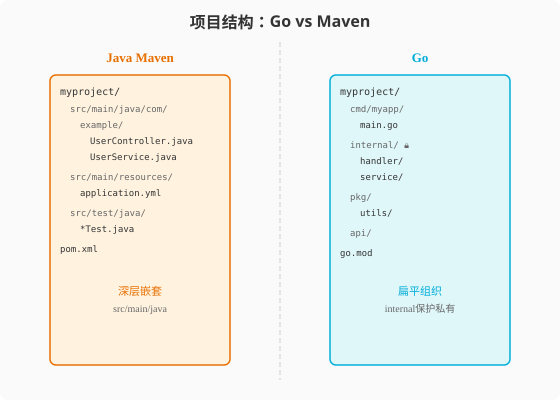

### 第11章 项目结构与测试：约定大于配置

> 📖 本章你将学会：
> - 用Go标准项目结构组织代码，理解cmd/internal/pkg的分工
> - 用`go test`的约定式测试替代JUnit的注解式测试
> - 写表驱动测试——Go社区最受欢迎的测试模式
> - 用基准测试和模糊测试验证性能和健壮性

---

#### 11.1 项目结构：Go的布局哲学

##### 11.1.1 开篇：Maven的约定 vs Go的约定

Java的Maven有一套严格的项目结构约定：`src/main/java`放源码，
`src/main/resources`放资源，`src/test/java`放测试。Spring Boot
还额外约定了`src/main/resources/application.yml`。

Go也有约定，但更简洁——没有`src/main`这种嵌套，一切围绕`package`
组织：

```
myproject/
├── go.mod              # 模块定义（相当于pom.xml）
├── go.sum              # 依赖校验
├── cmd/                # 可执行入口
│   └── myapp/
│       └── main.go     # package main
├── internal/           # 私有代码（只能本模块import）
│   ├── handler/
│   ├── service/
│   └── repository/
├── pkg/                # 可被外部import的公共代码
│   └── utils/
└── api/                # API定义（proto/openapi）
```

> 💡 比喻：Maven项目像一栋写字楼——不同部门在不同楼层（src/main/java
> 的包路径），有严格分区。Go项目像一个创意园区——每个建筑是独立的
> package，按功能松散分布，但有个"围墙"（internal）保护私有区域。



##### 11.1.2 可见性规则：首字母大小写

Java用`public`/`private`/`protected`/包级私有四个修饰符控制可见性。
Go只用一条规则：**首字母大写=公开，小写=私有。**

```go
package user

type User struct {
    Name  string  // 公开（外部可访问）
    email string  // 私有（仅本包可访问）
}

func (u *User) Save() error { ... }   // 公开方法
func validate(u *User) error { ... }  // 私有函数
```

| 可见性 | Java | Go | 说明 |
|------|------|----|------|
| 全局公开 | `public` | 首字母大写 | 任何包可访问 |
| 包内私有 | package-private | 首字母小写 | 仅本包可访问 |
| 子类可访问 | `protected` | 无 | Go无继承，不需要 |
| 类内私有 | `private` | 无 | Go没有类，用包级私有替代 |

##### 11.1.3 internal目录的特殊保护

Go 1.4+引入了`internal`目录——这个目录里的包只能被其**父目录的包**
import，外部不能import：

```
myproject/
├── internal/
│   └── handler/     # 只有myproject内部的包能import
├── pkg/
│   └── utils/       # 任何包都能import
└── cmd/
    └── main.go      # 可以import internal/handler
```

```go
// ✅ 同模块内可以import
import "myproject/internal/handler"

// ❌ 外部模块不能import
import "github.com/other/internal/handler" // 编译错误！
```

---

#### 11.2 测试：go test vs JUnit

##### 11.2.1 约定式测试

Java用JUnit + Maven Surefire，需要`@Test`注解和`pom.xml`配置。
Go用**约定**：文件名`xxx_test.go`，函数名`TestXxx`，一条命令`go test`。

```go
// user_test.go
package user

import "testing"

func TestUser_Save(t *testing.T) {
    u := &User{Name: "Alice"}
    err := u.Save()
    if err != nil {
        t.Errorf("Save failed: %v", err)
    }
}
```

```bash
go test ./...           # 运行所有测试
go test -v ./...        # 详细输出
go test -run TestUser   # 只运行匹配的测试
go test -cover          # 覆盖率
go test -race           # 竞态检测
```

| 维度 | JUnit | Go testing | 差异 |
|------|-------|------------|------|
| 标记测试 | `@Test`注解 | `Test`前缀 | Go用命名约定 |
| 断言 | Assert.assertEquals | 手写if + t.Error | Go无断言库 |
| 测试发现 | Maven Surefire | `go test`自动 | Go内建 |
| Mock | Mockito | 手写或接口 | Go偏好手写 |
| 参数化 | `@ParameterizedTest` | 表驱动测试 | Go用循环 |

##### 11.2.2 表驱动测试

这是Go社区最受欢迎的测试模式——用一个表格组织所有测试用例：

```go
func TestAdd(t *testing.T) {
    tests := []struct {
        name     string
        a, b     int
        expected int
    }{
        {"正数相加", 1, 2, 3},
        {"负数相加", -1, -2, -3},
        {"零值", 0, 0, 0},
        {"正负混合", 5, -3, 2},
    }

    for _, tt := range tests {
        t.Run(tt.name, func(t *testing.T) {
            result := Add(tt.a, tt.b)
            if result != tt.expected {
                t.Errorf("Add(%d, %d) = %d, want %d",
                    tt.a, tt.b, result, tt.expected)
            }
        })
    }
}
```

```bash
go test -v -run TestAdd
# === RUN   TestAdd
# === RUN   TestAdd/正数相加
# === RUN   TestAdd/负数相加
# === RUN   TestAdd/零值
# === RUN   TestAdd/正负混合
# --- PASS: TestAdd (0.00s)
#     --- PASS: TestAdd/正数相加 (0.00s)
#     --- PASS: TestAdd/负数相加 (0.00s)
# --- PASS: TestAdd/零值 (0.00s)
# --- PASS: TestAdd/正负混合 (0.00s)
# PASS
```

##### 11.2.3 基准测试

```go
func BenchmarkStringConcat(b *testing.B) {
    for i := 0; i < b.N; i++ {
        s := ""
        for j := 0; j < 100; j++ {
            s += "a"
        }
        _ = s
    }
}

func BenchmarkStringBuilder(b *testing.B) {
    for i := 0; i < b.N; i++ {
        var sb strings.Builder
        for j := 0; j < 100; j++ {
            sb.WriteString("a")
        }
        _ = sb.String()
    }
}
```

```bash
go test -bench=. -benchmem
# BenchmarkStringConcat-8     20000     60000 ns/op    10000 B/op    100 allocs/op
# BenchmarkStringBuilder-8   1000000      1000 ns/op     1024 B/op      8 allocs/op
```

> 💡 提示：`b.N`是Go基准测试的核心——编译器自动调整N让测试运行
> 足够长时间（默认1秒），从而得到稳定的性能数据。

##### 11.2.4 模糊测试（Go 1.18+）

```go
func FuzzParseURL(f *testing.F) {
    // 种子语料
    f.Add("https://example.com/path")
    f.Add("http://localhost:8080")

    f.Fuzz(func(t *testing.T, raw string) {
        url, err := ParseURL(raw)
        if err != nil {
            return // 解析失败是正常的
        }
        // 如果解析成功，重新序列化应该得到相同结果
        if ParseURL(url.String()) == nil {
            t.Errorf("roundtrip failed for: %s", raw)
        }
    })
}
```

```bash
go test -fuzz=FuzzParseURL -fuzztime=10s
```

---

#### ⚡ 11.3 性能贴士：测试覆盖率与性能基准

| 指标 | Java (JUnit+JaCoCo) | Go (go test) | 差异 |
|------|---------------------|--------------|------|
| 测试启动 | ~2s（JVM启动） | ~0.1s | 20x |
| 覆盖率收集 | JaCoCo插件 | `-cover`内建 | Go零配置 |
| 基准测试 | JMH（独立工具） | `Benchmark`内建 | Go零依赖 |
| 竞态检测 | ThreadWeaver | `-race`内建 | Go原生 |
| 模糊测试 | Jazzer（第三方） | `-fuzz`内建 | Go原生 |

**优化建议**：

1. **用`-race`检测并发bug**：开发时始终开启，CI时也开启
2. **基准测试加`-benchmem`**：同时看内存分配和GC压力
3. **用`t.Parallel()`并行测试**：加速测试套件
4. **表驱动测试用`t.Run`子测试**：每个用例独立，失败不中断

> 💡 性能口诀：**Go测试零配置，一行命令全搞定；表驱动测试最优雅，
> 基准竞态全内建。**

---

#### 本章小结

1. **Go项目结构围绕package组织** —— `cmd`放入口，`internal`放私有代码，
   `pkg`放公共库。可见性靠首字母大小写，不需要修饰符。

2. **`go test`是约定式测试** —— `xxx_test.go` + `TestXxx`函数，零配置。
   表驱动测试是Go社区最受欢迎的测试模式。

3. **基准测试内建** —— `BenchmarkXxx` + `b.N`，`-benchmem`看分配。
   不需要JMH这样的独立工具。

4. **模糊测试内建（1.18+）** —— `FuzzXxx` + 种子语料，自动发现边界bug。

> 🤔 思考题：Go没有Mockito这样的Mock框架，测试时怎么Mock依赖？
> 提示：Go用接口+手写fake。第13章会展开讲。
